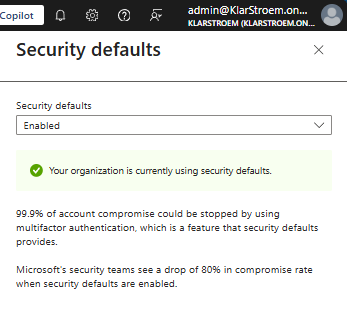

## Tenant overview

- Tenant Name: KlarStroem  
- Tenant ID: 51fc7846-429d-4406-84e7-cfd3c0c3b3ec  
- Region: Denmark  
- Default domain: klarstroem.onmicrosoft.com  
- Primary domain: since I do not own the domain "klarstroem" means I am not able to verify it. If I could the - primary domain would have been klarstroem.com  
- First global admin account: admin@klarstroem.onmicrosoft.com "Signup account becomes the first global admin"

## Licensing

License type purchased:
- Microsoft 365 E5 trial license
  - Includes 25 licenses to assign to users

 Reason for choosing it:
 - The reason I chosee to sign up for Microsoft E5 is mainly because Entra ID P2 is included
  - Entra ID P2: Comes with all the advanced IAM capabilities that are nessesary for the upcoming labs

Capabilities unlocked:

Entra ID P2 capabilities:
- Identity protection
- Privileged Identity Management
- Access Reviews
- Entitlement Management

For my project I am mainly interested in understanding the difference between Entra ID Free, Entra ID P1 and Entra ID P2 licenses. I found this official Microsoft 365 plan comparison that gives an good overview of the differenct products and the capabilities included en each:  
[Microsoft 365 Enterprise plan comparison](https://www.microsoft.com/content/dam/microsoft/final/en-us/microsoft-brand/documents/Modern-Work-Plan-Comparison-ENT-1-16-2024.pdf)

## Security defaults

For the initial tenant setup I have chosen to enable the security defaults option. This option is preconfigured by Microsoft and isn't customizeble. The default security ensures:
- Requiring all users to register for multifactor authentication
- Requiring administrators to perform multifactor authentication
- Blocking legacy authentication protocols
- Requiring users to perform MFA when necessary
- Protecting privileged activities like access to the Azure portal

