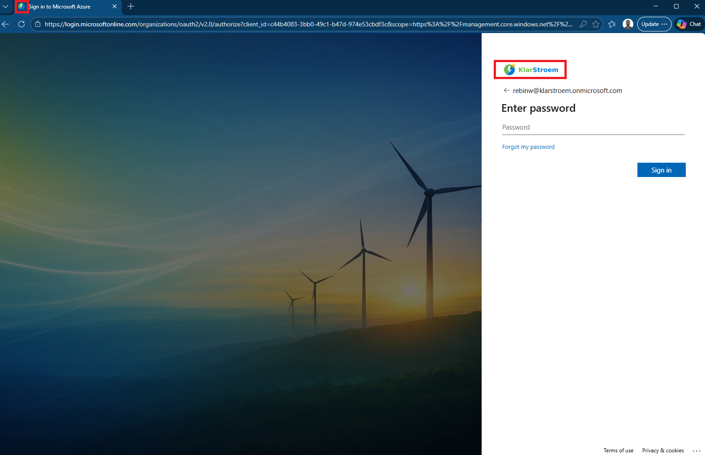

# Configuring the company brand

The official Microsoft SC300 labs do not include this project. I chose to do this anyway because branding affects:  
- Branded sign-in page helps users distinguish legitimate tenant from fake ones, which reduces the likelihood of credential harvesting attacks
- Branding during B2B sign-in helps external users verify they are accessing the correct tenant, which lowers the risk of social engineering and unauthorized access.

I have chosen to not document each step in this lab since it is quite straight foward and there are many ways to customize the layout. I will still document the outcome and highlight the main features I chose to customize including: 
- Favicon: Appears in the web-browser tab
- Background image
- Banner-logo
- Show self-service password reset

