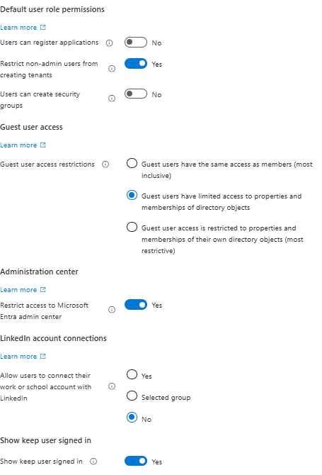

# User Settings

## Configuring tenant-wide user settings  
To configure the tenant-wide user settings I'll navigate to:  
- Entra ID - Users - User Settings

Here where I'll configure what the default permissions will be for all our users both native members and guest users (B2B collaboration) as well. I'd like to follow the concept of least privlege from start, and therefore i'm going to change following from the Microsofts default settings: 

**Users can register application**  
This feature is by default enabled, but im going to disabled it following the concept of least privlege. Later I'll allow only specific roles or developer groups this feature.

**Restrict non-admin users from creating tenants**  
This one is by default disabled. Once again following the concept of least privlege I am then going to enabled this. I do not see any reason why I would allow regular users to create seperate tenanats, this would lead to governance and data risk.

**Users can create secerity groups**
This one is by default enabled, but once again following least privlege i'm going to disable this feature.

**Gust users access restrictions**  
Now, for this they are mainly three levels to choose from:  
1. Same access as members: This option is too open and does not follow least privlege principles
2. Limited access to directory objects: This one is in my opinion the best oprion because it still allows for collaboration
3. Restricted to own objects only: This one will probably not work since it could break collaboration and prevent guest users from completing their intended tasks

**Restrict access to Microsoft Entra Admin portal**  
- If enabled: Only admins can access the portal
- If disabled: non admins can open it but cannot change anything

I have chosen to enable restriction. Even though normal users cannot change anything I still do not see any reason why they would have visibility here.

**LinkedIn account connections**  
This one is by default set to yes. I have chosen to set the option to no from a security perspective, also I do not see the need for employees to sign-up using their work account they're probably going to switch to another company at some point.

**Show keep user signed in**  
This option allows users to stay signed in untill they explicitly sign out. This also means that if the close a browser the session is still going to stay active and they wont have to re-authenticate. This gives a better user experience in my opinion while we still be able to control risk using:
- Multi Factor Authentication 
- Conditional access 
- Device compliance  
I have therefore chosen to enable this feature.

**Output**  

