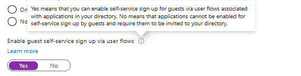
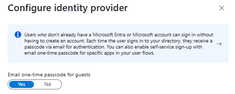
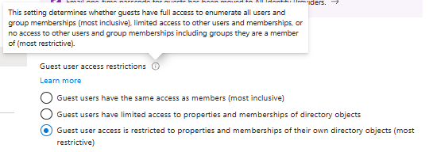
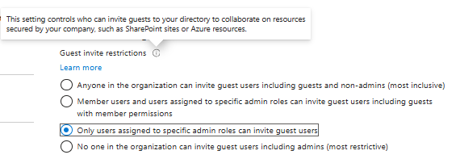

# External collaboration settings

In this exercise I follow the official Microsoft SC300 lab: Lab 04: Configure external collaboration settings:  

[Microsoft lab](https://microsoftlearning.github.io/SC-300-Identity-and-Access-Administrator/Instructions/Labs/Lab_04_ConfigureExternalCollaborationSettings.html)

## Exercise 1 - Allowing guest users to be invited into the organization.

**Task 1 - Enableing guest users to perform self service sign-up**

Microsoft has changed the location in Entra for this "Official lab not updated" I found the settings by navigating to Entra ID - External Identities - External collaboration settings.  

Here we see the option to **Enable guest self-service sign up via user flow** and the lab tells us to enable this option. In my opinion we need a little more information on what are we exactly enableing 

*What "Enable guest self-service sign up via user flows" means:*
- We build an application that external users need to access
- We configure a user flow for sign up and sign in
- Guest register themselves through that flow instead of being invited manually

This means this feature is tied to applications and not Entra itself.

*What thype of applications are we talking about?:*
- Internal apps the organizations develops
- Third party applications integrated with Entra
- Web apps applications integrated with Entra

This means it refers to applications that rely on our tenant for authentication

Example: Lets say our trading company KlarStroem builds a partner portal  
External users must:
1. create an account
2. submit documents
3. access dashboard

Instead of us inviting them manually this feature supports:
- Portal uses self-service sign up
- supplier registers
- identity is created in Entra
- Access controlled through company policies

When first working with this task I was still left with a couple of questions:
1. Is this tied to mainly B2B collaboration or will this affect B2C in Anyway?
   - This feature only affects B2B collaborations.
2. Will the user after sign up automatically have a guest user created inside our tenant?
    - Yes, The user is created in our tenant and we controlled this through conditional access policies and authorization. Still the user is going to use their own identity provider for the whole authentication process.
3. How do we ensure that anyone can't just register themselves?
   - Domain restrictions, meaning we specify the trusted domains
     - This can be configued in the collaboration settings and in user flow or even app configuration.
   - Application assignment
   - Conditional access
     - MFA Required
     - Compliant device
     - Allowed locations
     - sign in risk policy
    

  My simple understanding of this feature is that self-service sign up is a controlled onboarding without manual identity creation by IT.

  ISO 27001 relevance:  
  This feature supports identity governance and controlled onboarding of external users.  
  Primary Annex A linkage:
  - A.5.15 Access control
  - A.5.16 Identity management
  - A.5.19 Information security in supplier relationships
  - A.8.5 Secure authentication

## Task 2 - Configure external collaboration settings

**1. Enable one-time passcode**

Email one-time passcode is an authentication method for external users who do not have an IdP or MS account. It allows the user to access recources without federation. A guest identity is still created in our tenant. The authentication will then each time happen through email when the user wants to sign in.

Just as with other guest identities we can still apply
- Conditional access policies on top of OTP
- Specify trusted domains
- Application access control
- Approval workflows

  ISO 27001 relevance:  
  Supports secure onboarding and authentication for external users who do not have a federated identity. This function reduces unmanaged access while ensuring controlled collaboration.  
  Primary Annex A linkage:
  - A.5.15 Access control
  - A.5.16 Identity management
  - A.5.19 Information security in supplier relationships
  - A.8.5 Secure authentication

**2. Guest user access**  
This feature basically controls what guest users can see in our directory and not what they can access in apps. In other words we can restrict guest users directory visibility meaning weather they can see and search other users outside of the management group they're invited to.

There are three options:  
  

1. option: Out of questions in our environment, I always think least privelege. This option would mean:
   - Guest users can view user lists. group memberships and directory info.
     
2.  option: Valid but I still see no reason that guest users should have the visibility and actions such as:
      - Look up some users and groups
      - Resolve names
      - See limited metadata
This options also means that guest users can see membership of all non-hidden groups

This would help collaboration in MS 365 such as:
   - Teams mentions
   - sharing
   - finding people
     
3. option: Following least privelege we're going with this option for now. If at a later stage we find it necessary for collaboration to go with the second option we can only change the setting. For now this means that guest users can only see:
     - Their own profile
     - Their own group membership

**3. Guest invite settings**  

Guest invite settings controls who inside the organization can onboard external users into the tenant. This is different from self-service sign up, which is application focused and most often limited to specific services. This means guest invites can give broader access than self-service sign on this includes:  
- SharePoint
- Azure resources
- Teams
- Groups

Now, having to decide whitch of the four options to go with:

As seen on the picture, I chose to go with the third option. The official MS lab suggests to go with the second option, but in my opinion it really depends on the perspective. Lets me explain the different options and give justification.

1. Allows all users to invite guest: This means that both internal employees "member users" and external identities "guest users" can invite other external identities. Following least privelege this option is out of question.
2. This option basically disallows guest users "external identites" to invite other guest, but still allows member users meaning all internal employees to invite guests. If productivity was our main priority then maybe we would go with this option.
3. This option basically only allows certain admin roles to invite guest users. This one follows least privelege in my opinion and the main focus/ priority over the second option here is security first. The admins specified here are:
   - Global admin
   - User admin
   - Guest inviter
4. This option is not relevant because we want to be able to invite guests.

**4. Collaboration restrictions**
