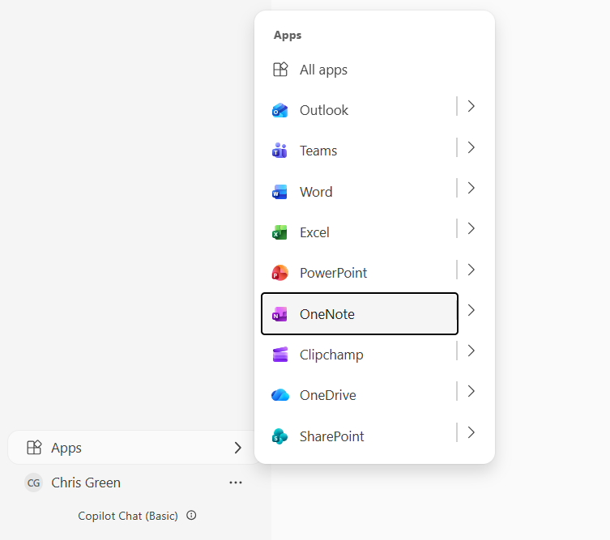
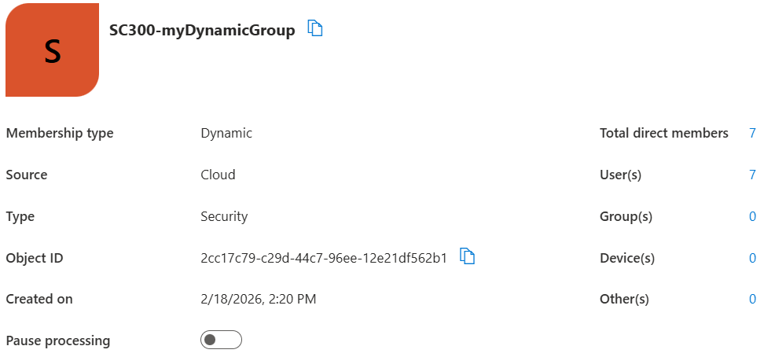

# Assigning licenses using group membership

[Official Microsoft link to the lab](https://microsoftlearning.github.io/SC-300-Identity-and-Access-Administrator/Instructions/Labs/Lab_03_AssignLicensesToUsersByGroupMembershipAAD.html)

## Objective

- Implement group-based licensing
- Reduce manual license assignment
- Validate access provisioning

## Tools used

- Microsoft Entra admin center
- Microsoft 365 admin center
- Security groups
- Dynamic groups

## Methodology

**Exercise 1: Create a security group and add a user**

**Task 1: Check to see if the user has access to Office 365**

I reviewed the user account in Microsoft Entra and Microsoft 365 admin center to confirm license status and service access. I also checked to ensure that the user isn't a member of any group yet, since the goal of the lab is to assign the license through group-based licensing.

**Task 2: Create a security group in Microsoft 365**  
In Microsoft Entra admin center, I created the following group:  
- Group type: Security
- Group name: sg-SC300-O365
- Group description: Test Group for SC300 lab
- MS Entra roles can be assigned to this group: NO
- Membership type: Assigned

I chose my own account as the owner of the group and selected the test user Chris Green to be a member of the group. 

**Task 3: Add an Office license to sg-SC3000-O365**  
For this task i'll assign the Office 365 license manually, to do this I have to navigate to the MS 365 admin center, path: Billing - Licenses - Office 365 E5 - assign licenses.

I'll then choose to assign the license to the newly created security group *sg-SC300-O365* instead of assigning directly to the user.

Afterwards, I went into Entra admin center and chose the newly created security group just to confirm that the license has been assigned correctly to the group.

**Task 4: Confirm the Office 365 license**  

In task 3 I successfully assigned the license to the group, so I will now simply test weather the user have been given the license. To test this I go straight into [Office](https://www.office.com.) and login as Chris to see if I have the Office applications available to me:

**Exercise 2: Create a Microsoft 365 group in Entra ID**

**Task 1: Create the group**

In the previous exercise we created a security group, and for this exercise we're going to create an MS 365 group instead.

Group type: Microsoft 365
Group name: Northwest sales
Group email address: Northwestsales@klarstroem.onmicrosoft.com
Membership type: Assigned
Owners: I'm going to assign my own account
Members: Chris Green and Ariyan Wasi

**Exercise 3: Creating a dynamic group with all users as members**

**Task 1 - Create the dynamic group**

Group details:  
- Group type: Security
- Group name: sc300-myDynamicGroup
- MS Entra roles can be assigned to the group: NO
- Membership type: Dynamic User
- Owner: My own account "System admin, global admin"

MS learn wants us to write the query syntax manually to include all users in the tenant "Query also includes B2B guests": user.objectID -ne null, This basically means to include all users:
- user.objectId 
- ne = not equal
- null = means there is no value added
This translates to *find users where object ID is not empty*, and every user has an object ID it is automatically created, it cannot be missing therefore the result is that all users match the rule.

Now, we could also just take advantage of the rule builder instead of writing the syntax manually:  
- Property: user.objectID = Object Id  
- Operator: -ne = not equal  
- Value =  null = leaving the value field empty  

**Task 2 - Verify the members have been added**

Lets verify that all the users in the tenant/ directory have been added to the newly created dynamic security group. I see that I've currently got 7 users in my tenant, so I expect 7 users in the group: 

**Task 3 - Experiment with alternate rules**

Try making a group with only Guest users:

(user.objectId -ne null) and (user.userType -eq “Guest”)
Try make a group with only Members of the Microsoft Entra users.

(user.objectId -ne null) and (user.userType -eq “Member”)
Lab Tip - If you get a Failed to Create Group message mentioning an Invalid Operator, confirm the spelling of the operator. Note I in objectId and the T in userType are capital letters.

