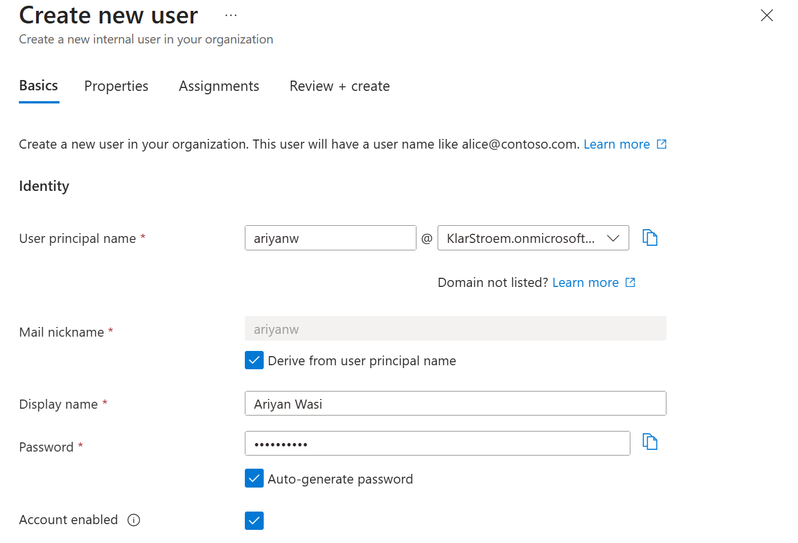
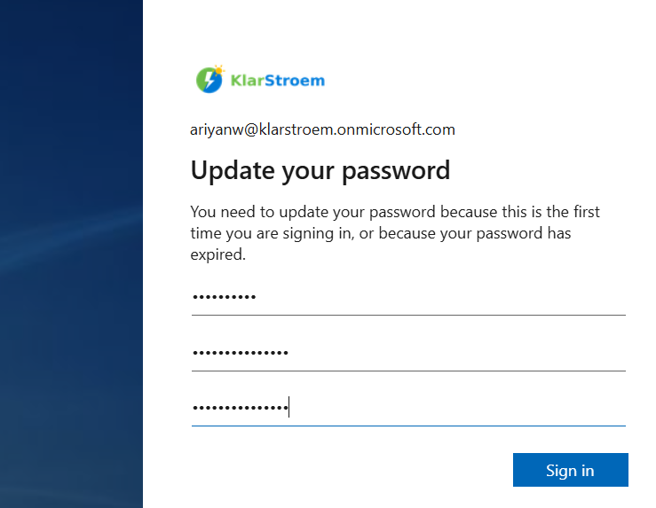

## Create a new user and test their application admin rights

**Task 1: add a new user**

In order to add a new user navigate to: Entra ID -Users - New user

We will only fill out the basic info requiered fields nescessary for creating a new user and wont assign a role yet because we will like top test application creating rights before hand.

**Task 2: log-in and try to create application**

Since it is our first time logging in to the account with the new user we'll then get asked to create a new password after we typed the auto-generated password from user creation.

We will then type a new unique password and since we have enabled security defaults, MFA is then requiered for all users therefore we will be asked to setup MS authenticator.

