# Lab 01: Manage user roles
**[Official Microsoft link](https://microsoftlearning.github.io/SC-300-Identity-and-Access-Administrator/Instructions/Labs/Lab_01_ManageUserRoles.html#experiment-with-managing-users)**

## Exercise 1: Create a new user and test their application admin rights

**Task 1: add a new user**

In order to add a new user navigate to: Entra ID -Users - New user

We will only fill out the basic info requiered fields nescessary for creating a new user and wont assign a role yet because we will like top test application creating rights before hand.

**Task 2: log-in and try to create application**

Since it is our first time logging in to the account with the new user we'll then get asked to create a new password after we typed the auto-generated password from user creation.

We will then type a new unique password and since we have enabled security defaults, MFA is then requiered for all users therefore we will be asked to setup MS authenticator.

Finally, we'll notice that we can't even access entra admin center and therefore wont even be able to navigate to *enterprise application* to create an new app. The reason is that we in a previous lab configued tenant-wide/ user settings and restricted access for all non admins to the Entra admin portal. 

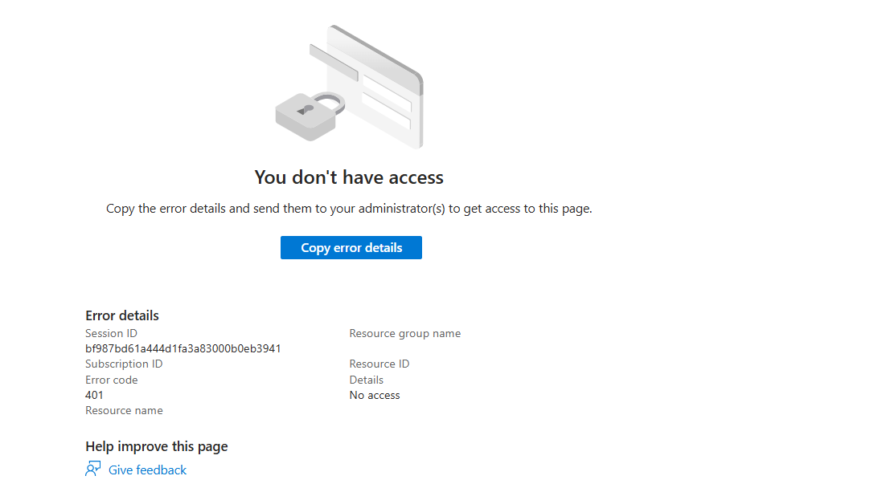

I'll disable the "Restrict access to Microsoft Entra admin center" temporarely just to prove that a non-admin can't create applications without the role assigned, pay attention that the create option is grayed out:

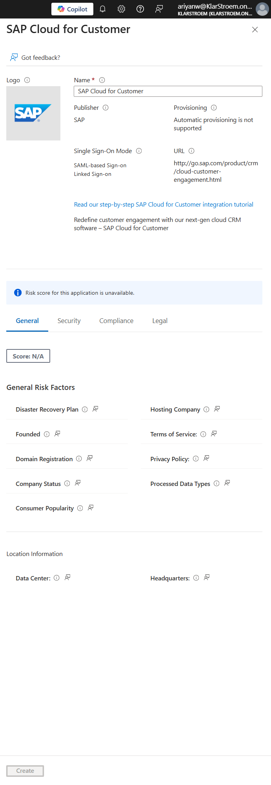

## Exercise 2: Assign the application admin role and create an application

**Task 1: Assign a role to a user**

Lets assign the application administrator role to the user: Entra ID - Users - All users - Ariyan - assigned roles - add assignment: 

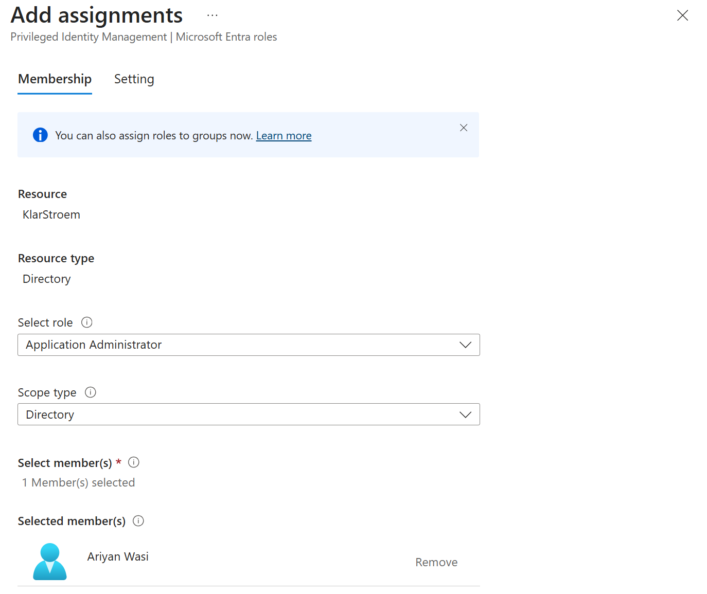

Since we've got the P2 license of Entra ID, this means that admin accounts are protected by PIM and therefore we have to congifure these settings aswell.

Under *assignment type* I chose eligible, this means:
- No standing privileges, meaning user does not the admin role by default
- User has to activate role on demand
- MFA approval, justification enforced at activation
- Role expires after activation threshold time ends

If we on the other hand assign Active instead then:
- Role still stays governed by PIM
- Assignment can be time bound if specified
- Activation step is skipped
- User has standing admin privileges
- Audit and alerts still apply

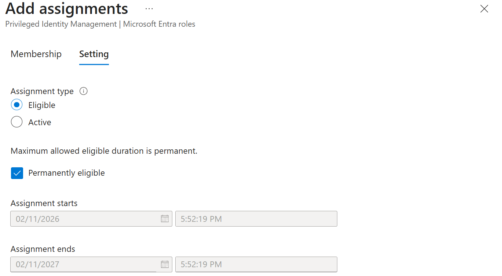

**Task 2: Activate role and check application permissions**

I've just logged in to the Entra admin center as the user Ariyan, to active an eligible role navigate to: ID Governance - PIM - My roles -Eligible assignments - Activate.

After we successfully activated the role we then navigate to Entra ID - Enterprise apps - new application, we will then see that the user is able to create the enterprise application:

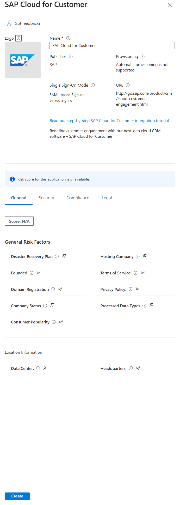

## Exercise 3 - Remove role assignment

There are many ways to remove a role from a user, you can navigate directly to the user and remove it there or you can go to: Entra ID - Roles and admins - All roles. 

Here I typed Application administrator in the search bar and removed the role from the user:

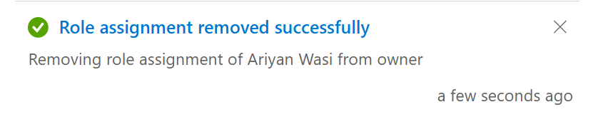

## Exercise 4 - Bulk import of users

**Task 1: Bulk operations for creating users with a .csv file**

Microsoft provides a template for bulk upload that i've downloaded: Entra ID - Users - All Users - Bulk operations - Bulk create. 

I then downloaded the the .scv template: 

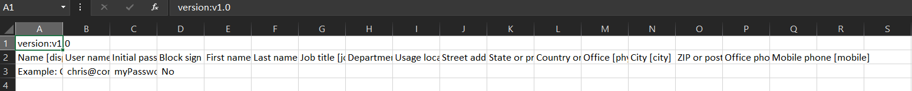

You can modify and populate the template directly into Excel, but another option is to open the file in Notepad. You do not have to fill out all the fields, the mandatory ones are:
- Name (displayName)
- User name (userPrincipalName)
- Initial password
- Block sign in (accountEnabled)
- First name (givenName)
- Last name surname
- Usage location

NOTE: when editing the .csv file in Notepad and only choose to include the mandatory fields, you still have to place commas between fields you do not include meaning that if you leave out a field you still have to place a comma for that field and leave it empthy:

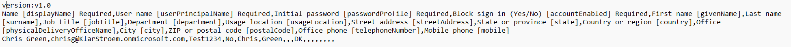

I then save the file still as a csv file and uploaded it in Entra ID - Users - All Users - Bulk Operations - Bulk create:

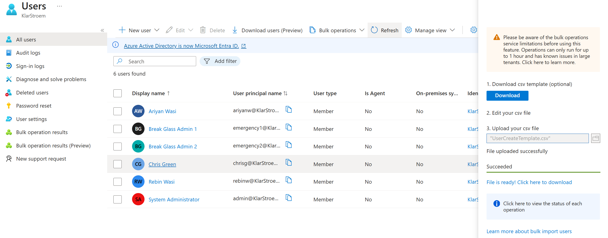

**Task 2: Bulk addition of users using PowerShell**

1. We'll need to ensure that we have PowerShell version 7.2 or later
2. We have to instal Microsoft.Graph PowerShell module: **Install-Module Microsoft.Graph -Scope CurrentUser -Verbose**
3. Confirm that the module is installed: **Get-InstalledModule Microsoft.Graph**
   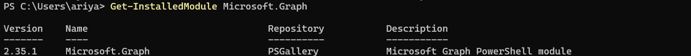
4. Login to Microsoft Graph API: **Connect-MgGraph -Scopes "User.ReadWrite.All"**
     - Edge browser opens and I got promted to login
5. Verifying that i'm logged in correctly: **Get-MgUser**
   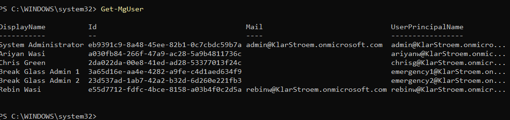
6. Assigning a common temporary password for all new users:
   
7. Create the new user using PowerShell, I used following script:
   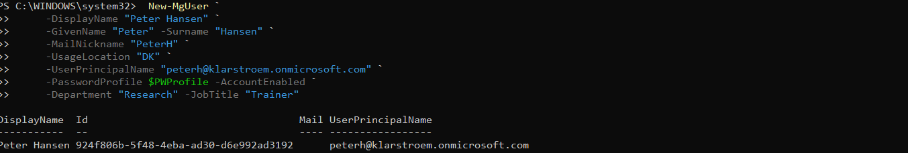

Now, we see that the new user "PeterH" has been successfully created. I tried to log-in with the new user, and since I set the *ForceChangePasswordNextSignIn* to true it forced me to create a new password after I typed the temporary password. 

## Exercise 5 - Remove a user from Entra ID

**Task 1: Remove a User**
1. To remove/ delete a user from the tenant, navigate to: Entra ID - Users - All users and select the user.
2. After I have selected the newly created user I simply click delete:
   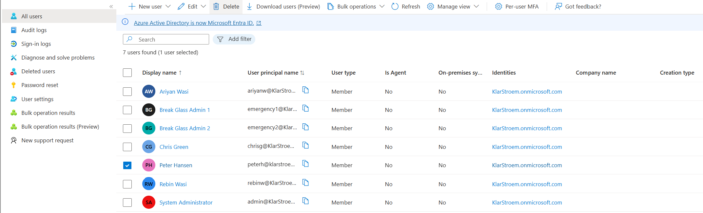

**Task 1: Restore deleted user**

A deleted user gets moved to the deleted user tab, and will remain there for 30 days and then get permanently deleted. This means that we have the ability to restore the user before the 30 days have pass and if we haven't forced permanently deletion of the user inside the deleted users tab. 

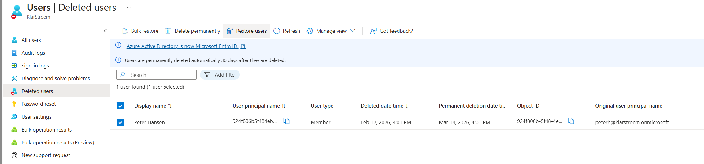

## Exercise 6 - Add a Windows 10 license to a user account

**Task 1: Find your unlicensed user in Entra ID**

Lets ensure that the user does not have any licenses assigned before we go ahead and assign one.
- Entra ID - Users - All users - PeterH - Licenses:
  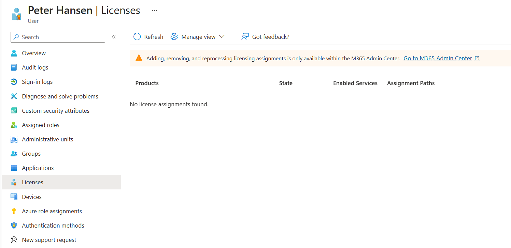

**Task 2: Add a Windows License to the user**

