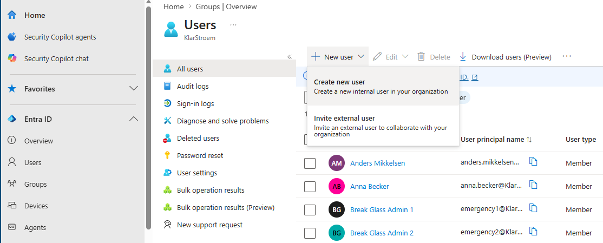
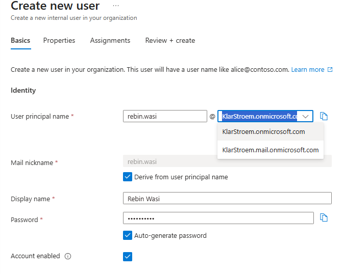
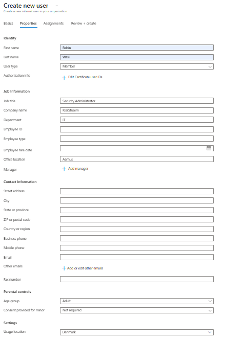
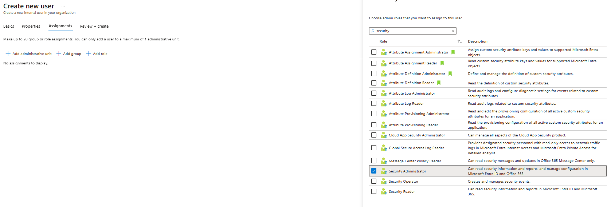
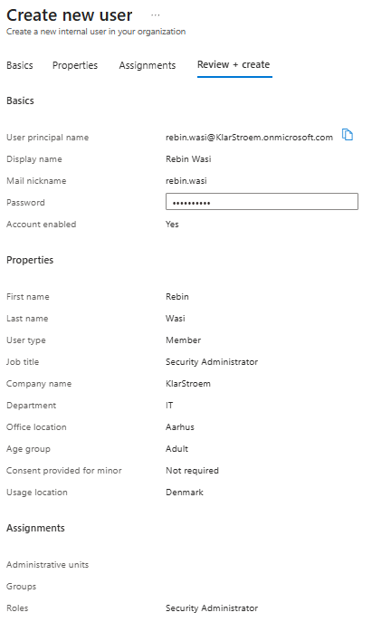

# Create and manage cloud users

## Overview
Creating user accounts is one of the first steps in the identity lifecycle. Before a user can sign in. Before a user can sign in, recieve licenses, become member of a group, or access applications, the user first needs an identity. In lange organizations this process is often automated through user provisioning, but in this lab i'll create the account manually to show how it works in Entra ID.

In my lab environment, I'm running a hybrid identity setup where Active Directory is the source of authority. This means that any user acoount that needs to exist both on-premise and in Entra ID should always be created in Active Directory first and then synchronized to the cloud using Microsoft Entra Connect.

Because synchronization only works one way, user acoounts created directly in Entra ID are not synchronized back to Active Directory. Those users remain cloud-only identities. I've already covered the process of creating hybrid user accounts in my Active Directory project, so I won't repeat it here. Instead, this lab focuses on creating and managing cloud-only user accounts directly in Entra ID.

Instead of creating a rondon account,I'll create a dedicated cloud-only admin account. The account that creates the Microsoft Entra tenant automatically becomes the first Global Administrator, but following the principle of least privilege, that account shouldn't be used for everyday tasks. I'll use this new account throughout the rest of the project as I implement and test different admin roles, but for now i'm just going to create the identity.

## Objectives
- Create cloud-only user account
- Configure required user properties
- Verify successful user creation
- Understand the characteristics of cloud-only users

## Environment
- Identity Provider: Entra ID
- Licenses: Microsoft 365 E5
- Tenant: KlarStroem
- Role used: Global Administrator
- License requirements
  - For this lab so far none  

## Implementation
#### Step 1: Getting started creating the user
Lets start creating our new user. As I mentioned previously this user is going to serve as my go-to user for the entire project. 

To start creating a new user in Entra ID, we simply navigate to:
1. Open Microsoft Entra Admin Center
2. In the navigation menu to the left we clik on **Entra ID** and then **Users**
3. Click on the **New User** Option and then **Create new user**

#### Step 2: Provide the basic user information
In the *Basics* window wee need basically need to fill out:
1. User principal name: this is basically the login name. I chose to write rebin.wasi because my fictional company policy says UPN names should follow this structure: firstname.lastname@domain
2. Mail nickname will automatically be filled out since we checked the *Derive from user principle name* option, meaning it will automatically create the *Mail nickname* from the information in User principle name.
3. Display name: This is going to be the name that will be displayed
4. Password: We can choose to uncheck the *Auto-generate password option* and instead fill out a password manually. Regardless of how we choose to create the password it has to be sent/ given to the user, who will then be forced to create a new one first time logging in.
5. I choose to enable the *Account enabled* option to ensure the account will be active right after creation.

#### Setp 3. Fill out the Properties tied to the user
In this window all the different properties are optional, meaning we can actually create the user without providing any additional properties to the user. Still, it is important to mention that real organizations would specify in their user creation policy what has be filled out. Since These user properties often are used by applications, conditional access polies, dynamic group creation and much more, it is then highly recommended that we fill out as much as possible because these features rely on exactly these attributes. Also another important thing to mentioned is that we cannot assign licenses to users if we havent specified **USAGE LOCATION**, it is a requirement that this is filled out if we want to assign the user a license.

For this user i'm not going to fill out all the properties only the following:

#### Step 4: Assigning the security administrator role
In the *Assignments* window, we can directly add the user to a *administrative unit*, a group or directly assign a role to the user. 

I'm going to cover Administrative units in a seperate lab and different group types in another aswell. For now I will simply assign the user the Security Admistrator role.

I'm also going to document roles and role assignment in depth in a seperate lab later in the project.

#### Step 4: Review user properties and create the user
In this last step we're simply given an overview of user and the properties we chose to provide. Since I agree with the following shown in the picture below, i'm then going to press create.

## Verification

## Results  

## Lessons Learned  

