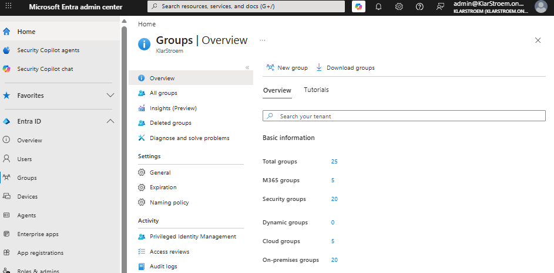
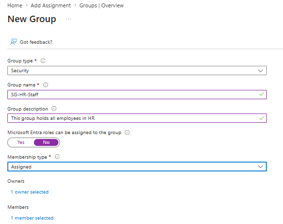
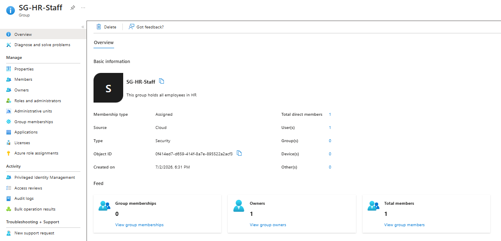
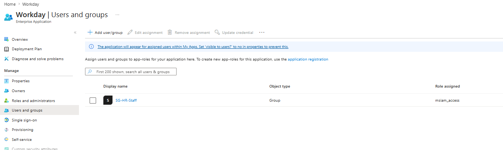
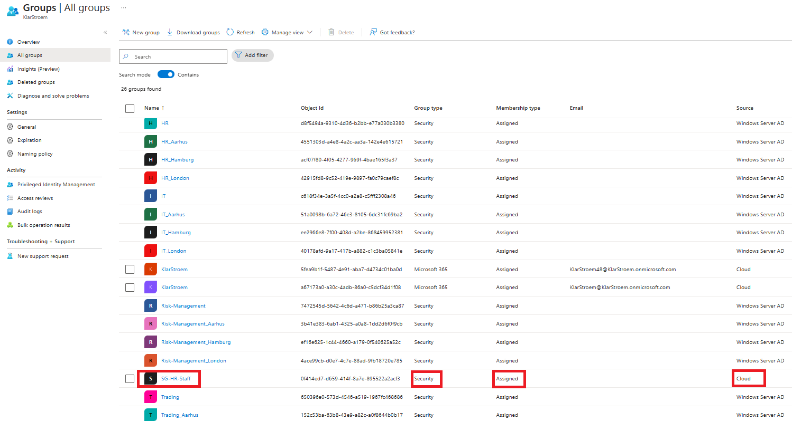
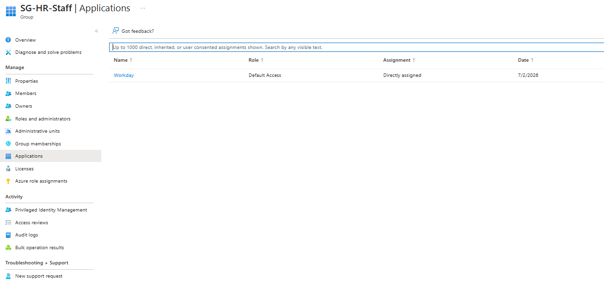
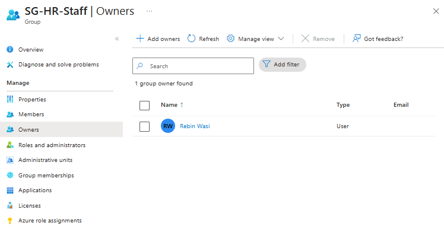
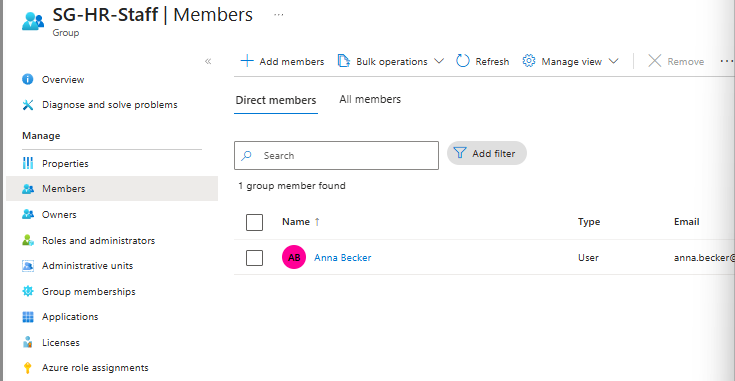

# Creating, configuring and managing security groups

## Overview
There are two main group types in Microsoft Entra ID: **Security Groups** and **Microsoft 365 Groups**. These groups are used to organize and manage identities, making it much easier to manage access in larger environments. In this lab, i'm going to focus on **Security Groups**

Security Groups are the most common group type in both Microsoft Entra ID and on-premise Active Directory. Their main purpose is to manage access to resources by assigning permissions to a group instead of to individual users.

In on-premise Active Directory, you have the option to create either a Security Group or a Distribution Group. While the comparison isn't exactly 1-1 match, I think it's useful to compare them like this:
- On-premise Security Group -> Entra ID Security Group
- On-premise Distribution Groups -> Microsoft 365 Groups

I already have a few security groups in my tenant that were synchronized from my on-premise Active Directory using Microsoft Entra Connect. For this lab, i'm going to create the security group directly in Entra ID to show how it is done. Since the group is created in Entra ID, it will be a cloud-only security group. Users and groups created on-premise can be synchronized to Entra ID, but synchronization does not happen the other way around, thats why they stay cloud-only.

Security groups can have to membership types. The group can either use **Assigned** membership, where users are added and removed manually, or **Dynamic** membership, where users are added and removed automatically based on a set of rules.

In this lab, I'll create an **Assigned Security Group** and manually add users to it. In the next lab. I'll take a closer look at Dynamic security groups and how dynamic membership works.

Security Groups also supports:
- Group nesting
- Group-based lisencing
- Can contain other identities such as Service Principles and Devices

## Objectives
- Create an Assigned Security Group in Entra ID
- Configure the groups's basic settings
- Manually add users to the group
- Assign an application to the group
- Verify that the group and its membership have been created successfully

## Environment
- Identity Provider: Entra ID
- Licenses: Microsoft 365 E5
- Tenant: KlarStroem
- Role used: Global Administrator
- License requirements: None  

## Implementation
#### Step 1: Start creating a group
To start creating a group in Entra ID:
1. Navigation bar -> **Groups**
2. Pree **New Group**

#### Step 2: Fill out basic information
1. **Group Type:** Here we have the option of choosing between creating a Security Group or a Microsoft 365 Group. For this lab we're going to choose Security Group
2. **Group Name:** I'm simply going to name the group SG-HR-Staff
3. **Group description:** I just have the group a simple description as seen on the picture below
4. **Microsoft Entra Roles can be assigned to the group:** This lets us chose specific Entra roles that can be assigned to the group so that any user that gets assigned to the group will automatically get the chosen role assigned. For this lab i'm not going to assign an Entra role to the group. Also onece the group has been created this can not be changed, and in addition it only supports the assigned membershiptype.
5. **Membership type:** Here I'll have to choose between an assigned group, Dynamic User Group or Dynamic Device Group. I chose the Assigned option, and as mentioned ealier this means the administrator would have to add or remove users manually.
6. **Owners:** Adding a owner is a way to delegate permissions. The owner you assign to the group does not have to hold any administrator role, and if added the owner would only be able to administrate the group, like adding or removing users witch fits perfectly with the principle of least privledge.
7. **Members:** Here we'll directly assign users to the group, we can of course also add additional users later. Here we can actually also choose to add another group "Group-nesting", devices or enterprise applications if it would sense. For this lab I simply chose a single user working in HR.

I then simply pressed create and the Assigned Security Group had now been created:

#### Step 2: Reviewing and additionally configuring the group
Now that we have successfully created the group, we can navigate to the group and see additional information and further configure/ reconfigure the group.
- Entra ID -> Groups - > SG-HR-Staff
- 

I'm not going to go through all the options in detail, but a quick description:
1. Properties: Gives an overview over the general settings for the group
2. Members: Shows all the assigned members
3. Owners: Shows who can manage the group
4. Roles and administrators: This would only we relevant if I had configured the group with the **Microsoft Entra Roles can be assigned to the group** option enabled. For this reason, i'm going to cover this in another lab were I'll create a group with this option enabled.
5. Administrative Units: A security group can be assigned to an AU. this does not affect the group's permissions or membership. It allows to delegate administrative managment of the group to admins responsible for that specific AU. I'm going to cover AU in a seperate lab, but for this lab I have not assigned the group to any AU.
6. Group membership: shows if the group is a member of another group, this is where group nesting is represented.
7. Applications: This shows witch Enterprise Application have been assigned to the group. In other word it shows what applications the group and its users can access.
8. Licenses: Shows weather we have assigned any license to the group.

I won't cover all of the options, but I covered the most important ones. I'll instead go ahead and assign an Enterprise application to the group, so that every user inside the group will get access to.

To do this I navigate to:
1. Entra ID -> Enterprise applications -> Workday
2. Users & Groups -> Add user/group
3. I'll choose the SG-HR-Staff group and press assign

## Verification
#### Test 1:
We can simply start by verifyiing that the group has been created, and that it's the correct configuration. This verifies that the group have been created correctly.
- Name = SG-HR-Staff
- Group Type = Security
- Membership Type = Assigned
- Source = Cloud

#### Test 2: Verifying Workday has been assigned to the group
I do not have full access to the application, but I still can verify that the application has been successfully assigned to the group. I simply went navigated to the group and then chose the application option on the left:

#### Test 3: Verify Group ownership
To see if the chosen user have been assigned as the owner of the group we can simply take a look at the *Owners* blade in the group overview:

#### Test 4: Verify user have been assigned to the group
To verify membership of the user Anna, I simply navigated to the group overview and then chose the *Members* blade:

## Results  
Successfully created an assigned security group, manually added users, and verified the group's configuration and membership.

## Lessons Learned  

