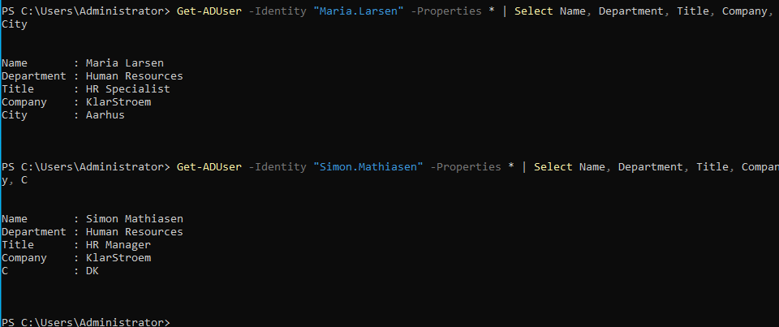
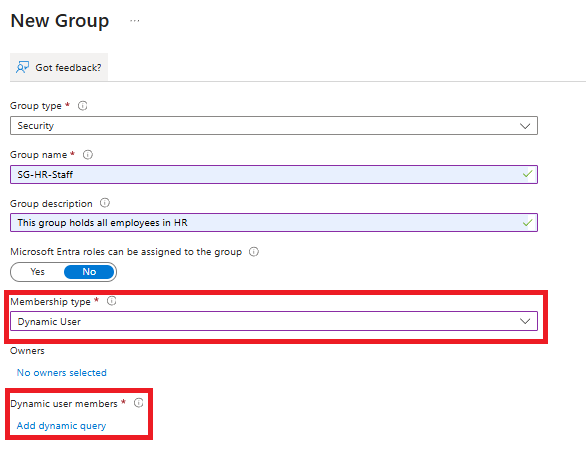
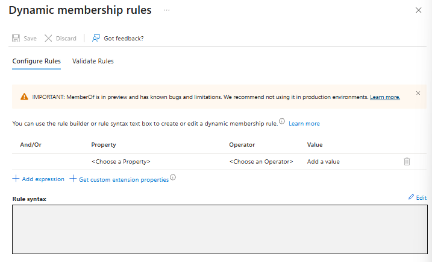

# Creating and configuring dynamic groups

## Overview
In the previous lab I covered the charataristics of different groups in Entra ID, and for the first group exercise I created and explained assigned security groups. In this lab i'm going to do the same but instead the focus will be on creating a **Dynamic Security Group**, and most importantly i'm going to show how to create those rules that will determine membership to the group.

Once again just to give an explanation on what exactly a **Dynamic Security groups** is and the charactaristics:
- **Rule-based membership:** membership is determined by user or device attributes, these attributes can forexaample be department, country, job title, or device ownership.
- **Automatic updatesL:** When an attribute changes, Entra ID automatically reevaluates the rule and adds or removes an object from the group.
- **User or Device groups:** Dynamic groups can contain either users or devices. The membership rule applies to one object type only.
- **Security Groups:** Used to assign permissions, conditional access policies, intune policies, application/resource access and licenses.
- **No manual membership:** membership is controlled entirely by the rule, this means that users/devices cannot be added manually
- **Licensing:** Group-based licensing is one of the most common reasons organizations use security groups in general
- **Reduced administration:** Admins don't need to manually maintain membership, this reduces errors and administrative effort.

The goal here isn't to cover all the possible attributes that can be used in the rules. Instead I see the value in understanding how to automate group membership so that we do not have to manually add and manage users.

## Objectives
- Create a Microsoft Entra dynamic security group
- Configure the groups's basic properties and membership type
- Create a dynamic membership rule based on user attributes
- Confirm that users are automatically added or removed when they meet or no longer meet the rule
- Explain some of the common user attributes for dynamic group membership

## Environment
- Identity Provider: Entra ID
- Licenses: Microsoft 365 E5
- Tenant: KlarStroem
- Role used: Global Administrator
- License requirements
  - **As a minimum the P1 or higher license is required for the users who benefits from the dynamic membership feature**

## Implementation
#### Step 1: Ensure the right attributes are set and synchronized to Entra ID
In the last lab I created a assigned security group named SG-HR-Staff were I of course manually added the users. I went ahead and deleted the group and will now recreate the same group, but just as a dynamic security group instead.

Before I start creating the dynamic security group, I just want to mention that I have updated some attributes related to two users. I updated the attributes in my on-prem enviroment because those two users are hybrid identities and therefore the source of authority is Active Directory in this case. After I updated the attribues I went ahead and forced a synchronization by running a PowerShell command, just to ensure the changes would be synchronized right after attribues were updated.

These are the two users, and some of the attributes we're going to build the syntax rule around:

#### Step 2: Start creating the Dynamic Security Group
Now that I know witch attributes i'm going to build my rules around, I'm then ready to start creating the Dynamic security group.

Inside Entra ID, I navigate to:
1. Entra ID blade -> Groups
2. Press New Group

From here I just filled out the basic properties for the group. It's important to chose the **Dynamic User** option under Membership type

#### Step 3: Navigate to the rle builder
We're now ready to add the dynamic query that will determine who becomes a member of this group. We cannot create the group until a query has been added, I have marked the option in the screenshots above where it says *Add dynamic query*. If we click on this option it takes us to the rule builder:

#### Step 3: Start creating the rules
The dynamic rule consists of three main components:
- **Property:** The user or device attribute that the rule evaluates
  - Examples: Department, jobTitle, city, employeetype and many more and even custom ones.
- **Operator:** Defines how the property is compared to the last component "The Value"
  - Examples: -eq (equals), -ne (not equals), -contains. startsWith, -and, -or
- **Value:** The value that the property is compared against
  - Examples: HR, Manager, Aarhus, Denmark and so on 

## Verification

## Results  

## Lessons Learned  

Sign-in logs  
Audit logs  
Provisioning logs  
PIM audit history  
Diagnostic settings  
Workbooks 

