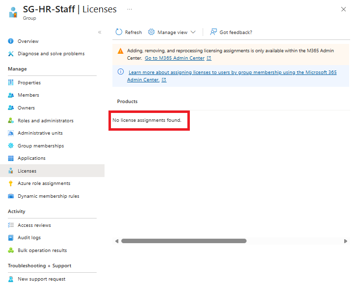
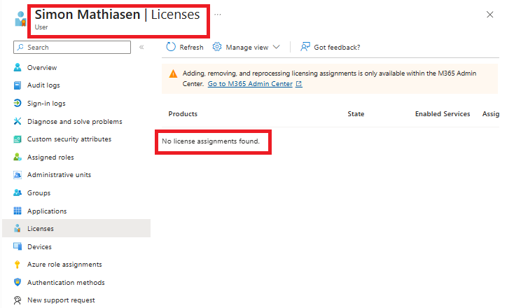
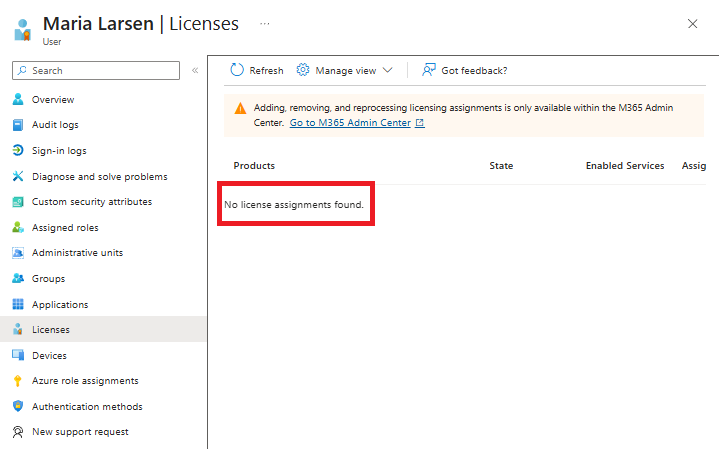
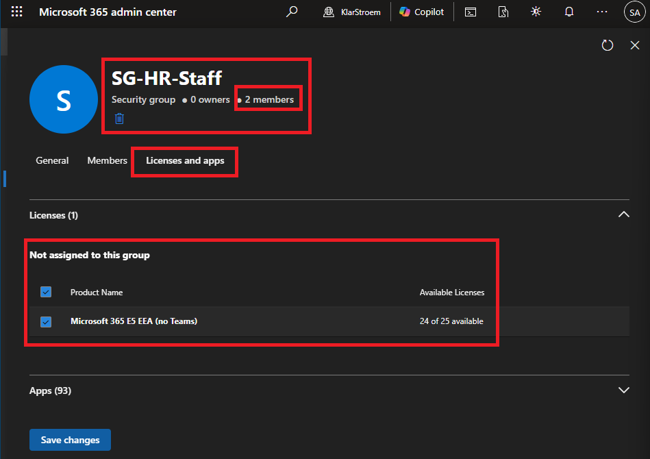
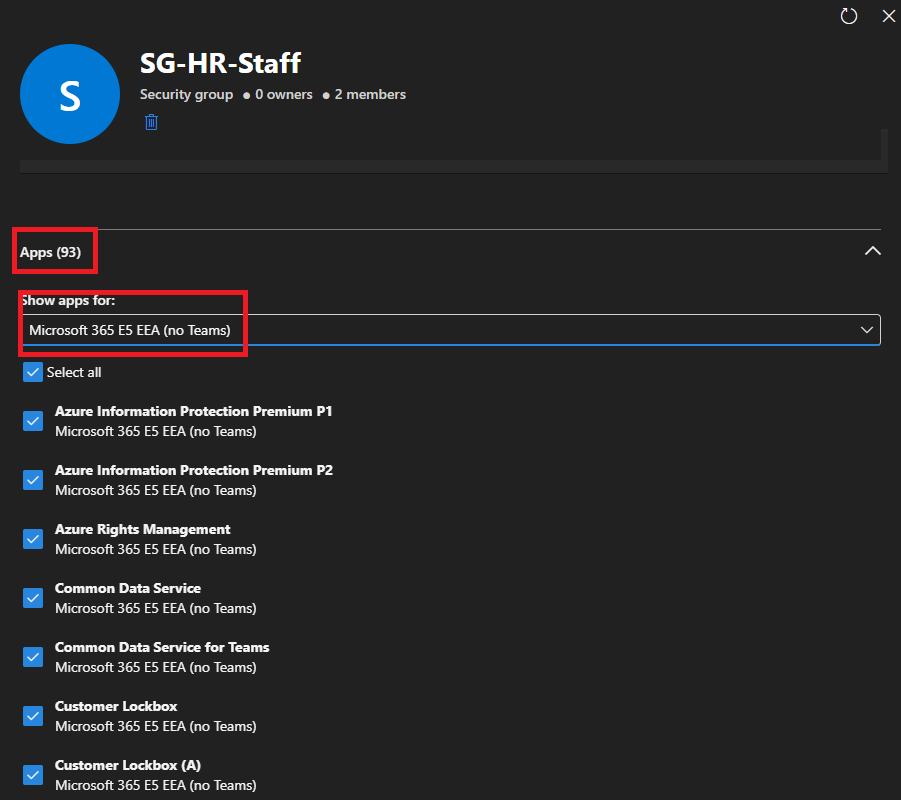
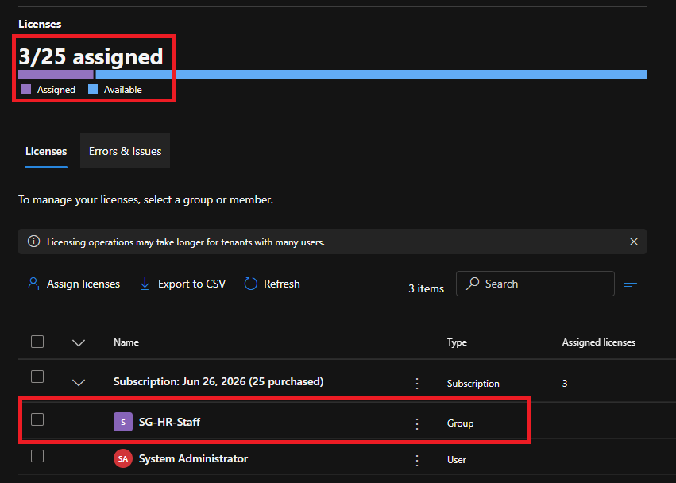
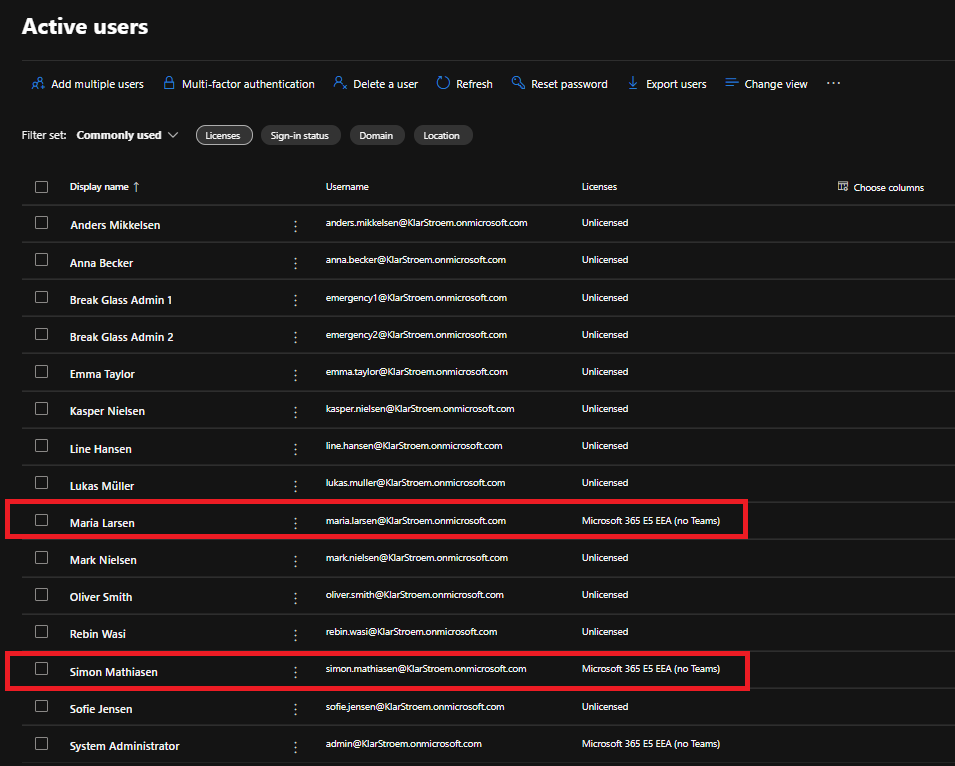
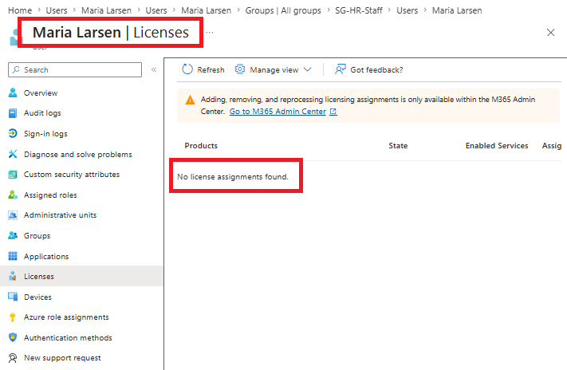

# Assign licenses using group-based licensing

## Overview
In a previous lab we created a dynamic security group named SG-HR-Staff. I'm going to reuse the dynamic group to automatically assign licenses to users. Group-based licensing lets you assign a license to a group, and everyone who becomes a member of that group will have have the license automaticallly assign. This also works the other way around, meaning if a user gets removed from the group the license will then automatically be removed as well.

This is an important feature in my opinion because just like with dynamic groups this also automates an important process, in this scenario assigning licenses to users. Not only does it automate the process, it also reduces mistakes, and therefore this approach is considered more secure. It is also important to mention that group-based licensing requires the tenant to have a P1 license as a minimum.

Group-based licensing supports both
- Security Groups
- Microsoft 365 Groups

## Objectives
- Reuse the SG-HR-Staff security group for group-based licensing
- Apply the E5 license to the security group
- Verify that members of the security group automatically gets the E5 license assigned
- Verify that the license gets removed if a user no longer is a member of the group the license is assigned to

## Environment
- Identity Provider: Entra ID
- Licenses: Microsoft 365 E5
- Tenant: KlarStroem
- Role used: Global Administrator
- License requirements
  - **As a minimum the P1 or higher license is required for the use of group-based licensing**

## Implementation
#### Step 1: Verify that the group and its members do not have any licenses assigned
Normally, I would place this step in the verification section of the lab. Still I think it is important to verify that the group and its members do not have any license assigned before we go ahead and assign the license to the SG-HR-Staff group.

To verify this I simply went to the group page and opened the SG-HR-Staff specific group:
1. Microsoft Entra ID -> Groups
2. Press *All Groups*
3. Find and open *SG-HR-Staff*
4. Under overview press *Licenses*

Now that we have confirmed that the group doesn't have any license applied yet, lets then also confirm that the member user Simon Mathiasen doesn't have any license applied directly to the user.

In the SG-HR-Staff groups overview:
1. Press Members
2. Press on the member Simon Mathiasen
3. Go to licenses

I did the same thing for the second user named Maria

This confirms the members of the group doesn't have any license assigned at this point.

#### Step 2: Assign the license to the dynamic security group
To assign the Microsoft E5 License to an already existing group is quite simple. The most important thing to remember is that, no matter if we're assigning licenses directly to a user or to a group we need to assign the licenses through the Microsoft Admin Portal and not through the Microsoft Entra Admin Center.

So we need to open Microsoft 365 Admin center, and once there we navigate to:
1. Under the navigation menu -> Groups -> Active Groups
2. Click on Security Groups
3. Find and open SG-HR-Staff
4. Click on Licenses and apps

Once here we'll see an overview over the current licenses our tenant hold and if there are any assigned to the group. We have the Microsoft E5 license available and therefore i'm going to check that one and press save changes.

At this point we have assigned the license to the SG-HR-Staff group. This means that the Microsoft E5 license should be automatically assigned to the members of the group. Also as we can see on the picture there is an dropdown menu that shows all the different apps, tools and features that is included in the license, and we can choose to uncheck any of these if these arent relevant for the users thats going to have the license assigned, this follows the principle of least privledge

## Verification
#### Test 1: Verify that the group and its members have the license assigned
There are different ways to verify that the licenses have been assigned. Since i'm already inside the Microsoft 365 Admin center i'm simply going to verify it from there.

First lets verify that the SG-HR-Staff group has the license assigned to it. There are several ways to confirm the license has been assigned, but since i'm already inside the Microsoft 365 Admin center i'm just going to confirm it from here, in the navigation menu:
1. Billing
2. Licenses
3. Click on the Microsoft 365 E5 license

From the screenshot we can se that the license has been applied and assigned to the SG-HR-Staff group. Also pay attention to the fact that it says that 3/25 licenses have been assigned. We can see one license have been directly assigned to the system admin and a license has been applied to the SG-HR-Staff group witch holds 2 members that got the license assigned automatically. This also confirms that a group doesn't consume a license but only its members:

#### Test 2: Verify members got the license assigned
We should also confirm to be sure that the two members of the SG-HR-Staff group gor the Microsoft E5 license assigned through the dynamic security group. To confirm the license have been correctly assigned I navigated to the navigation menu and from here:
1. Users -> Active users

The overview confirms that our two users got the correct license assigned:

#### Test 3: Remove user from the security group and verify license gets removed automatically
One last test I think is benefitial and important, is to ensure if a user gets removed from the security group, that the user also gets the license unassigned automatically.

To test this I changed the department attribute on the user Maria. Since our Security group is a dynamic security group and the *department* property is included in the dynamic membership rule, changeing the department should automatically remove the user from the group and thereby the user should also get the Microsoft E5 license unassigned automatically. 

Since my user is a hybrid user, I then changed the department attribute in Active Directory from Human Resources to Service desk, and right after I forced a synchronization from my Sync01 server for the chages to take affect in Entra ID.

After the attribute had been changed and updated in Entra ID, I confirmed that Maria was no longer a member of the SG-HR-Staff group and also confirmed that she no longer had the license assigned:

## Results  
We successfully applied the Microsoft E5 license to the SG-HR-Staff group, and also confirmed that its members automatically got the E5 license assigned to them. In addition we confirmed removing a user from the group also meant that the user automatically had the licensens unassigned.

## Lessons Learned  

