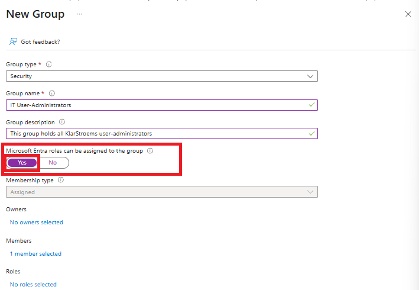
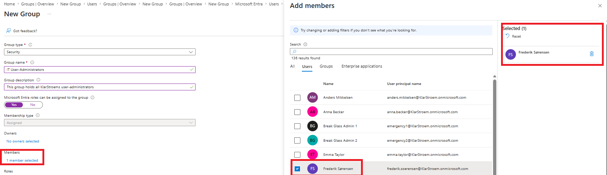
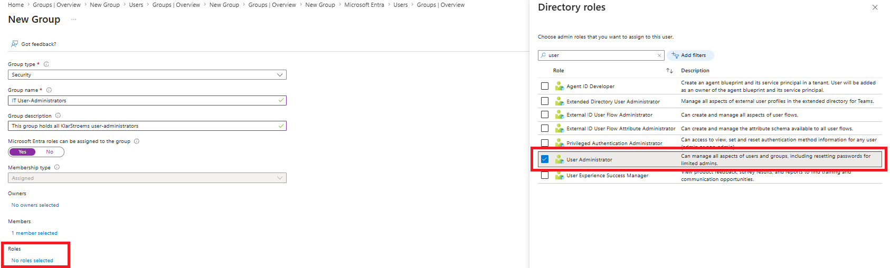
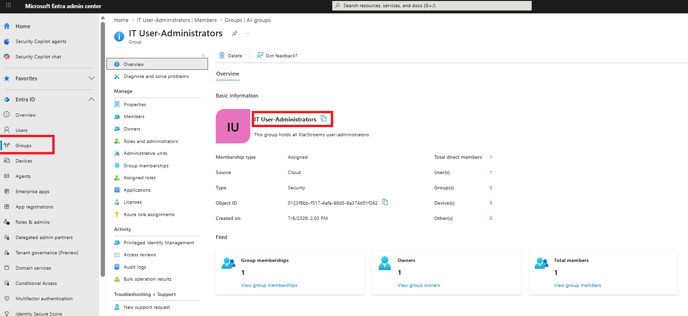
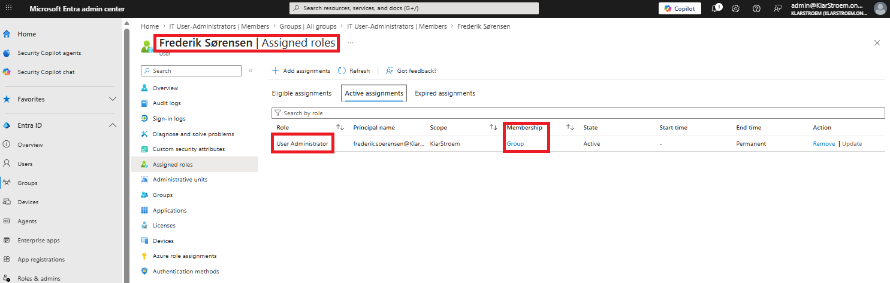
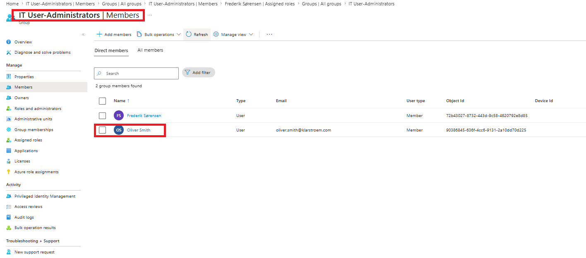
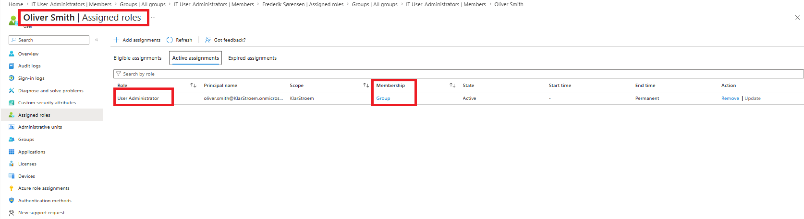
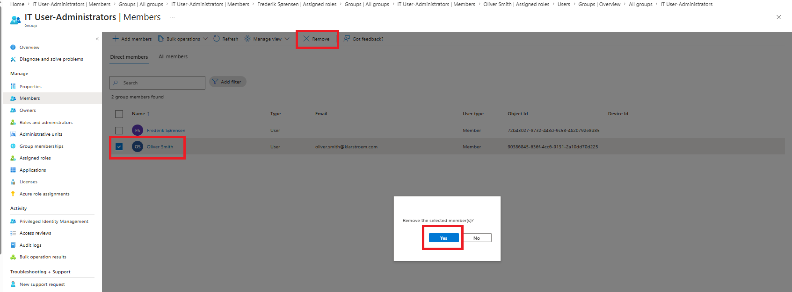
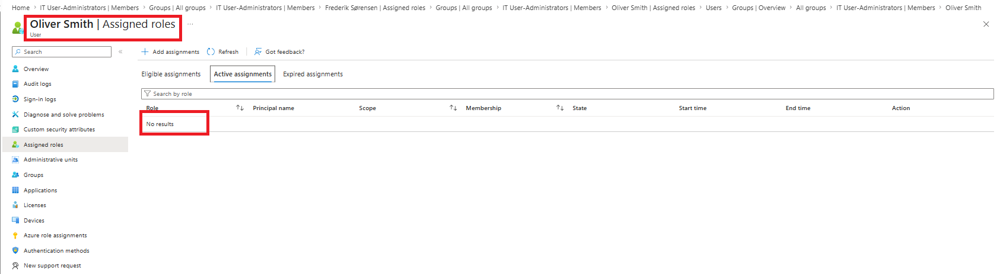

# Create and administrate Entra role assignable groups

## Overview
Role-assignable groups are special security groups in Entra ID that are designed to simplify the management of administrative roles. Instead of assigning a privieged role directly to each administrator, the role is just assigned to the group, and every member of the group will automatically have the role assigned and get the same permissions. This makes it easier to onboard new administrators, remove access when someone changes roles, and manage privileged access in the organization.

Role-assignable groups must use assigned membership. Dynamic membership is not supported because administrative roles should always be granted manually to prevent mistakes from happening.

Role-assignable groups:
- Requires at least a P1 license
- Supports all Microsoft Entra roles
- Supports custom roles
- Supports both Security groups and Microsoft 365 groups
- One or several roles can be assigned to a single group
- One a group is configured the option for creating a role-assignable groups can't be changed, so a already non role-assignable group can't be changed to role-assignable group
- Role-assignable groups do not support dynamic membership
- Group-nesting is not supported

For this lab i'm simply going to create a role-assignable group to group all KlarStroems user administators. I will therefore assign the role directly to the group instead of the users, and if configured correctly the members of the group should automatically get the role assigned, and if removed from the group, then the role should also automatically be unassigned.

## Objectives
- Create a role-assignable group in Entra ID
- Add and manage members of the group
- Assign the user administrator role to the group
- Verify that group members automatically gets the role assigned
- Verify that removing a user from the group also removes the administrative role
- Understand how role-assignable groups simplify the management of privileged access

## Environment
- Identity Provider: Entra ID
- Licenses: Microsoft 365 E5
- Tenant: KlarStroem
- Role used: Global Administrator
- License requirements
  - **As a minimum the P1 or higher license is required for the use of group-based licensing**

## Implementation
Before I start creating the group, I just quickly created a user named Frederik Sørensen to later become a member of the IT User Administrator group.

#### Step 1: Start the creation of the role-assignable group
Just like creating any other group, we start out in the navigation menu to the left in Entra ID Admin center:
1. Entra ID -> Groups
2. Click on *New Group*

From here we configure the basic information as seen on the screenshot below. The most important thing is to set the *Microsoft Entra roles can be assigned to the group* to yes.

#### Step 2: Assign an owner, members and the user-administrator role to the group
Choosing an owner for a group is different depending of the type of group that is being created. Forexample the owner for a Microsoft 365 group could be and is typically the person responsible for the team or department. For a security group the owner would typically be an application owner or an IT administrator. For a role-assigned group it is a bit different since the groups grants privileged access. This means the owner would typically be someone responsible for identity administration such as:
- Identity Administratior
- Privileged Role Administrator
- Global Administrator
- IAM Team Lead

For this lab, i'm just going to choose myself as the owner of the group simply because I haven't created any other role at this point that would be suitable for a role-assignable group.

Now, i'm going to choose the user mentioned in the beginnig of this lab "Frederik Sørensen", to become a member of this group:

Next, i'm going to choose the role to be assigned to the group. As you can see on the screenshot below, I have chose the User-Administrator role, and right after clicked *selected*:

#### Step 4: Verify basic congiguration
As shown on the screenshot, I have filled out all the basic information required for the group and also chose an owner, members, and the role to be applied to the group:

After I had verified the configuration, I simply clicked on *Create*

## Verification
Now we need to verify that the group has been created, and that the member user holds the user-administrator role.

#### Test 1: Verify that the group has been created
If we navigate to the groups page in Entra ID, we can now see that the role-assignable group IT User Administrator has been created successfully:

#### Test 2: Verify that the user-administrator role is assigned to members
Lets navigate to the member of the newly created group, and verify that the user-adnministrator role has been assigned to the user Frederik:

#### Test 3: Add another member to the group
Lets add another user to the IT User Administrator group to ensure that the user will get the role automatically assigned. To do this I once again navigate to the *IT User Administrators* group page -> Members -> Add members:

Then I simply click on the user Oliver -> Assigned roles:

To finish it off, I'd like to ensure that when a user is removed from the group, that the user then automatically gets the role unassigned. I therefore manually removed Oliver from the group and then went into Oliver's user page under Assigned roles to verify that Oliver no longer holds the User Administrator role:

## Results  
We successfully created a role-assignable group named *IT User Administrators*, and we assigned the user-administrator role to the group. We then verified that members of the group would automatically inherit the role assigned to the group, and in addition to that we also verified that removing a user from the group also meant that the user would have the role automatically unassigned.

## Lessons Learned  
Learning material:
- [Use Microsoft Entra groups to manage role assignments](https://learn.microsoft.com/en-us/entra/identity/role-based-access-control/groups-concept)
