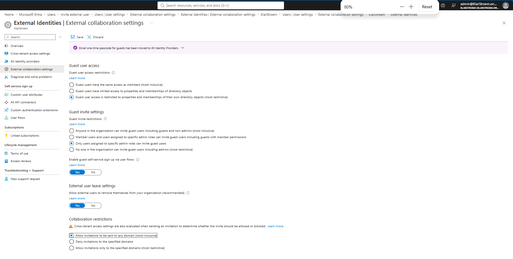
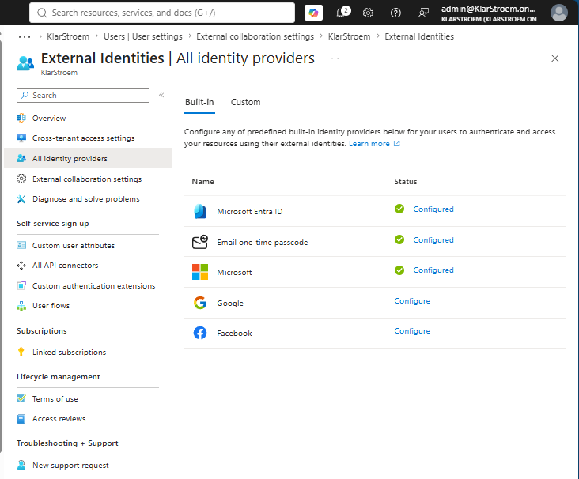
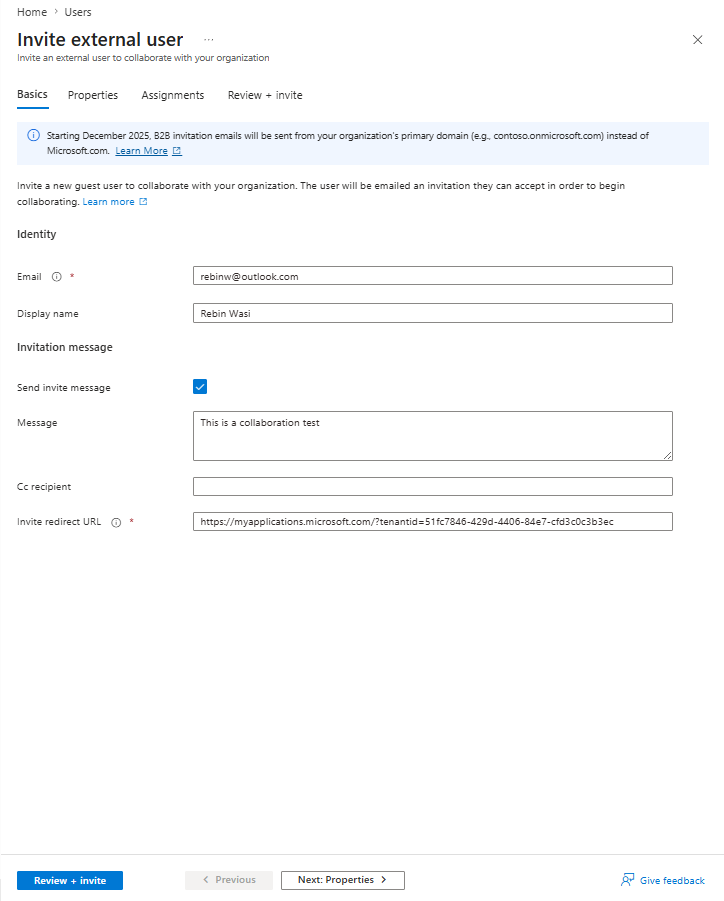
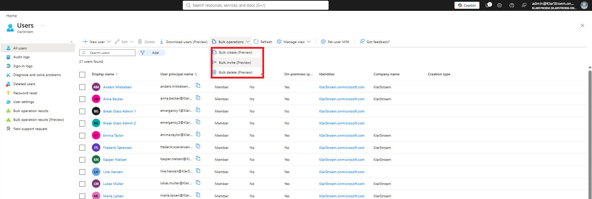
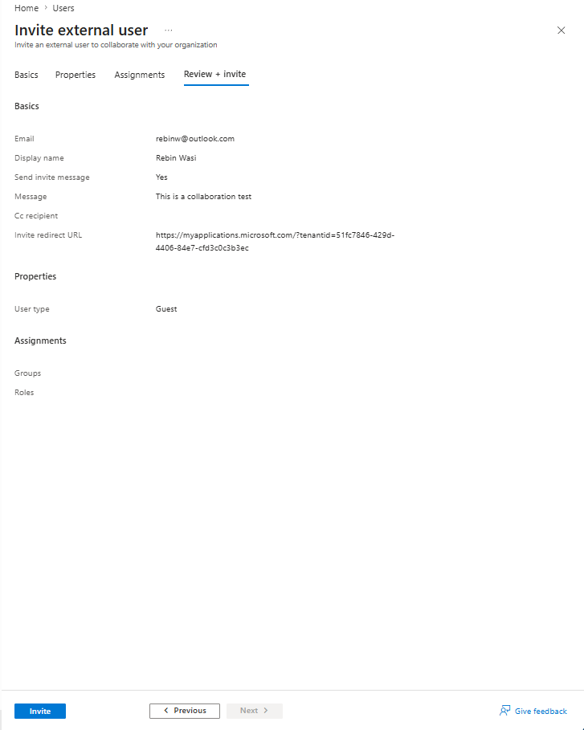
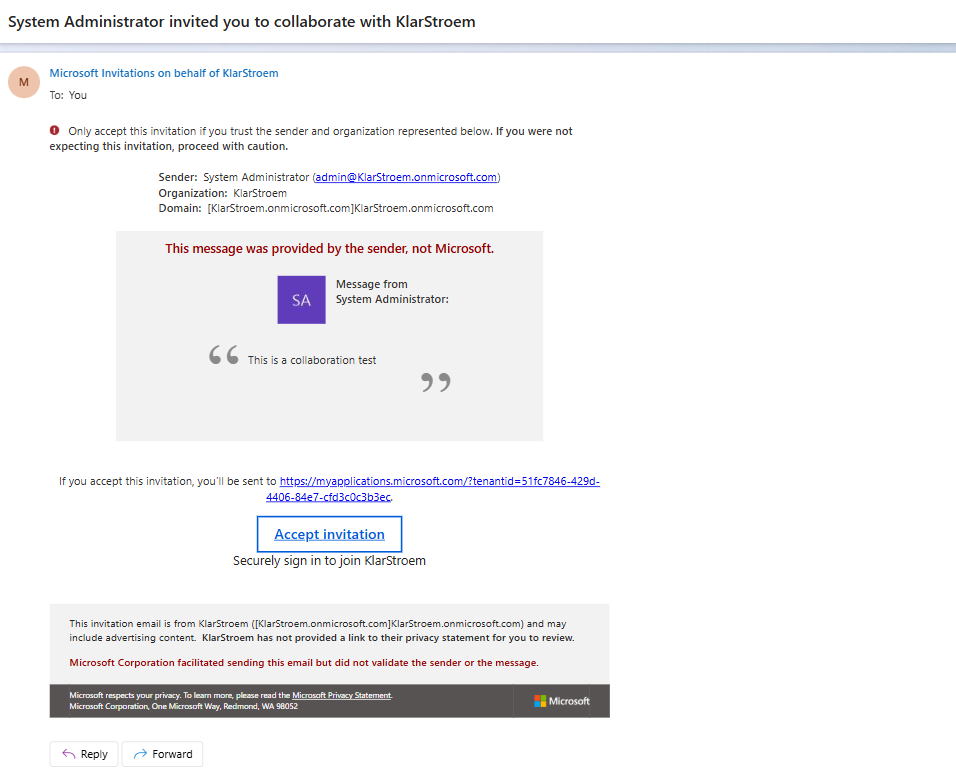
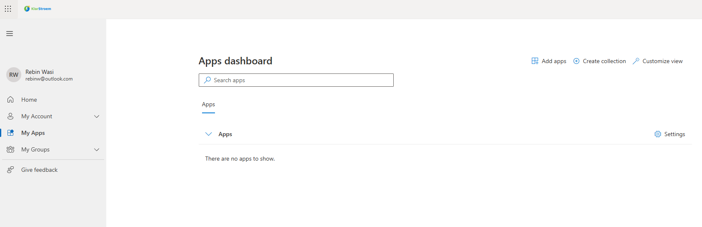
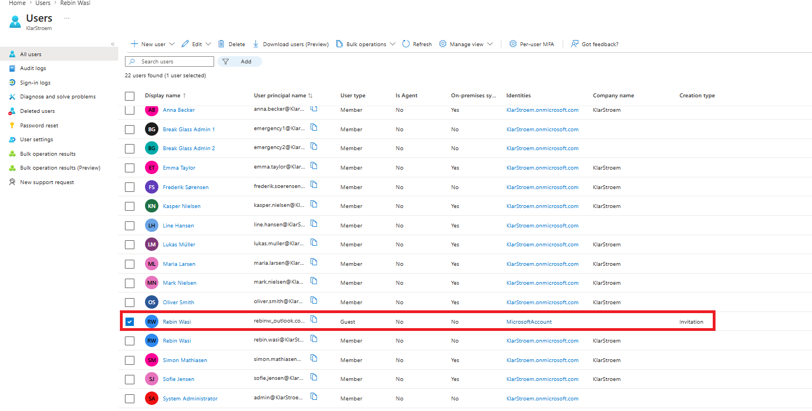
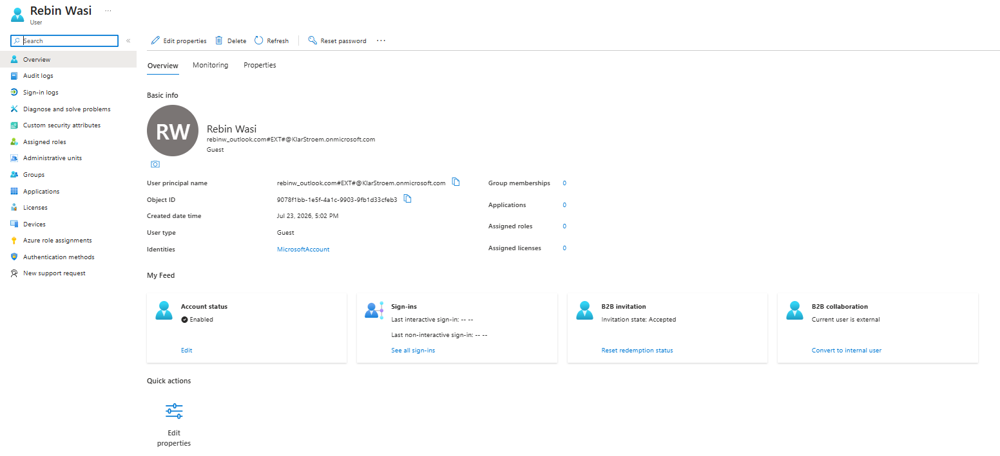

# B2B Collaboration

## Overview
Organizations often need to work together with people outside their own organization. This could be colsultants, contractors, suppliers, vendors, or other business partners who need access to specific company resources without becoming permanent employees.

Microsoft Entra B2B Collaboration makes it possible by allowing us to invite external users into our tenant. Instead of creating a separate username and password for these users, they continue using the credentials from their own identity provider. Once they accept the invitation, Entra creates a guest object in our tenant. This gives us full control over the authorization part, meaning we decide what resources they can access, what permissions they recieve, and what they are allowed to do inside our environment.

Microsoft Entra supports many different external identity scenarios. In this lab, I'll focus on the most common one, B2B Collaboration. I'll show how to invite an external user, redeem the invitation, verify that the guest object has been created, and explain how huests users differ from ordinary member accounts.

## Objectives
- Explain the purpose of Microsoft Entra B2B Collaboration
- Explain the most important external collaboration settings related to B2B Collaboration
- Invite an external user into the tenant
- Redeem the invitation using the user's existing identity
- Verify that a guest object is created successfully in Entra ID
- Explain how guest users authenticate while authorization is managed inside our own tenant
- Compare guest users with ordinary member accounts

## Environment
- Identity Provider: Entra ID
- Licenses: Microsoft 365 E5
- Tenant: KlarStroem
- Role used: Global Administrator
- License requirements
  - For this lab so for none  

## Implementation

#### Step 1: Review the external collaboration settings
Before I invite any external users into the tenant, I first reviewed the external collaboration settings. These settings determines what guest users are allowed to do once they have been invited, who is allowed to invite them, and how collaboration with external identities is handled.

When configuring these settings, I try to follow a Zero Trust approach. In other words, if I don't see a specific reason to allow a particular capability, I then prefer to leave it disabled or choose the most restrictive option. Permissions can always be granted later if they become necessary.

I found the *External Collaboration* setting by navigating to:
1. Microsoft Entra Admin center
2. In the navigation menu to the left click on Entra ID
3. Click on External Collaboration
4. click on External collaboration settings

**Guest user access:** For guest user access restrictions, I selected:
- Guest users access is restricted to properties and memberships of their own directory objects.

This is the most restrictive option ahnd means that guests users are only able to view information about their own identity. They can't browse other users or groups in the directory. 

**Guest invite settings:** For guest invitations, I selected:
- Only users assigned to specific admin roles can invite guest users.

I chose this because I don't believe every user in the organization should be able to invite external identities. If a department needs to collaborate with an external consultant or partner, the invitation should be performed by someone with the appropriate administrative permissions. This gives the organization better control over who is invited into the tenant

**Enable guest Self-service sign-up:**
- I left guest self-service sign-up enabled

This feature allows external users to register themselves through a self-service registration flow instead of requiring an administrator to send an invitation first. It is commonly used for partner portals and applications where external users need to request access themselves. Since this lab focuses on administrator-initiated invitations, I won't be using this feature here.

**External user leave settings:** for external users leave settings, I selected:
- Allow external users to remove themselves from your organization

I chose this option because it allows guest users to leave the organization themselves if they no longer need access. This removes the need for an administrator to manually remove every guest account.

**Collaboration restrictions:** for collaboration restrictions, I selected:
- Allow invitations to be sent to any domain

I chose this because only administrators are allowed to invite guest users in my tenant. Since invitations are already restricted to administrative roles, I'm comfortable allowing invitations to be sent to any domain. If all users were allowed to invite guests, I would probably configure more strict collaboration restrictions.

Before inviting the guest user, I also reviewed the configured identity providers. These settings determines which external identity providers users are allowed to authenticate with when accessing resources in our tenant. In my tenant, Microsoft Entra, Microsoft accounts, and Email OTP are enabled.

#### Step 2: Invite the external user
To invite the external user, I navigated to: 
1. Microsoft ntra Admin center
2. In the navigation menu click Entra ID
3. Click on Users
4. Invite external user.

This starts the invitation process and allows us to invite users outside our own organization to collaborate with.

For this lab, I chose to invite a single user. Microsoft Entra also allows inviting multiple users at the same time. This can be done by selecting the *Bulk invite users* option, where Entra provides a CSV template that can be downloaded and populated with the required user information. Once completed, the file can then be uploaded to create multiple guest invitations in a single operation.

#### Step 3: Configure the guest invitation
After selecting *Invite external user*, Entra opens the guest invitations page. Here, we configure the information that will be included in the invitation before it is sent to the external user.

**Email**
- The email field specifies the external user's email address. This is the address that will recieve the invitation and will later be used by the external user to authenticate with their existing identity provider. Also, since I allowed any domain in my *External collaboration* setting, then any domain can be used here to sent invitations to.

**Display name**
- The display name is how the user will appear inside the Entra tenant after accepting the invitation. This makes it easier to identify the guest user when assigning permissions or reviewing access later.

**Send invite message**
- I left this option enabled and wrote a simple message to the user to see. If this option is disabled.

**Invite redirect URL**
The redirect URL specifies where the guest user is taken after accepting the invitation. By default, Entra redirects the user to the *My Applications* portal, where the user can see the apps and resources they have been given permission to.

The invitation configuration also includes the **Properties** and **Assignemnts** tab. These are identical to the tabs used when creating an ordinary member account and allow additional information to be configured before the invitation is sent.

I'm not going to provide any additional information to the user in the *Properties* tab, but keep in mind, if the user needs to have a license assigned later, then the **Usage location** property needs to be filled out. Also I do not plan to assign any role or group to the user, there I'll also leave the *Assignments* tab not configured.

I'm simply going to click on review and create, and then on Invite:

At this point, the guest user doesn't yet exist in the tenant. Entra first sends the invitation, and the guest object is created once the invitation has been redeemed by the external user.

#### Step 4: Redeem the invitation
After sending the invitation, I recieved an invitation email at the externam email address. Opening the email and selecting **Accept invitation** started the redemption process.

Microsoft Entra first asked the external user to grant permission for basic profile information, to be shared with the tenant. Since I haven't configured any Terms of Use policies in my tenant, there were no Terms of Use documents to review or accept.

After accepting the permissions, I was redirected to another page requesting additional authentication. This happened because I previously configured a Conditional Access policy requiring MFA for all users in the tenant. Since the policy targets **All users**, it also applies to external guest users. I therefore had to complete MFA registration before Microsoft Entra granted access to the tenant.

After the registration was complete, I successfully signed in and was redirected to the **My applications** portal, which is the default redirect location configured during the invitation process.

## Verification
During step 4, we already verified that the external user was able to redeem the invitation, complete MFA, and successfully sign in to the tenant. We also veerified that the user was redirected to the *My Applications* portal after the sign-in process was complete.

In this verification step, I'll instead just verify that Entra has successfully created the guest object inside the tenant.

To verify this, I navigated to *Microsoft Entra ID -> Users -> All users*, where I located the newly created created guest account.

From here, we can verify several things:
- **User type:** The account is identified as **Guest**, confirming that the user is an external identity.
- **Identity:** Unlike internal users, which authenticate using the organization's Entra tenant, the guest user authenticates using a **Microsoft Account**. This confirms that the authentication still takes place with the user's own identity provider.
- **Creation type:** The *Invitation* value confirms that the account was created through the Microsoft B2B invitation process
- **User principal name:** The guest user's UPN is different from the UPN of ordinary member accounts. Instead of using the organization's domain, Microsoft Entra generates a unique UPN that represents the external identity while still linking it to the original email address.

These properties confirm that the invitation was redeemed successfully and that Entra has created a guest object that can now be managed like any other identity when it comes to authorization.

## Results  

## Lessons Learned  

