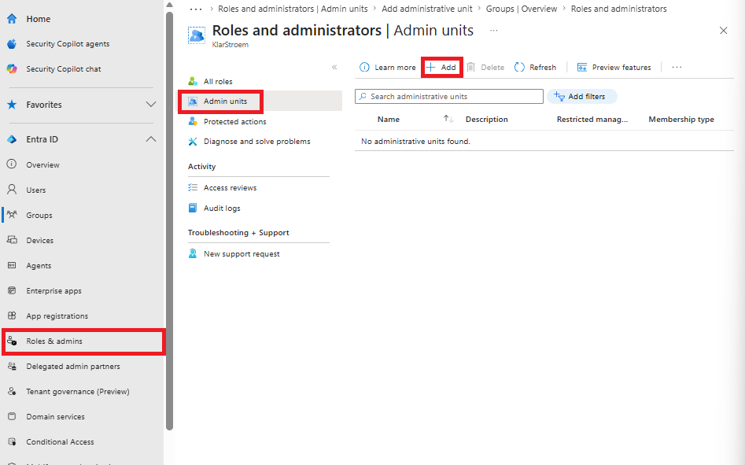
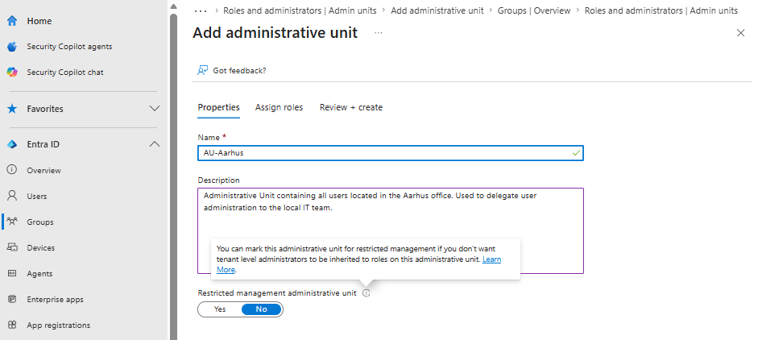
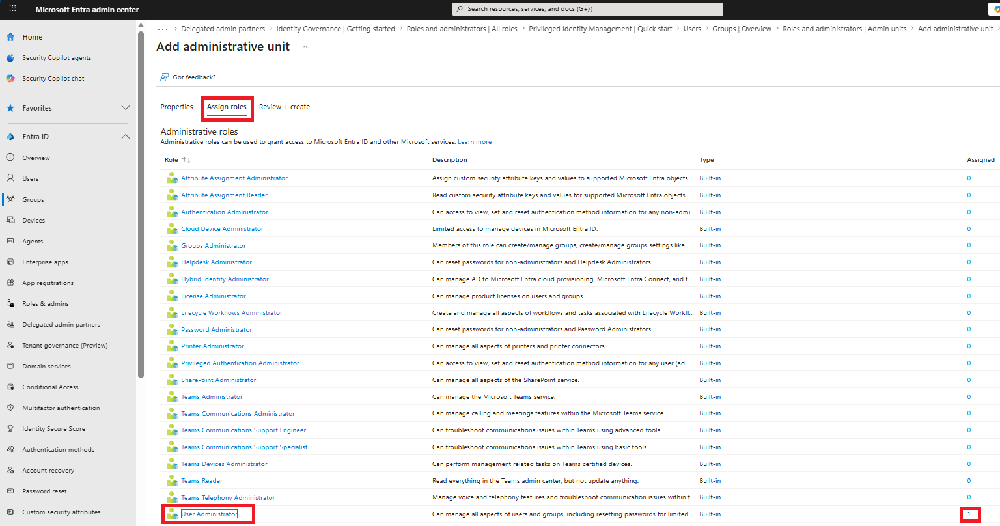
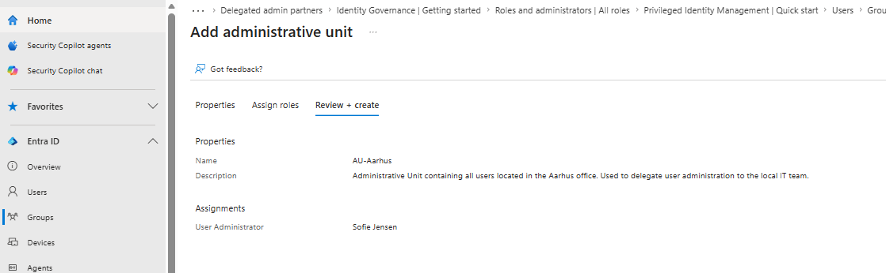
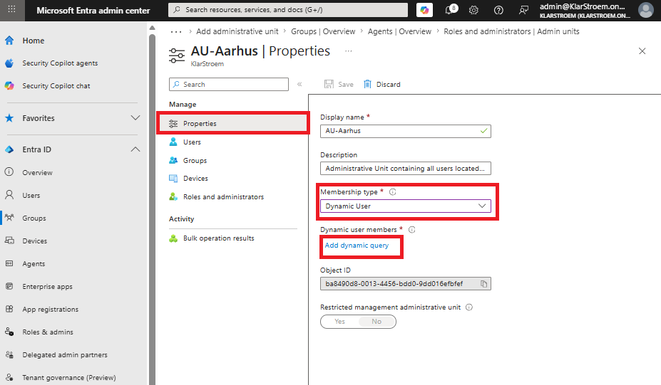
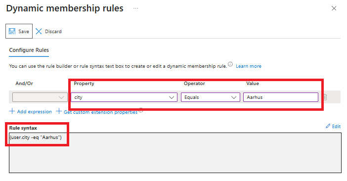
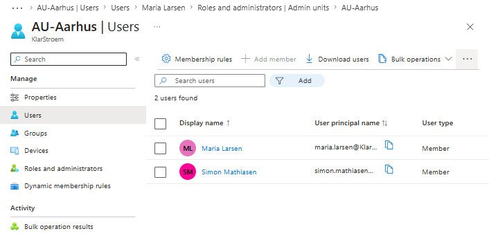
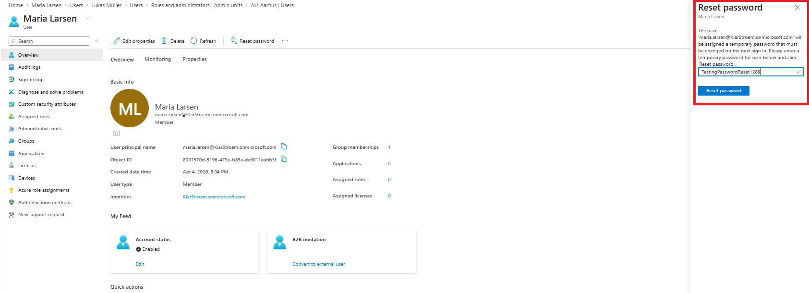
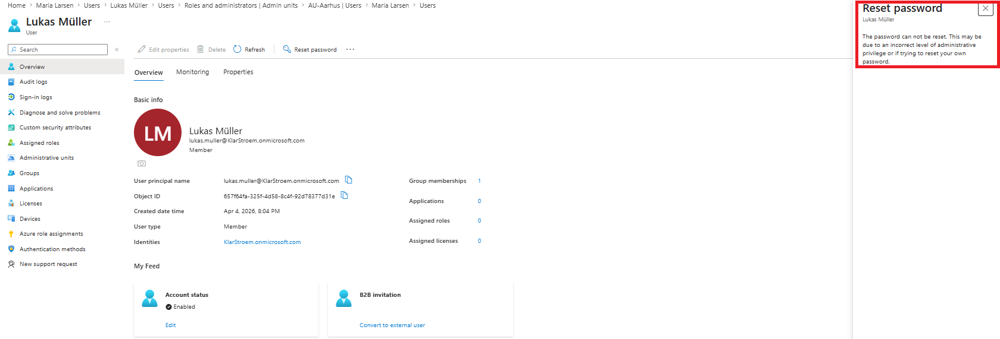

# Create an Administrative Unit and scope administrative privileges

## Overview
An administrative Unit (AU) is a resource in Entra ID that serves as a container for other resources, which can be users, groups, or devices. The purpose of grouping these resources is to delegate administrative management within a defined scope.

Normally, when an administrator assigns a Microsoft Entra role such as User Administrator, the role applies across the entire tenant. This means the administrator can manage all users in the directory according to the permissions the role holds.

Administrative Units allows us to limit that scope so administrators only recieve administrative privileges over the resources that are members of a specific administrative unit. This means a User Administrator cannot manage resources outside of the assigned administrative unit, this helps the organization to follow the principle of least privilege.

For this lab, I'm going to create an administrative unit that contains all users from the Aarhus office. I will then assign the User Administrator role to a delegated administrator and scope that role to the AU. This means the administrator will only be able to manage users in Aarhus and will not have administrative permissions over users in any other office. 

Some charactaristics of an Administrative Unit:
- Doesn't support group-nesting
- Requires the P1 license as a minimum
- Adding a group to the AU doesn't give the admin of that AU privileges to manage resources inside that group. Instead the admin can manage group naming or group membership.
- Creating an AU requires the *Privileged Role Administrator* role as a minimum
- Supports dynamic membership

## Objectives
- Create and configure an Administrative Unit in Entra ID
- Configure dynamic membership to automatically include all users from the Aahus office
- Assign the User Administrator role with its scope limited to the AU
- Verify that the delegated administrator connot manage users outside the AU
- Demonstrate how AUs support delegated administration while following the principle of least privilege

## Environment
- Identity Provider: Entra ID
- Licenses: Microsoft 365 E5
- Tenant: KlarStroem
- Role used: Global Administrator/Privileged Role Administrator
- License requirements
  - P1 or higher 

## Implementation
#### Step 1: Start the creation of the Administrative Unit
To create an Administrative Unit go to:
1. Microsoft Entra Admin Center
2. In the navigation menu to the left click on Entra ID
3. From the drop down menu click Roles & Admins'
4. Click on Admin units
5. Click on +Add

#### Step 2: Fill out the basics
From here we fill out the basics such as name, description, and chose the no option on the *Restricted management administrative unit* option.
- **Restricted management administrative unit:** Protects the resources/objects inside the AU so that only authorized admins can manage them, even if other admins have tenant level privileges.

#### Step 3: Assign a role and a user to hold that role
In the next tab, I chose the User Administrator role to be assigned to Sofie Jensen. This means Sofie should be able to manage users in Aarhus once we have created and after configured the AU

#### Step 4: Review and create
I quickly reviewed the AU settings before I clicked create:

#### Step 5: Dynamically add users to the AU
When creating the AU, It doesn't give you the option to choose dynamic membership. Instead one the group have been created we then change the membership type from assigned to dynamic user. To do so we open the newly created AU named AU-Aarhus and from there go into Properties and change membership type to dynamic User:

#### Step 6: Add the query to enroll all Aarhus users
After we choose the Dynmamic User option under membership type, it then lets us add a rule that will decide how users become members of the AU. In a previous lab on dynamic security groups I explained this section in more depth, but for this lab I'm simply going to create a simple rule. This rule basically says if the Property equals the Aarhus attribute, then let that user become a member of this AU:

A couple of minutes after I had added and saved the query, I could then see that two users had become members of the group:

## Verification
#### Test 1: Test that the User-Administrator can manage members of the AU
We already verified that users had automatically become members of the AU. Now, i Needed to test if our user administrator (Sofie Jensen), can manage users inside of the AU. To test this it is important to understand the permissions/capabilities that comes with the User-Administrator role, the User-Administrator can:
- Create new users
- Delete users
- Updated user properties
- Reset user passwords
- Force users to change their password
- Manage group membership for different group types
- Manage authentication methods for users
- Manage guest users

These are some of the default permission a user administrator holds, but it is important to mention that user-administrators scoped to an AU doesn't hold all the same permission a tenant-wide user administrator holds, one example would be to create new users.

Now, I will test permission by loggin in as the user administrator Sofie Jensen, and try to see if I would be able to reset user passwords. First i'm going to try to see if it would allow me to reset a password for a member of the AU. I chose Maria Larsen, she's currently a member of AU-Aarhus and ass the screenshot confirms, I'm able to reset her password:

Next, I tried to reset the password for a random user that sits outside of the Aarhus office and there by isn't a member of the AU-Aarhus. As we can see on the screenshot below, I'm unable to reset the users password:

## Results  
We successfully created the Administrative Unit AU-Aarhus, and delegated the user administration role to a user. We changed the membership type from assigned to dynamic user, and verified that the query works. 

Next, we also tested that the user administrator permissions didn't apply outside the scope AU, forexample we tested resetting the password for a user outside the AU and couldn't do that while we could reset the password for any user that is a member of the AU.

## Lessons Learned

Learning material:
- [Administrative units in Microsoft Entra ID](https://learn.microsoft.com/en-us/entra/identity/role-based-access-control/administrative-units)
