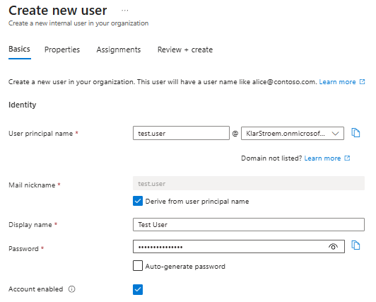
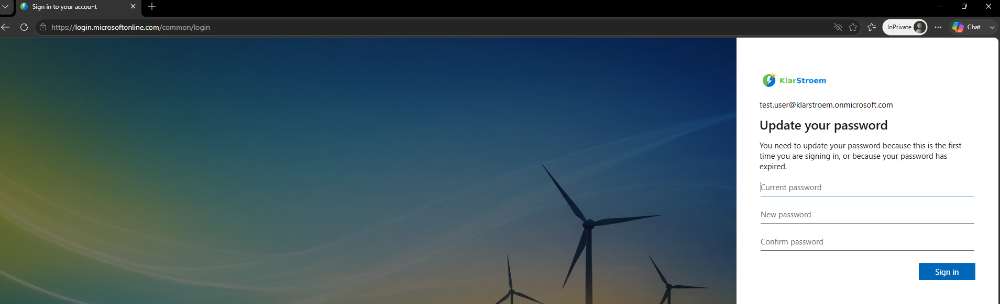
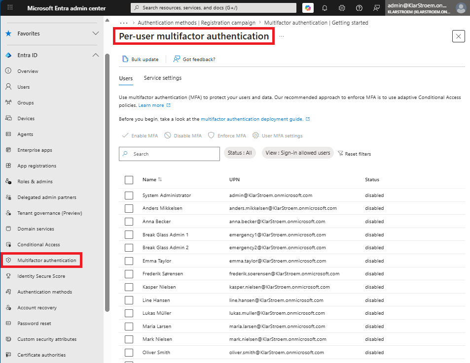
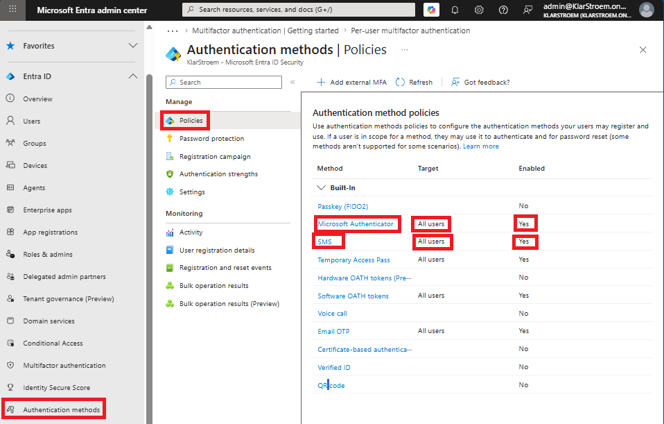
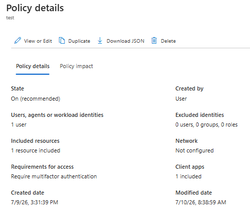
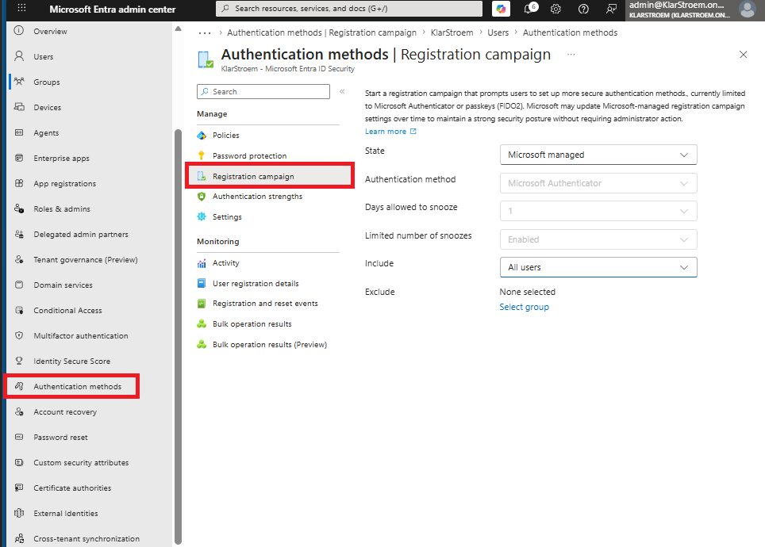
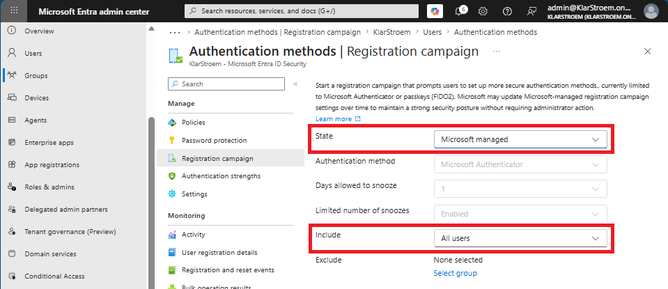
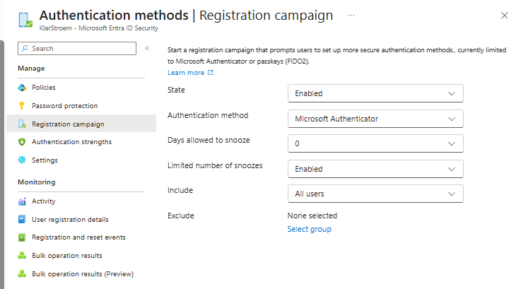

# Configure MFA Registration Campaign

## Overview
When I first started working with Registration Campaigns, I thought it was a feature used to enforce multi-factor authentication for users. After testing it on my own lab, I found that this isn't the case. Registration campaigns don't enable or enforce MFA by themselves. Instead, they build on an existing MFA deployment.

A Registration campaign is used to gradually move users towards a specific authentication method over time. At the time of writing my lab, Microsoft Entra supports campaigns for Microsoft Authenticator and Passkeys (FIDO2). Administrators can choose which users are included, how many times they are allowed to postpone the registration, and how long they are allowed to snooze the promt before they are reminded again.

For a Registration campaign to work, the targeted users must already be using Microsoft Entra MFA. The campaign appears after a successful MFA sign-in and encourages users to register the targeted authentication method. This makes it useful when an organization wants to move users from a weaker or older authentication method, such as SMS or another authenticator application, to Microsoft Authenticator or Passkeys, without forcing the change immediately.

In this lab, I'll configure a Registration Campaign for Microsoft Authenticator and verify how the campaign behaves for users with a different authentication method. This shows the difference between enforcing MFA through Conditional Access and gradually moving users towards stronger authentication methods through a registration campaign.

## Objectives
- Create cloud-only user accounts
- Configure required user properties
- Verify successful user creation
- Understand the characteristics of cloud-only users

## Environment
- Identity Provider: Entra ID
- Licenses: Microsoft 365 E5
- Tenant: KlarStroem
- Role used: Global Administrator
- License requirements
  - For this lab so for none  

## Implementation
#### Step 1: Disable security defaults
As mentioned in the overview my tenant has the security defaults enabled this means that by default when a new user tries to log in for the first time, that user will be required to set up MFA using the Microsoft Authenticator Application. Since this lab focuses on setting up a Registration campaign that targets the same authentication method as Security Defaults, it would only then make sense to disable Security defaults first and then enforce MFA through another way such as Conditional Access.

Lets first go ahaed and disable the security defaults:
1. In Entra ID Admin Center -> Navigation Menu to the left -> Entra ID
2. Click on the *Overview* option
3. Then click on *Properties*
4. At the bottom of the page click on *Manage Security Defaults*
5. Set security defaults to *Disable* and provide justification
6. Press *Save*

#### Step 2: Create new cloud user and test log in
I'm quickly just going to create a new user to be sure this user hasn't already registered for MFA previously, then I'm going to try to log in with tha user and see if MFA registration will be required.

User created  

After I had created the test user, I then opned a in private browser and tried to log in with the newly created user to ensure that MFA registration wasn't required. I tried to do exactly that, and the only requirement it had was to create a new password since it was my first time logging in, and right after that I was successfully logged in.

#### Step 3: Enable multi-factor authentication
As I mentioned in the overview, a prerequisite for registration campaigns to work is that we have MFA already enabled for the users in scope for the campaign. This also means that the enabled MFA method should use another authentication method that the one we're going to make an campaign for, if the method is stronger or the same as the one we're making a campaign for then the campaign really doesn't make much sense.

There is the option to enable MFA through the legacy method in Entra Admin Center the specific location is highlighted in the screenshot belowe:

This method is considered the legacy way of enabling and enforcing MFA on users, and also it targets MFA per user.

If we enable MFA for a user through this method, the user can then chose to register any authentication meethod that we have allowed in the tenant if the user is a part of the scope. The user can then simply go to portal.mysigninss.com and configure any of the methods we have allowed: 

Instead of using the legacy method of enableing MFA, I'm simply going to create a simple Conditional Access policy. The policy is just going to target our test user, and i'm basically going to require the user to register for MFA when accessing Microsoft 365 resources. The options the user can chose from is once again going to be the same as those we have allowed in our tenant, as seen on the picture above.

Simple CA Policu:

#### Step 4: Configure the registration campaigh and enable it for all users
Now, I'm finally ready to actually implement the registration campaign, and to do this we have to native to:
1. Entra ID Admin Center
2. Authentication methods
3. Registration campaign

Now that we are in the registration campaign wiondow, we're finally ready to configure it and apply it to our tenant. The *State* option highlighted in the screenshot below has three possible states:
1. Microsoft Managed: This means that Microsoft manages the registration campaign. In other word Microsoft decides the authentication method and the snooze behaviour.
2. Enabled: This means that our organization manages the registration campaign. Now we can decide the authentication method ourselves, how many days the user can snooze/postpone the registration campaign, whether the number of snoozes is limited.
3. Disabled: This basically means there is no registration campaign enforced.

For this lab, I chose the enabled option. The reason I didn't go with the *Microsoft Managed option* is simply because I wanted to be able to configure all of the options. In the Microsoft Managed option the *days allowed to snooze* option is set to 1 day, this means if the user postpones the set-up then one day will pass before the user gets nudged/encouraged again.
- **Authentication method:** The two method Entra supports at this time is Microsoft Authenticator and Passkeys
- **Days allowed to snooze:** determines how many days will pass before a user gets nudged/encouraged again if the user already postponed the set-up I chose to set it to **0** because I want to be able to test the campaign right away.
- **Limited number of snoozes:** We can only chose between *Enabled* or *Disabled*, Enabled, means that we limit the number of times a user can postpone the set-up, the exact number is 3 times by default. Disbled on the other hand, means that the user can postpone the set-up for ever, this also means that the user will never be enforced to set-up the targeted authentication method but will always be encouraged. I chose to enable it this means our test user should be reminded 3 times before the user is going to be enforced to set up Microsoft Authenticator.
- **Include:** here i'm just going to include all users, simply because it is still just going to affect our test user since he is the only one I have actually enforced MFA on through the Conditional Access policy.

## Verification

## Results  

## Lessons Learned  

- The biggest lesson from this lab was understanding that Registration Campaigns are not used to enforce MFA. I thought that it was their purpose, but after testing different scenarios I found out that MFA already has to be enabled for the users in scope. The campaign is simply used to encourage and later enforce to move to a specific authenticaton method over time
- One thing I noticed while testing was that Security Defaults and Registration Campaigns don't really make sense together if the campaign targets Microsoft Authenticator. Security Defaults already requires users to register Microsoft Authenticator the first time they sign in, so there's nothing left for the campaign to promote. The campaign only becomes visible, once MFA is enforced in another way such as through Conditional Access or the legacy way through the Multi-factor authentication blade in Entra Admin center where MFA is enforced per user.
- Even though I don't think that Registration campaigns are something every organization will use today, I can difinitely see the potential. Since the campaign can target a specific set of users instead of the whole tenant, it provides a controlled way of introducing stronger authentication methods over time. For example, an organization could start encouraging administrators or other high-risk users to move from Microsoft Authenticator to Passkeys before rolling it out to everyone else. That makes it alot easier to introduce new authentication methods without enforcing all users to change at once. Also, I believe that Microsoft will include more authentication methods in the feature over time, so that the feature becomes more valuable as new authentication tools and methods will enter the world of IAM.

