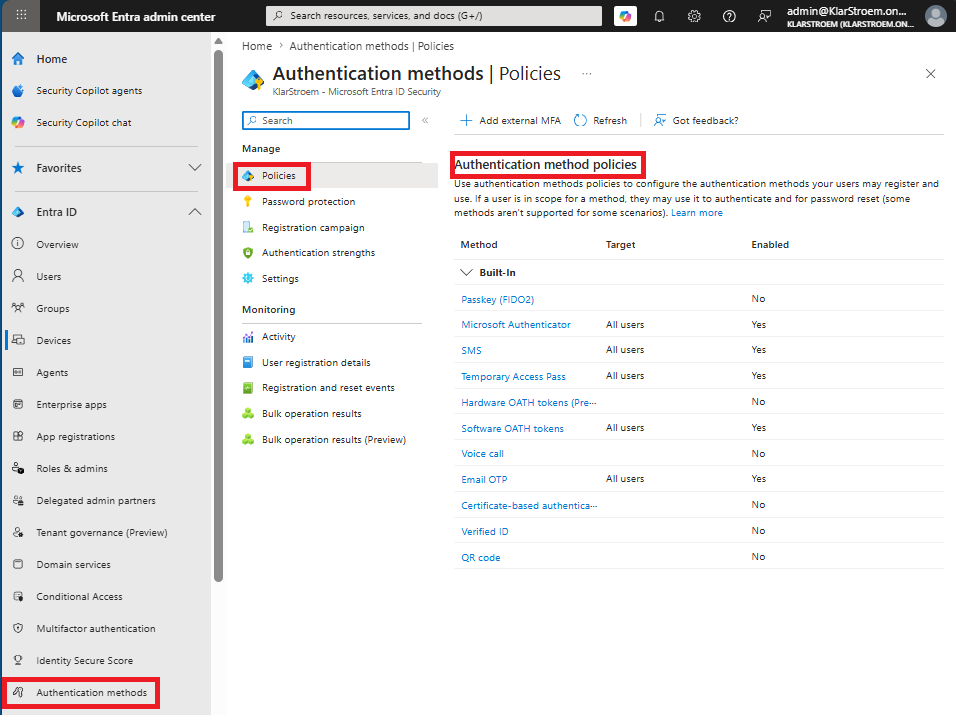
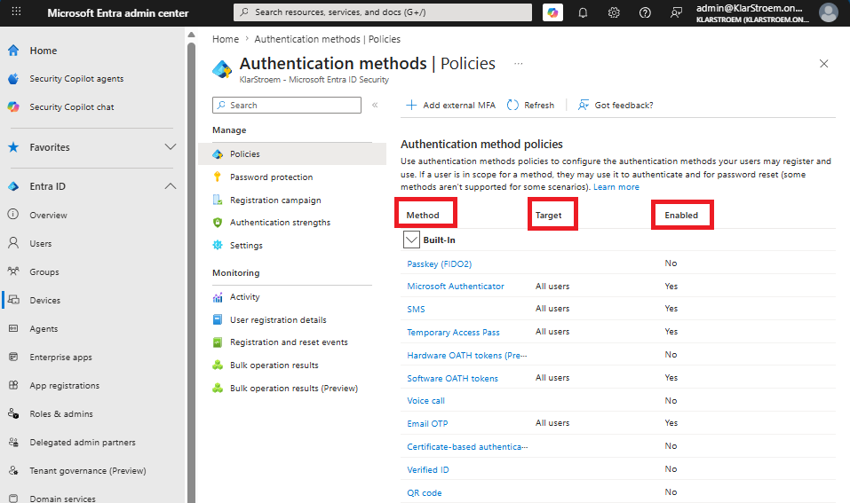
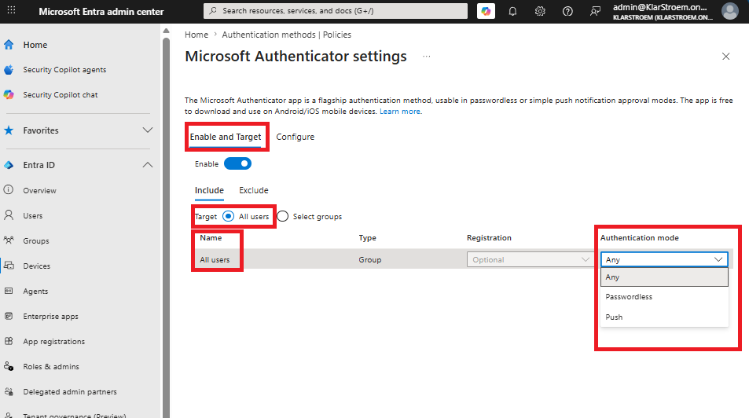
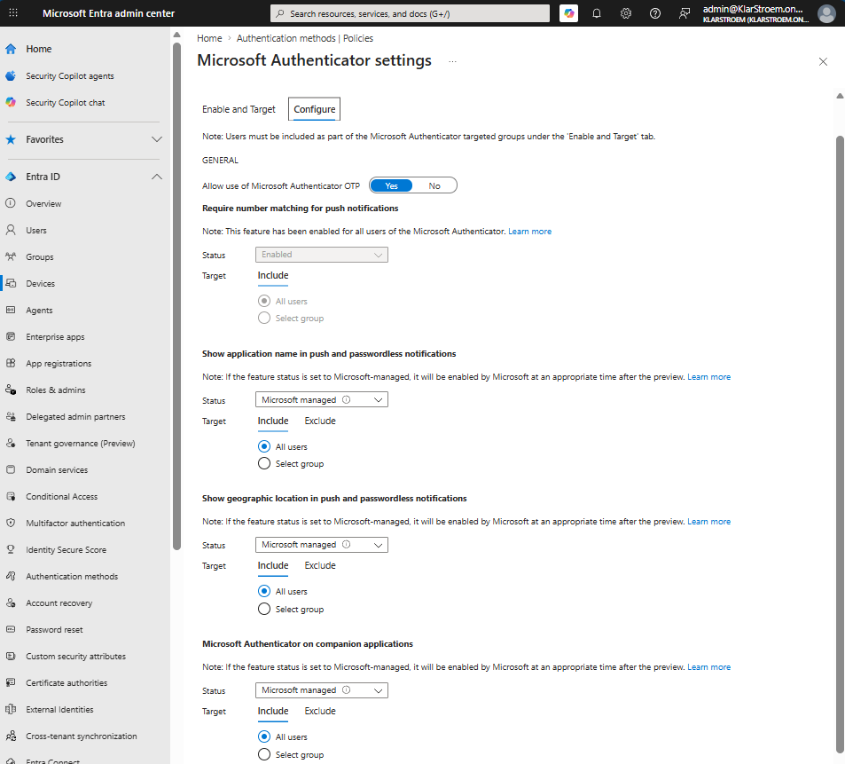
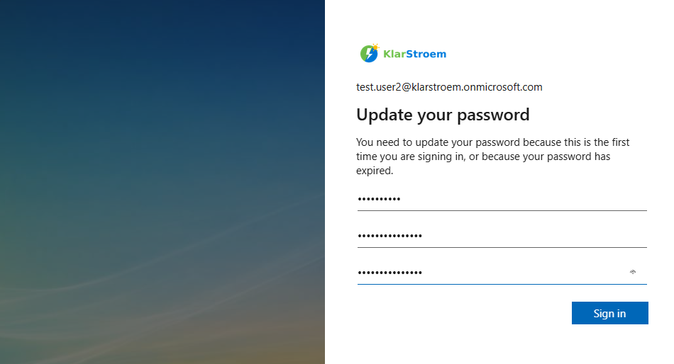
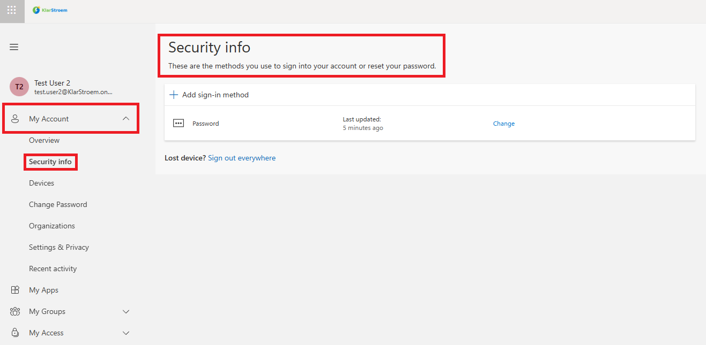
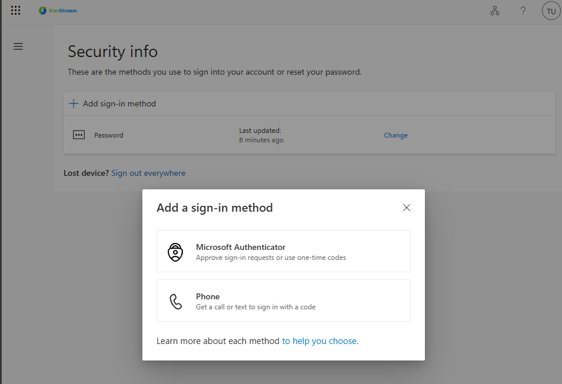
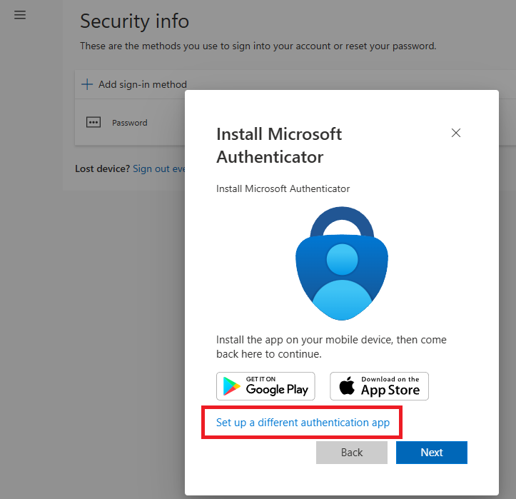
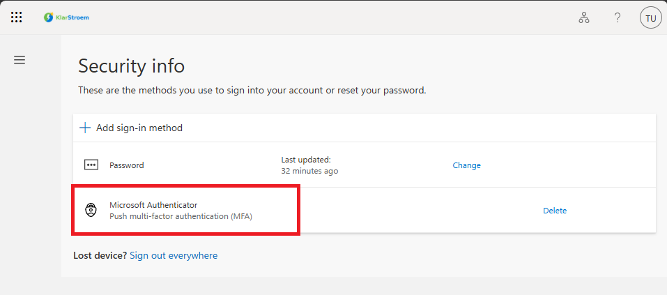

# Authentication methods in Entra ID

## Overview
Authentication Methods in ENtra ID define how users prove their identity when signing in. Entra ID supports multiple authentication methods, each provinding a different level of security and usability. Through authentication method policies, adninistrators decide which methods users are allowed to register and use when authenticating.

Not every authentication method provides same level of security. While some methods are mainly designed to improve usability, others are considered phishing resistant and are better for forexample privileged accounts or higher risk scenarios. Authentication methods by themselves don't decide when a user must use a specific method. Instead, they make the method available. Conditional Access policies can later then be used to require a particular method or authentication strength depending on the sign-in scenario.

In this lab, I'll configure authentication method policies in Entra ID and explain some of the most commoonly used methods, how they work, and when they are typically used. I'll also verify how users can register the methods that have been made available to them through the My Sign-in portal.

Understanding authentication methods is important before working with Conditional Access policies and Privileged Identity Management, since both features rely on the method that have been made available for the user.

## Objectives
- Explain the most common authentication methods
- Configure authentication methods policies
- Enable selected methods for users
- Verify that user can register the enebaled methods
- Explain where users manage their authentication methods
- Explain primary and secondary authentication methods

## Environment
- Identity Provider: Entra ID
- Licenses: Microsoft 365 E5
- Tenant: KlarStroem
- Role used: Global Administrator
- License requirements
  - For this lab so for none  

## Theory on Authentication Methods
Before I configure the authentication method policies, I think it's important to first understand some of the authentication methods available in Entra ID. Each method has different characteristics, provides a different level of security, and is used for different scenarios. Understanding these differences makes it much easier to decide which methods should be enabled and later required through Conditional Access policies.

### Microsoft Authenticator authentication method
This is Microsoft's recommended authentication method for Entra ID. It is available as a mobile application and supports multiple ways of verifying the user's identity, this makes it suitable for both MFA and passwordless authentication.

The application supports different authentication experiences, including:
- **Push notifications:** The user recieves a notification on their mobile phone and approves the sign-in.
- **Number matching:** The user must enter or confirm a number shown during the sign-in process. This helps protect against MFA fatigue attacks.
- **Passwordless sign-in:** The user signs in using the authenticator app instead of a password by verifying their identity with biometrics or the device pin.

**Typical use case:**  
Used as the primary authentication method for users signing in to applæications protected by Entra ID.

### Passkeys authentication method
Passkeys are a passwordless authentication method that uses public key cryptography instead of passwords. When a passkey is created, a public and private key pair is generated. The publicket is registered with the identity provider (Entra ID), while the private key is used to prove the user's identity.

A passkey isn't tied to one specific technology or device. It can be stored in Window Hello for Business, on a FIDO2 security key, or on a supported mobile device. Regardless of where it's stored, the authentication process follows the same principle. 

**NOTE:** In Microsoft Entra ID, the authentication method policy is called *Passkey(FIDO2)*. Even though FIDO2 security keys are a common way of using passkeys, they are not the only option. Passkeys can also be stored on supported devices, such as Windows Hello for Business or Microsoft Authenticator, this allows users to authenticate without a physical security key (USB).

**Typical use Case:**  
Used for passwordless and phisning-resistant authentication to applications/resources protected by Entra ID. 

### SMS authentication method
SMS is an authentication method where a one-time passcode is sent to the user's registered mobile phone number. The user must enter the code recieved during the sign-in process to verify their identity.

Although SMS is supported and easy to use, it provides a lower level of security than modern authentication methods and therefore more vulnerable to attacks such as SIM swapping and phishing.

**Typical use case:** Used as a simple MFA method when more modern authentication methods are not available.

### Temporary Access Pass (TAP)
TAP is a time limited passcode that admins can issue to a user. It is typically used during onboarding, account recovery, or when a user needs to register for a new authentication method.

TAP isn't ment for everyday sign-ins. TAP acts as a temporary credential that helps users gain access to their account so they can register stronger authentication methods, such as Microsoft Authenticator or Passkeys.

**Typical use case:** Used to onboard new users or help existing users recover access to their account without requiring a permenant password. A temporary Access Pass is a bootstrap credential, not a long-term solution.

### Software OATH authentication method
Software OATH (Open Authentication) is an authentication method based on time-based one-time passcodes (TOTP). Instead of recieving a code by SMS, the code is generated locally by an authenticator application, such as MS authenticatopr, Google authenticator, or another authenticator application. The generated code changes every 30 seconds and is entered during the sign-in process to verify the user's identity.

During registration, a shared secret is created between ENtra ID and the authenticator application. Both sides use this shared secret together with the current time to generated the same six-digit code independently. When the user enters the code, Entra then compares it with the one it has generated. If the two match, the user's identity is then verified.

**Typical use case:** Used as an MFA method for users who prefer one-tiime passcodes over other methods

### Email OTP authentication method
Email One-Time Passcode is an authentication method that sends a one-time verification code to the user's email address. The user enter the code during sign-in to verify the identity.

Unlike most other methods, Email OPT is primarily used by ENTRA B2B guest users. It allows external users to access shared resources without requiring a Microsoft account. It can also be used in certain account recovery scenarios.

**Typical use case:** Used by B2B guest users to authenticate to resources shared through Microsoft Entra ID.

### Certificate Based Authentication (CBA)
Certificate based authentication uses digital certificates instead of passwords to verify the user's identity. Each certificate contains a public and private key pair, allowing users to authenticate using public ket cryptography.

CBA is used in environments with high security requirements, such as goverment, healthcare, or organizations that already have a Public Key Infrastructure (PKI)

CBA uses digital certificates issued by a trusted Certificate Authority (CA). The certificate can be stored on a smart card, USB token, or directly on a managed device. During authentication, the associated private key is used to prove the user's identity without exposing the key itself. This authentication method is very similar to how passkeys work:
- Passkeys: Does this device possess the correct private key
- Certificate: Does this device possess the correct private key, and was that key certified by a trusted Certificate Authority

**Typical use case:** Used in organizations that require certificate-based sign-in through smart cards or other PKI solutions.

## Implementation
Now that I've covered some of the authentication methods in Entra ID, I then think we're finally ready to find test how they are enabled and configured in Entra ID.

#### Step 1: Navigate to Authentication methods
To locate the different authentication method policies in Entra ID, Go to:
1. Entra ID Admin Center
2. In the navigation menu to the left click on Authentication methods
3. Once in the Authentication methods window, click on Policies

#### Step 2: Review the available methods
As we can see on the screenshot below, we'll see the some of the authentication methods I have explained earlier. This gives an perfect overview of the different authentication methods available in Entra, the target/user in scope for the method and weather the method is enabled or disabled.

#### Step 3: Configure a method and enable the method for all users
For good reasons I had already enable and configured Microsoft Authenticator. Still, I'd like to show how we can enable an method an configure it, so lets take a closer look at Microsoft Authenticator.

From the policies window I simply click on the authentication method *Microsoft Authenticator* and it will then take me to Microsoft Authenticator Setting. In the settings menu, there are 2 tabs the *Enable and Target* and *Configure* tab. 

In the *Enable and Targets* tab you'll see that I have included all users to be able to register for the method. Also I have chosen any under authentication mode, this means that the user should be able to choose either passwordless or push notifications

The *Configure* tab, as the name suggets this is where we can configure the authentication method to our liking. These settings are quite straight forward so I will not cover then in depth, I just wanted to show where we can configure the method:

## Verification
#### Test 1: Verify authentication options
Users register and manage their authentication methods through the My sign-ins portal at mysignins.microsoft.com. The authentication methods available to the user depend on the policies configured in the tenant and whether the user is in scope for those policies.

I therefore created a new user named test.user2@klarstroem.onmicrosoft.com and made sure the user at this point only authenticates using a password. I then Opened an InPrivate window and went to mysingins.microsoft.com and from there logged in using only the password. Since it was my first time signing in with Test User 2, It only required me to create a new password:

Once I was logged in as test user 2, I needed to navigate to the page that lets me register for other authentication methods.
1. Open the navigation menu to the left
2. Click on My Account
3. Click on Security Info

The Security Info page confirms that my current sign-in method is only using Password. On the page we see the *Add sign-in method* option, I therefore click on the option, and it right away displayed two additional authentication methods I could choose from. 

In my tenant configuration, I've enabled the following authentication policies:
- Microsoft Authenticator
- SMS
- Temporary Access Pass
- Software OATH
- Email OTP

As we can see from the screenshot above, the user has been presented two the following two options:
- Microsoft Authenticator
- Phone (SMS authentication method enebaled)

Why doesn't the user see:
- Temporary Access Pass: Users don't register a TAP themselves. It's issued by an administrator
- Email OTP: Used for B2B guest scenarios, not for member users managing their own sign-in methods.

Now the only one left that we currently don't see is the Software OATH. We have to remember that Software OATH is also an experince that Microsoft Authenticator support, and since Microsoft recommonds their own solution the only one advertised here is their own. If we click on Microsoft Authenticator, then we can actually see the option *Set up a different authentication app*, this is were we would be able to use another option such as google authenticator.

I followed the instructions for setting up Microsoft Authenticator. It asked me to download the application, scan the QR code, and finally sent me a two digit numer to type in to complete the registration. Right after the registration was completed and I could see that the method had been added to the users sign-in method.

## Results  
- Verified that only the authentication methods enabled through authentication method policies were available for the user to register
- Verified that users can register supported authentication methods through the Microsoft Entra My Sign-In portal
- Verified that administrator-controlled methods, such as TAP aren't registered by the user 

## Lessons Learned  
- The reason for enabling several authentication method is:
  1. Convinience
  2. Resiliency: If for any reason an authentication method the user is already using is not available, the user can then choose/add another method to authenticate with.
