# Enable and configure Self-Service Password Reset (SSPR)

## Overview
Self-Service Password Reset (SSPR) is an feature in Entra ID that allow users to reset their own password without any involving any administrators/helpdesk personnel. This is extremely usefull because it ensures that admins can concentrate and focus on more important taks, and at the same time it ensures that users can regain access immediatly.

In this lab, I'm going to enable the SSPR feature to a specific test group in my tenant, and configure the requirements I have for the users in the group to be able to reset their own passwords.This lab is also directly connected to the last lab we did on authentication methods because the enabled policies determines which methods the user can use to reset their own password.

Since i'm running a hybrid environment, I then want to ensure that SSPR in Entra ID are going to be synchronized back to Active Directory. I covered my hybrid set-up in my other project, and of course I enabled the pæssword-writeback feature. We have to keep in mind that our AD DS is the source of authority in our setup. I'm therefore going to apply the feature to a group from my on-prem environment, instead of creating a test group/user directly in Entra ID.

## Objectives
- Create a test group and assign users to the group
- Enable and configure SSPR
- Link back to the authentication methods enabled
- Verify that the user can reset their own password
- Verify that the user can choose from the different authentication method policies to reset their password
- Confirm that the password has been changed and that the change has been synchrononized back to the on-prem environment

## Environment
- Identity Provider: Entra ID
- Licenses: Microsoft 365 E5
- Tenant: KlarStroem
- Role used: Global Administrator
- License requirements
  - An minimum of Enta ID P1 license is required when wanting to make the feature available for synchronized users.
  - Additionally for this lab another prerequsite is to have password writeback enabled.  

## Implementation
#### Step 1: Verify the group and users to be affected
Before I enable and configure SSPR, I then quickly want to ensure that I apply the feature to the correct users. My intention is to apply the feature and test SSPR on the users that sits in the trading department in Aarhus. I therefore went under groups in Entra ID just to confirm the users to be affected. In the picture below, we see that I currently have two users in the Trading-Aarhus group.

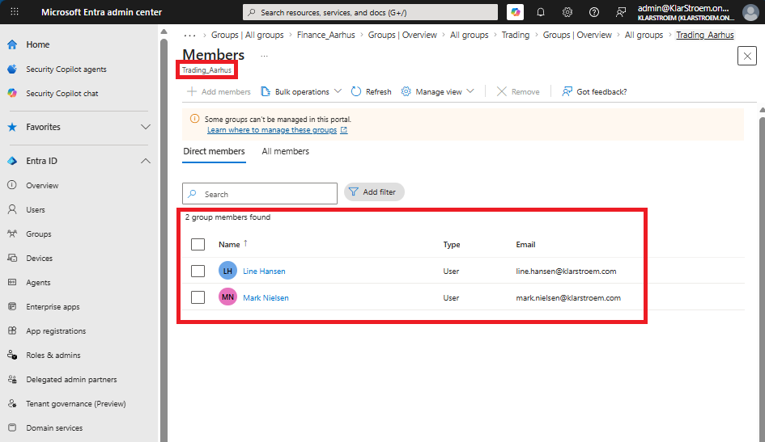

#### Step 2: Enable and configure SSPR
Now that we have verified the group to apply SSPR to. I then went on to configure the feature.
1. Microsoft Entra Admin Center
2. Entra ID blade
3. From the dropdown menu click Password reset
4. Click on properties

Here we see that the feature is disabled at the moment. We can choose to enable the feature to all users in the tenant, or we can specify a group. I of course choose the Trading_Aarhus group which has two users at the moment, and then click on save.

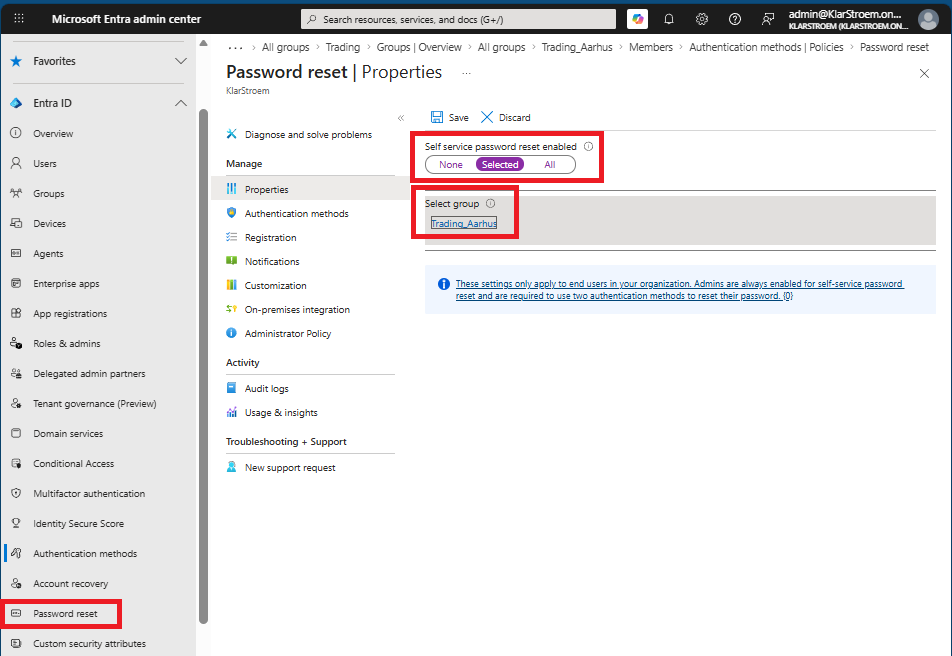

#### Step 3: Authentication method requirements
By default when enableing the feature the users it applies to must chose one authentication method when they want to reset their own password. The methods they can choose from depends of the authentication methods policies that the administrator has enable for them.

We can set the requirement to two methods, meaning the user must use an additional method from the ones enabled for them to be able to reset their password. If we check the *Security questions* option then this one would count as one method, keep in min that if we had included admin accounts then this method wouldn't apply to them.

I'm just going to require one method, this means the user should be able to choose from the enabled authentication methods policies we have enabled for them to use.

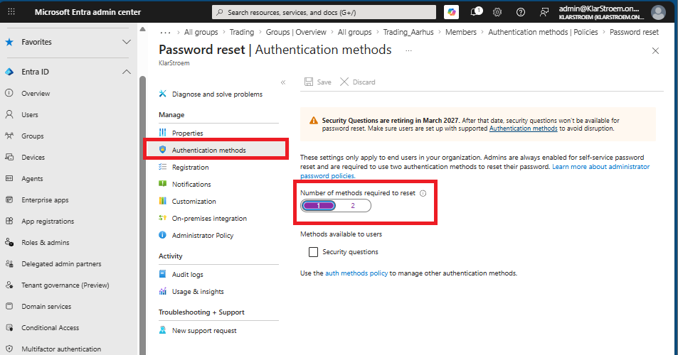

This additional screenshot from Authentication method policies shows the enabled policies:

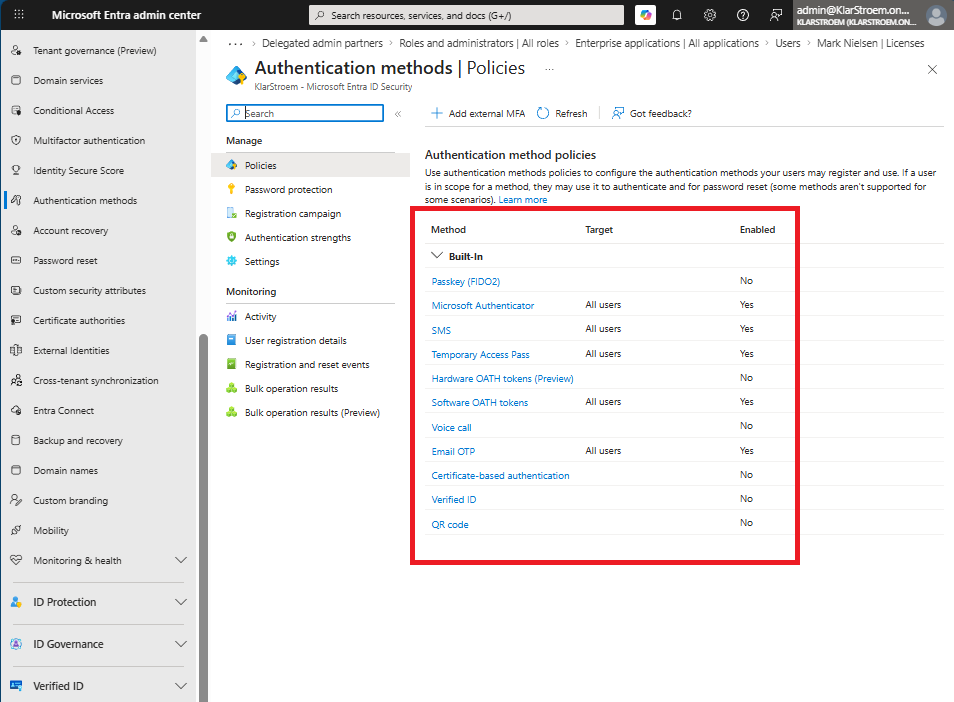

#### Step 4: Register Email OTP for SSPR
Before a user can use the SSPR feature, the user must register an authentication method that supports self-service password reset. The following authentication methods are available for SSPR:

- Microsoft Authenticator push notifications
- Hardware OATH tokens
- Software OATH tokens
- SMS sign-in
- Voice call
- Email OTP

I have applied the SSPR feature to the Trading_Aarhus security group, the group has two members. I'm going to log in first using mark.nielsen@klarstroem.onmicrosoft.com, and setup an authentication method that supports SSPR for this user i'm going for the Email OTP option.

1. Open an InPrivate Window in the browser
2. Go to https://mysignins.microsoft.com
3. Enter the users credentials and log in

This was the first time I was logging in with the current user. I previously disabled security defauls and haven't replacet MFA requirement yet through a CA policy. I expected the user to be presented with the requirement to set up SSPR, simply because of this configuration in my tenant:

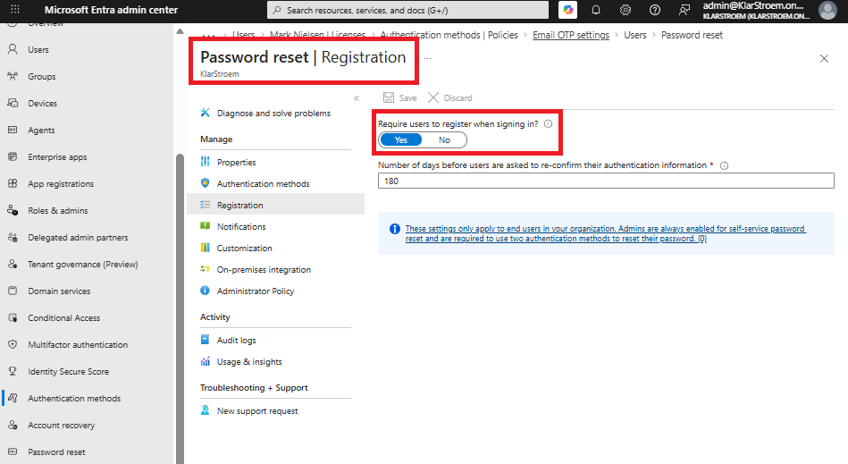

Instead, it just presented the *Lets secure your account* option. This really confused me because I thought there was a misconfiguration in my registration campaign under Authentication methods, I simply expected it to present it more straight forward something like: *Set up self-service password reset* or something similar. 

I just continued the login process and skipped the *Lets secure your account* option because it simply sounded like an MFA registration rather than setting up SSPR. Once I was at Mark Nielsen's *Security Info* page I say the following authentication options for me to add: 

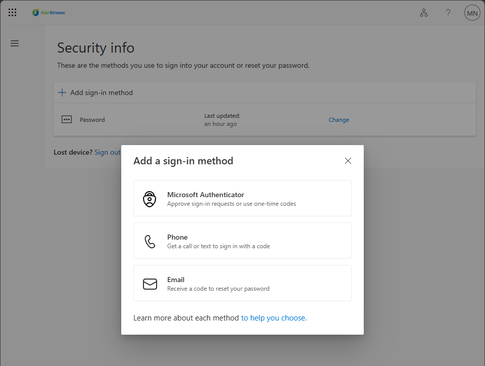

I chose the Email OTP options to add and short after I review a OTP code on my email to be used to verify it was me, right after the authentication method was added to my profile.

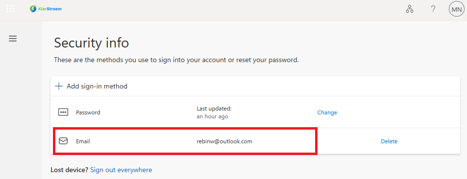

Next time Mark tries to log in and he can't remember his password, he should then be able to reset his password using the Email OTP option.

**NOTE:** Regarding the unexpected *Lets secure your account* option ealier. I found out it was the *Password reset registration* policy that kicked in, but in my opinion this should be made more obivious. I found out because I simple chose to log in as a new user that wasn't a part of the SSPR feature and wasn't required MFA in any way, and that user wasn't presented with the *Lets secure your account* option in any way.

#### Step 5: Register Microsoft Authenticator FOR SSPR
I followed the exact same steps for the other user (Line Hansen), but instead of adding the Email OTP option, I then added the Microsoft Authenticator option to be used for SSPR.

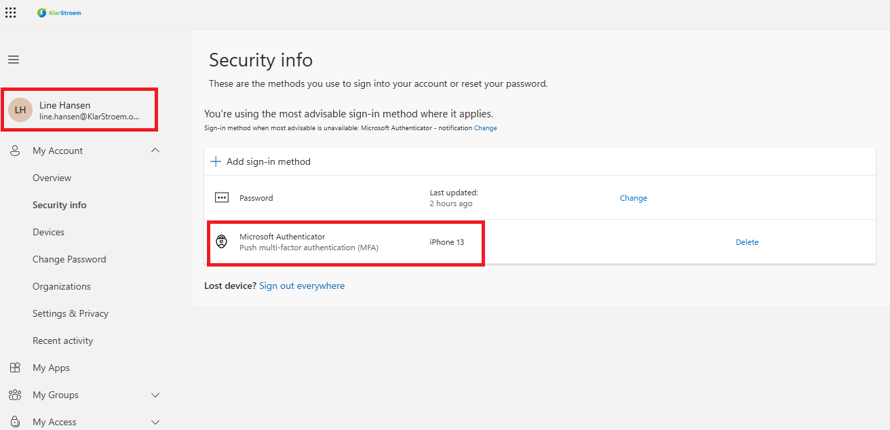

This means that next time Line tries to log in and she can't remember her password, she should be able to reset her own password using the Microsoft Authenticator application.

## Verification
#### Test 1: Test Email OTP SSPR
Lets try to log in as Mark Nielsen and pretent we can't remember our password.
1. Open an InPrivate Window in the browser
2. Go to https://mysignins.microsoft.com/
3. Type the users email address (mark.nielsen@klarstroem.onmicrosoft.com)
4. Click on *Forgot my password*
5. Fill out email and the challange presented -> click next

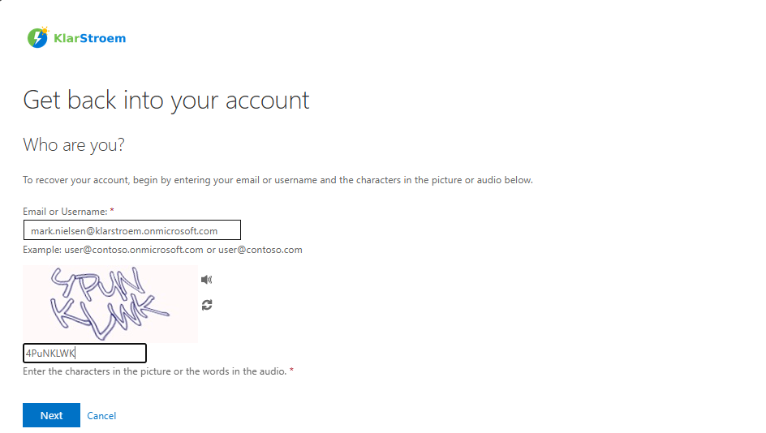

After I click next, I was directed to the *Get back into your acoount* page. As you can see on the screenshot below the only option for me to reset my password is to send a OTP code to my email and verify it is me.

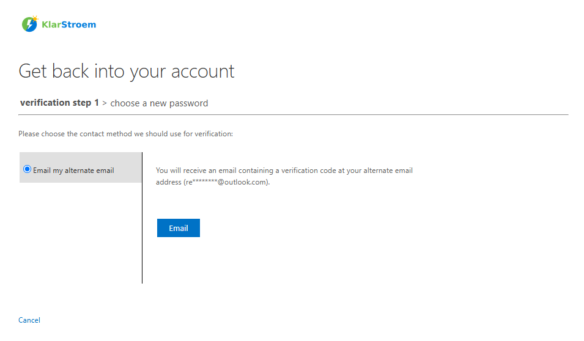

After I had verified the email using the OTP code, I was presented witht the option to type in the new password. I then type in a new password and clicked on save, then it confirmed the password had been updated.

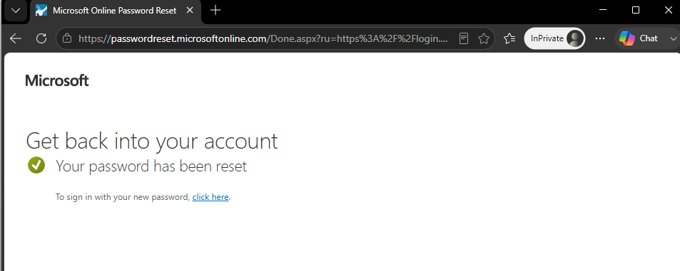

Additionally, Microsoft sent me an email letting me know the password had been changed:

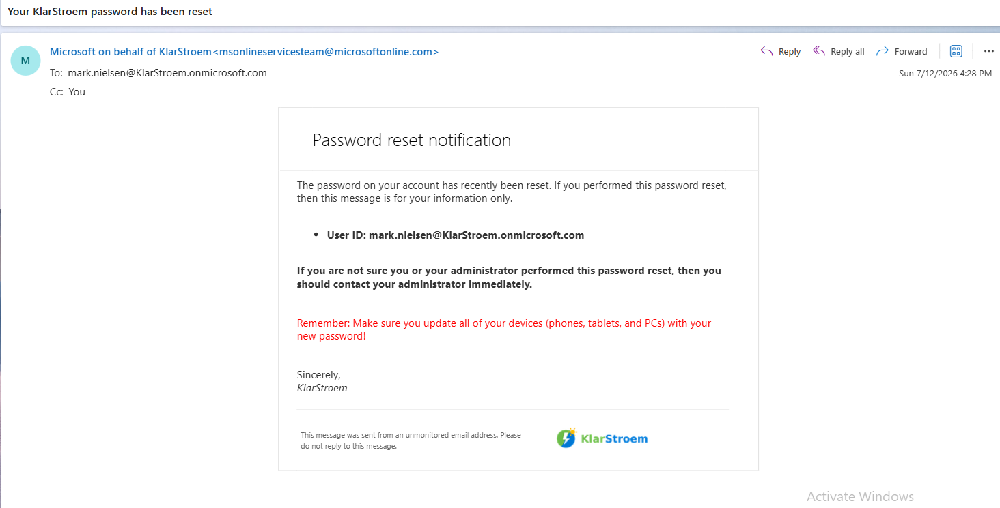

#### Test 2: Ensure the updated password also works on-prem
After I had updated the password successfully after trying a couple of times (more on this under lessons learned), I then turned on my domain-joined client PC and tried to log into Mark's account using the updated password, and it successfully logged me into the domain. 

#### Test 3: Verify that Line can reset her password using the MS Authenticator apllication
I ran the exact same test on Line just to confirm that she would be presented with the option to reset her password using the Microsoft authenticator application.

I followed the same steps, and after I click on *Forgot my password*, I was then presented with the following options to reset the password

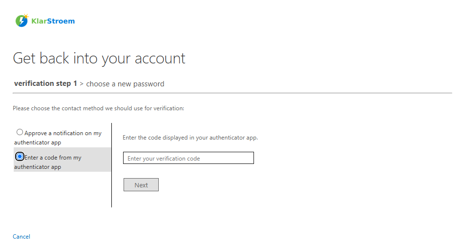

The scrrenshot confirms that Line can reset her password using the Microsoft authenticator application.

## Results  

## Lessons Learned  
Right after I had updated the password, I then turned on my domain-joined client PC and tried to log into Mark's account using the updated password, and it successfully logged me into the domain. 

I wasn't in doubt about this, because I noticed that when updating the password the system was talking directly to my domain controller. I found out abot this because it didn't want to update my password to begin with because of several reasons:
1. I had changed Marks password prior to testing the *Forgot my password* feature. I found out that the password policy applied on my domain controller preventet from changing again because the *minimum password age* was set to 1. This ment that if the user had s changed password recently, he then have to wait 24 hours before this could be changed again
2. I changed the policy and configured the *minimum password age* to be 0, I then expected to be able to change the password, but I of course forgot to run  the gpupdate /force command and realized this after some time.

This was actually a very good lesson because it showed me that the password is synchronized and updated in real time.
