# Disable user accounts & revoke all active user sessions

## Overview
Knowing how to disable a user account is crucial when an account is suspected to be compromised. Disabling the account isn't always enough because an attacker might still have a valid access token and refresh token. Revoking the user's active sessions invalidates the refresh tokens, preventing the attacker from obtaining new access tokens after the current access token expires. The user must authenticate again before accessing the organizations resources.

In a hybrid environment such as mine, the account should also be disabled in Active Directory because it remains the authoriative identity source for synchronized users. This prevents access to on-premise resources and ensures the disabled state/account is synchronized to Entra ID.

The user's password should also be reset as part of the incident response process. This complements the previous lab, which showed how self-service password reset enables users to regain access to their account.

## Objectives
- Show how to disable an user account in Entra ID
- Reset the users password
- Revoke active tokens
- Show how to disable the users account on-premise
- Verify the user no longer has access
- Verify that the tokens no longer are active

## Environment
- Identity Provider: Entra ID
- Licenses: Microsoft 365 E5
- Tenant: KlarStroem
- Role used: Global Administrator
- License requirements
  - For this lab so for none  

## Implementatio
Before disabling the account in Active Directory, the account is first disabled in ENtra ID and all active sessions are revoked. This immediately blocks access to cloud resources without having to wait for directory synchronization. The account is then disabled in Active Directory, which remains the authoritative identity source in this hybrid environment. This ensures that bouth cloud an on-premise access is blocked.

#### Step 1: Disable the suspected account in Entra ID
For this lab,' I'm going to focus on one of my hybird users. Let's pretend that Mark Nielsen account is suspected to be compromised, and therefore we need to follow the primary steps to ensure to stop an potential attack. 

First, in the screenshot below I have highlighted the user Mark Nielsen, and as you can see the user is an on-premise user that has been synchronized to Entra ID:

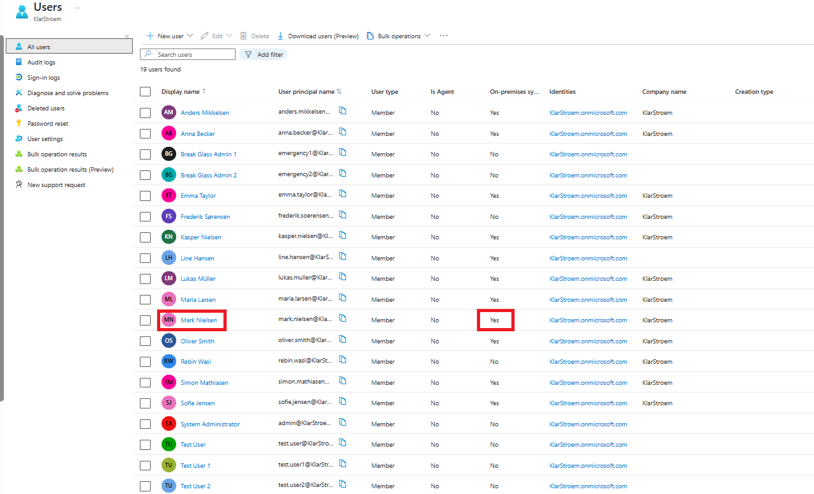

#### Step 1: Disable Mark's user account
Before we disable Marks user account, lets then first verify that the account at this point is enabled. From the User's overview, I simply click on Mark Nielsen to get to Marks user page. From the overview, we can see some of Marks details. If we take a closer look, we can then under *Account status* see that marks account at this point is enabled. For us to disable Marks account, we need to click on the edit option right below the account enabled status:

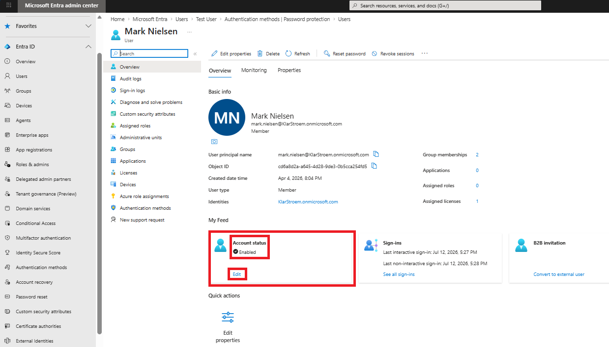

From here, I'm simply going to uncheck the Account enabled box, and right after click on save:

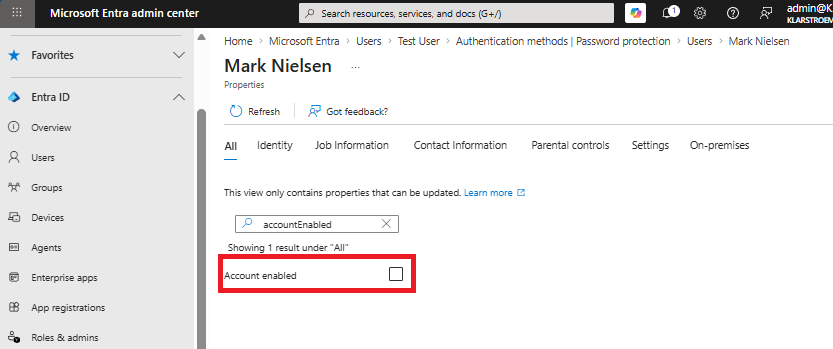

Right after I click on save, it then automatically took me back to Marks user's overview, can I could immediately see that the status had now changed from enabled to disabled:

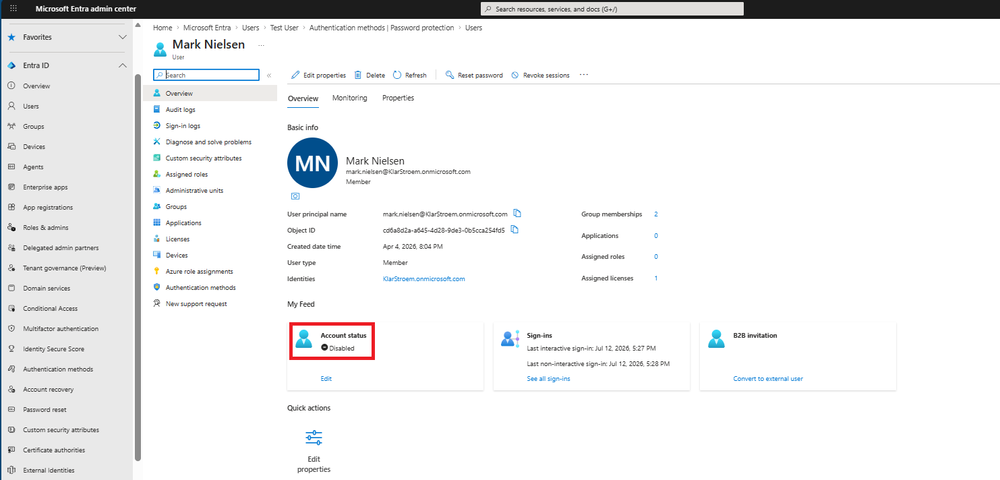

We also have the option to disable an account using PowerShell , we can simply use the following command:
- **Set-AzureADUser -ObjectId mark.nielsen@klarstroem.onmicrosoft.com -AccountEnabled $false**

#### Step 2: Revoke all active sessions
Revoking sessions ensures any stolen refresh tokens can no longer be used to get new access tokens. An attacker may still have an access token that's valid for a short period, but once it expires, they can't continue.

Revoking all sessions is made quite simple in Entra ID. From Marks user overview we see the *Revoke sessions* option, and if we click on that it then gives us the option to Revoke all current active sessions.

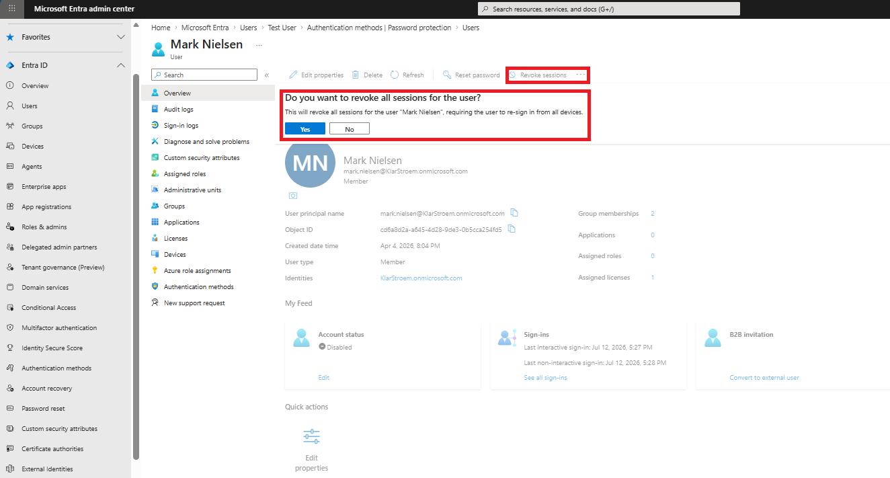

After I clicked on yes, it then confirmed it had revoked all active sessions for Mark Nielsen:

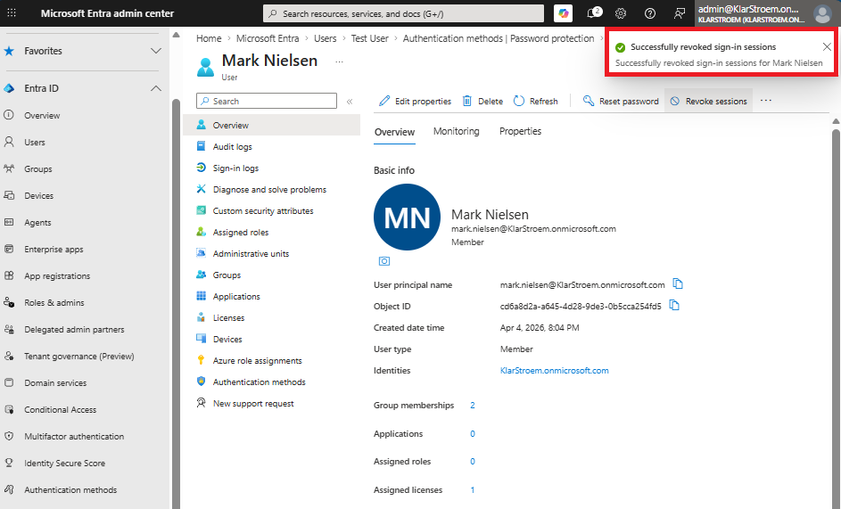

We also have the option here to revoke sessions for a user instead of using the GUI. If we wish to use PowerShell for this, the following command should work perfectly:
- **Revoke-AzureADUserAllRefreshToken -ObjectId mark.nielsen@klarstroem.onmicrosoft.com**

#### Step 3: Disable the account in Active Directory
Disableing an user account in Entra ID does not disable the account in on-premise Active Directory. I therefore logged into my domain controller as the administrator. In Server mangager go to:
1. Tools
2. Active Directory Users and Computers
3. Action -> Find
4. Search for Mark
5. Right click on Mark
6. Click Disable Account

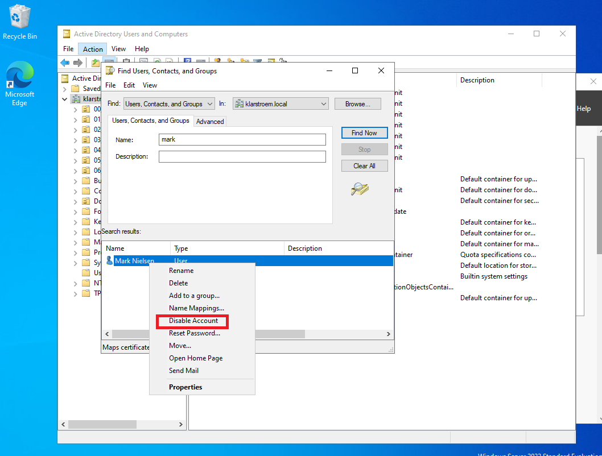

Right after I had clicked on disable, it then confirmed that the account was successfully disabled:

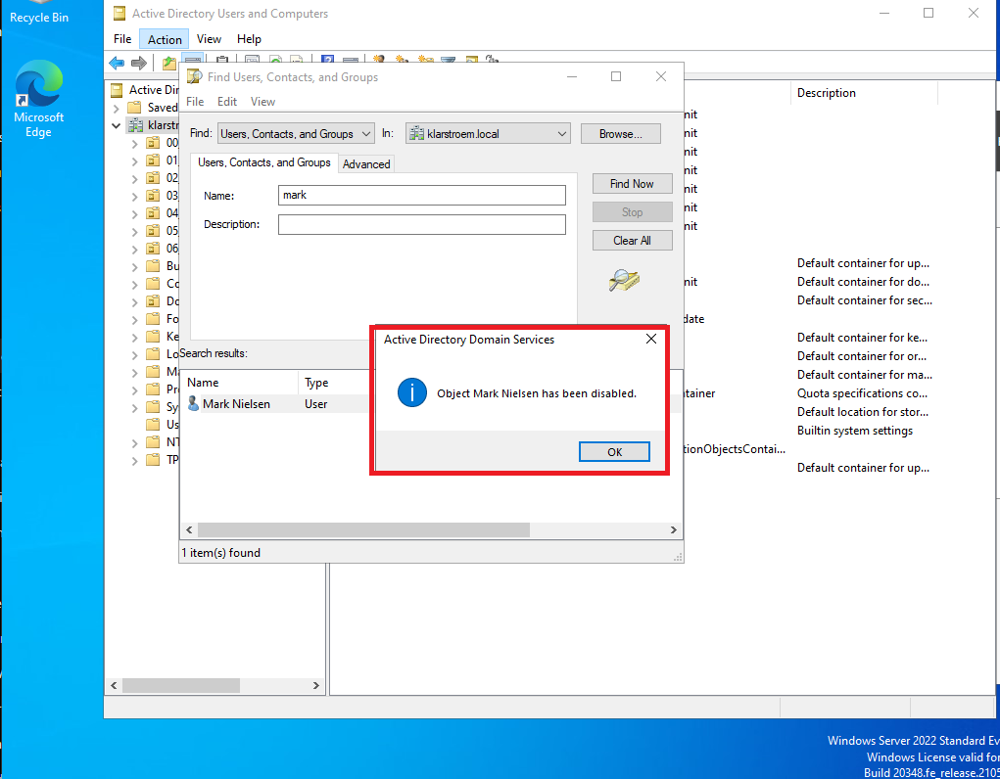

On-premise to disable an user account the folowing PowerShell command can be used:
- **Disable-ADAccount -Identity mark.nielsen**

#### Step 4: Reset users password and unlock the account
So far we have successfully disabled Marks acounnt in both Entra ID and on-premise as well, additionally we have ensured to revoke all user sessions.

Before I reset Marks password and also unlock his account, let me then first verify that the account is actually disabled (Test 1 in the verification section)

After I had verified that the account has disabled in both Entra and on-premise, I then in Active Directory found Marks again, right-clicked and then clicked on *Reset password*. Here I typed in the new temporary password, and right after that I right clicked on Mark again and clicked on Enable Account

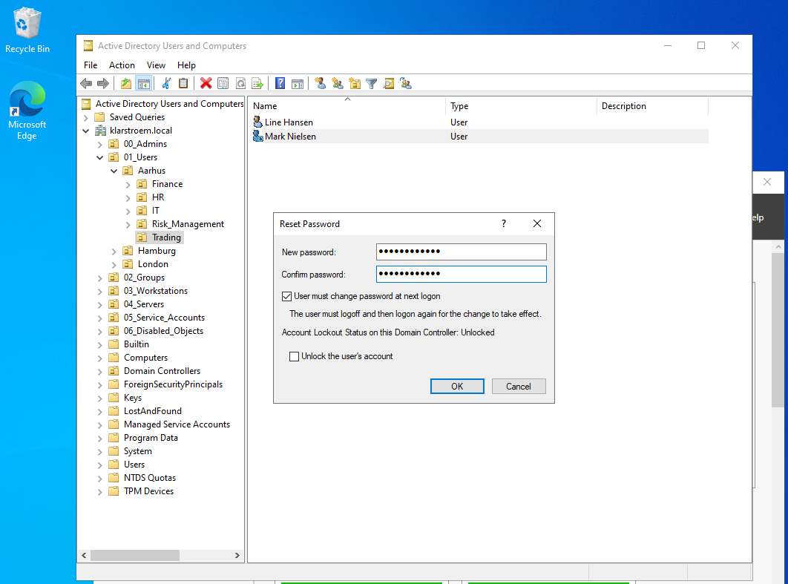

Note, that a locked/unlocked account is not the same as a enabled/disabled account. One happens automatically while the other one is performed by an administrator.

#### Step 5: Force the change to take affect immediately
Instead of waiting for the changes to synchronize automatically, I choose to force a synchronization of the changes since the last sync, therefore on my sync01 server I ran the following command in PowerShell:

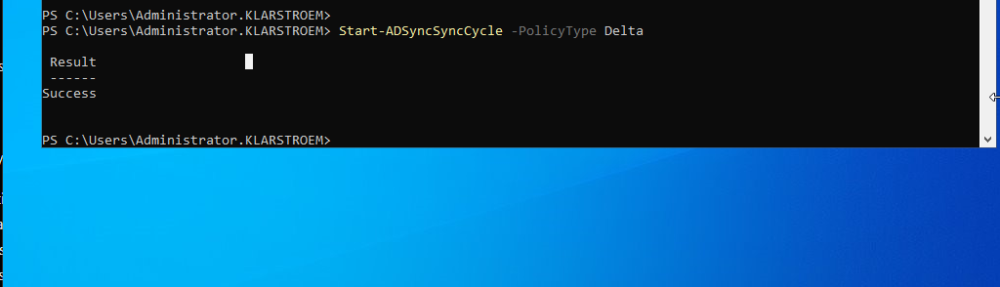

**NOTE:** I was waiting for the account to automatically change status in Entra ID from Disabled to Enabled. An important lesson for me is that for synchronized users, the account should always first get disabled in AD DS first. If a hybrid user account is manually disabled in Entra ID first and then disabled manually on-prem, then when enabling the account again in Active Directory, the changed state will not automatically take affect in Entra because I disabled it manually in Entra ID in the first place.

This means that I had to enable the account manually in Entra ID. Next time, I'll remember to disable and enable the account in AD DS first because then the changed state will automatically happen in Entra ID.

## Verification
#### Test 1: Verify that Marks account is disabled both in Entra and on-premise
First, I tried to login to marks account on-premise from a domain-joined client PC, and it prevented the login and confirmed that the user account is disabled

I then tried to login to the My Sign-in Portal using the same account, and here it also confirmed that the account was disabled:

#### Test 2: Verify that Marks account is enabled on-premise
First, I wanted to test if Marks account was enabled again on-premise. When I reset the password in AD DS, I then required the user to change the password when trying to log in again. I therefore expect that Mark can log in using the temporary password, and that he then has to change the password before successfull log on.

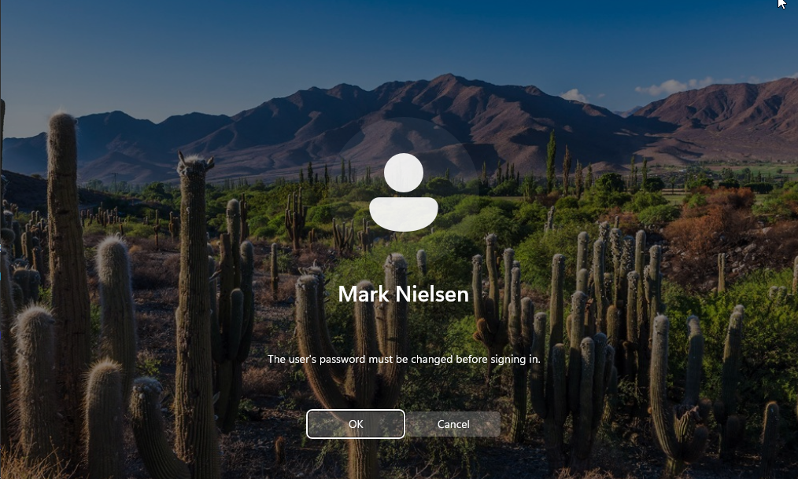

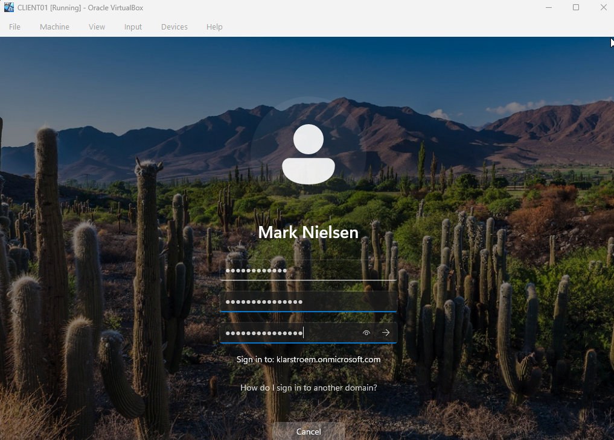

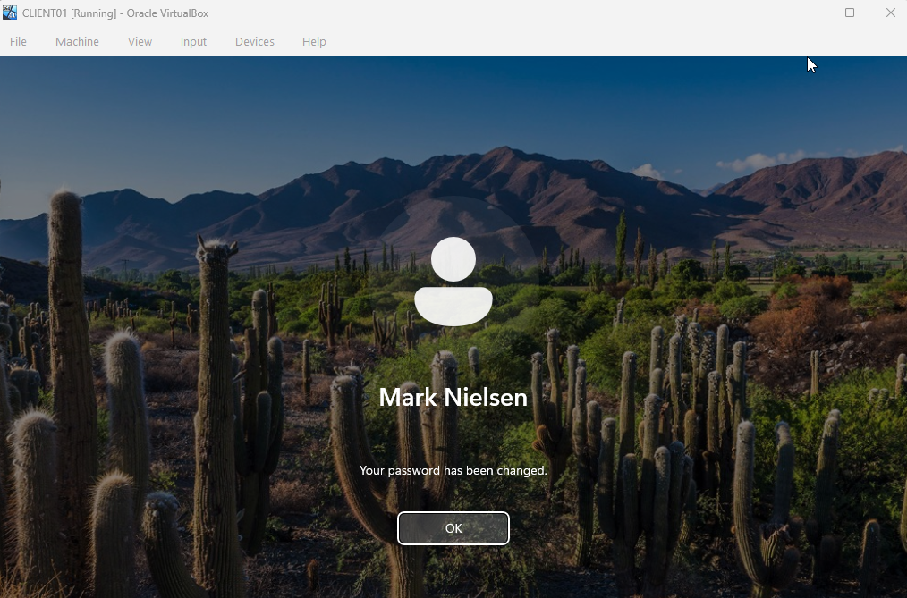

#### Test 3: Verify Marks account is enabled in Entra
Now, lets test that Mark can successfully log into cloud resources as well. I once again tried to log in to the My signIns page

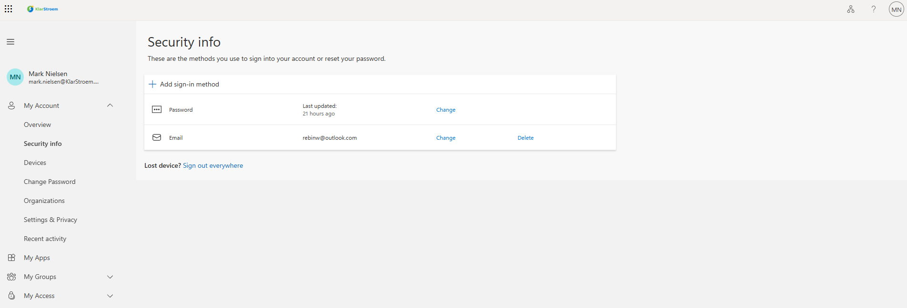

## Results  
We successfully disabled the user's account both on-premise and in Entra ID. We also ensured to revoke all sessions to ensure the attacker wouldn't be able to obtain new access tokens. We then ensured to change the user's password before unlocking the account, and requiring the user to change the password before the first log on.

At the end we verified that the user's account had been enabled again, and that the user could gain access to both the on-premise environment and to cloud resources as well.
## Lessons Learned  

