# Enable Windows Hello for Business and use TAP to register WHfB for the user

## Overview
Windows Hello for Business is Microsoft's passwordless authentication solution that allows users to sign in using a PIN or biometric authentication instead of a traditional password. Instead of relying on a password that is sent to a service during authentication, Windows Hello for Business uses asymmetric key cryptography. During provisioning, the device generates a public and private key pair. The private key is securely stored in the device's Trusted Platform Module (TPM) and never leaves the device, while the public key is registered in Microsoft Entra ID and used to verify the user's identity.

In this lab, I'll configure and deploy Windows Hello for Business using Microsoft Intune. Rather than deploying the policy to every managed device, I first create a pilot device group containing a single Windows 11 client. This allows me to verify that the deployment works as expected before rolling it out more broadly.

Since my environment is based on a hybrid identity setup, I also discovered that Windows Hello for Business depends on Cloud Kerberos Trust before users can authenticate to on-premises Active Directory using their PIN. Configuring Cloud Kerberos Trust is covered in a separate lab. This lab focuses on deploying and provisioning Windows Hello for Business using Microsoft Intune.

The following diagram shows the Windows Hello for Business authentication flow used throughout this lab.

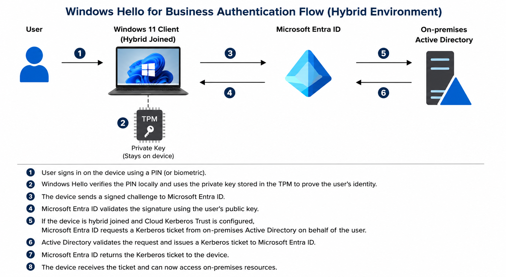

## Objectives
- Configure a Windows Hello for Business deployment policy in Microsoft Intune.
- Configure the required Windows Hello for Business policy settings.
- Create a pilot device group and assigned the policy to the group.
- Provision Windows Hello for Business on a hybrid Microsoft Entra joined Windows 11 client.
- Verify that users can successfully authenticate using a Windows Hello for Business PIN.
- Verify the deployment using the Windows Hello for Business operational logs in Event Viewer.

## Environment
- Identity Provider: Entra ID
- Licenses: Microsoft 365 E5
- Tenant: KlarStroem
- Role used: Global Administrator
- License requirements
  - For this lab so for none  

## Implementation
**Configure Windows Hello for Business in Intune**  
The first step in the process is to enable Windows Hello for Business on the devices managed by Intune. There are two ways of enabling WHfB in Intune:
1. Method: Enables tenant-wide enrollment policy. It applies to every enrolled Windows device in the tenant and is mainly for provisioning Windows Hello during enrollment.

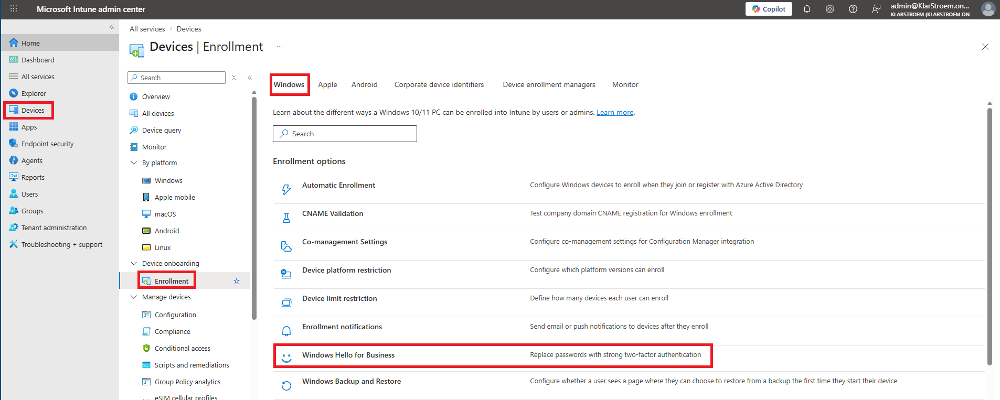

2. Method: A more controlled deployment, this is the recommended approach because we're able to control the scope instead of applying the policy/enrollment to the whole tenant at once. **We're going to choose this deployment method in this lab**

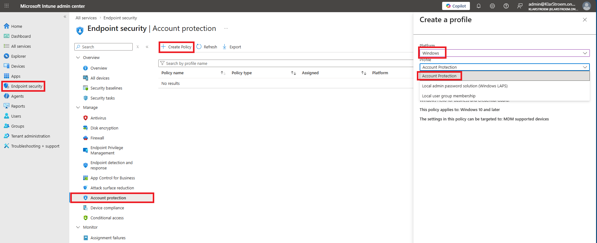

#### Step 1: Fill out the *Basics*
I choose to go with the second option, and therefore click on *Create* it then took me to the configuration wiindow, and the firste step was to name the policy and give it a short description and click on *next*

#### Step 2: Configure the *Configuration settings*
Under the *Create Policy* window, I'm going to configure the WHfB policy that will later be assigned to the pilot group. This is where I define how I want WHfB to be configured on managed devices.

One thing worth pointing out is that Intune lets us configure WHfB either at the device level or at a user level. A device-scoped policy follows the device and applies to anyone who signs in to that device. A user-scope policy, on the other hand, follows the user regardless of which managed device they use.

Since the purpose of this lab is to configure Windows Hello on managed devices, I chose to configure only the device-scope settings. I therefore left all user-scope settings to **Not configured**, allowing the device policy to control the WHfB configuration.

I also left **Credential Guard** as **Not configured**. this is a seperate Windows security feature that protects credentials such as NTLM password hashes and Kerberos tickets from being stolen. Even though it is a recommended feature, it is not required for Windows Hello, so i'm leaving it out from this lab and policy.

I also left **Facial Features Use Enhanced Anti-Spoofing** as **Not configured**. This setting is used together with facial recognition to help *supported* cameras distinguish a real user from spoofing attempts, such as pictures. Since this lab is running on a VM  without biometric hardware, this setting then isn't relevant.

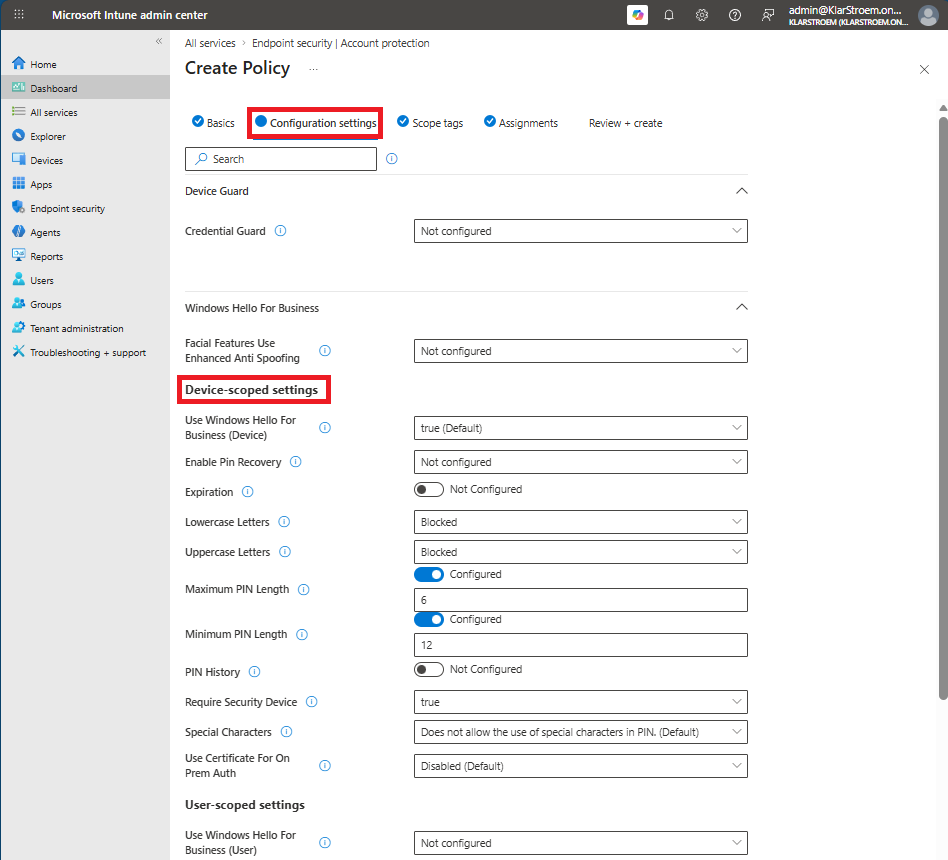

I'd also like to explain some of the configured options that seem less obivious than others:

**Require Security Device (TPM):** I chose to require a security device, meaning that WHfB must use a Trusted Platform Module if one is available. The TPM is a hardware chip designed to securely protect cryptographic keys. Instead of storing the private key in the Windows software-based key store, the private key is protected by the Trusted Platform Module (TPM). The TPM performs the cryptographic operations internally, meaning the private key never leaves the hardware.

**Use Certificate for On-prem Auth:** I left this setting disabled because this lab uses the modern Windows Hello for Business deployment model. Enabling this option is intended for environments using the older Certificate Trust model, where user certificates issued by an on-premises Certificate Authority are used for authentication to Active Directory. Since my environment doesn't use certificate-based authentication, this setting isn't required.

Lastly, I chose to block uppercase letters, lowercase letters, and special characters. This limits the Windows Hello credential to a numeric PIN. Since the PIN only unlocks the private key stored on the device and is tied to that specific device, I'm comfortable using a numeric PIN instead of a more complex password.

#### Step 3: Determine the 'Scope tags*
The scope tags page is used to delegate administration within Intune. Scope tags determine which Intune administrators are allowed to view and manage the policy we're creating.

As an example, lets say an organization with IT departments in Denmark, Germany, and United Kingdom. Separate scope tags could be created for each country, ensuring that administrators in Denmark only manage danish devices and policies, while admins in Germany only manage the German environment.

Since my lab only has a single Intune administrator, there is no need to create additional scope tags. I therefore left the default scope tag.

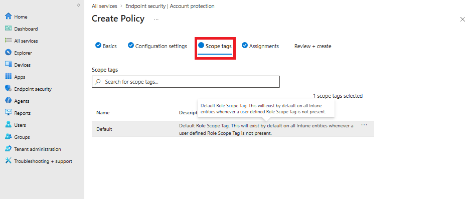

#### Step 4: Determine the *Assignments*
The final step is to assign the policy. Since I chose to configure the device-scoped settings, I created a security group containing the pilot device rather than the pilot user. This ensures that the policy follows the managed device and applies to anyone who signs in to that device. Had I instead configured the user-scoped settings, I would have assigned the policy to a user group so that the configuration followed the user across multiple managed devices.

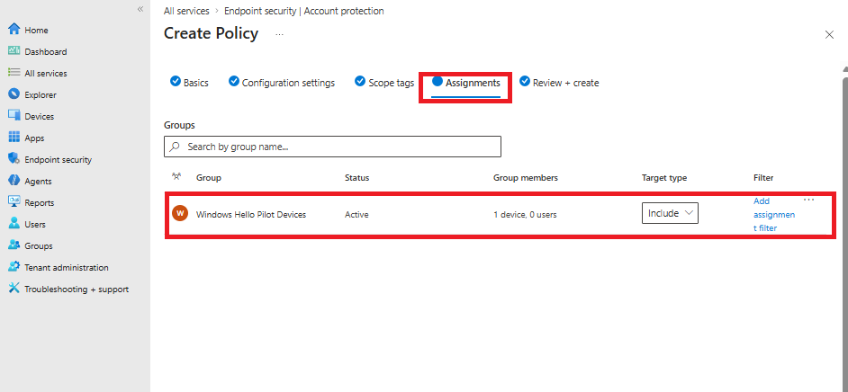

I then reviewd the settings before finally creating the policy. After I had clicked *Create* I the policy was now successfully created:

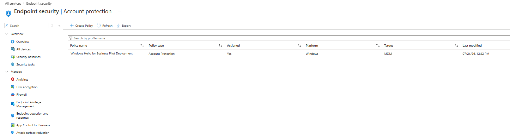

#### Step 5: Set-up Windows Hello for Business on the client
After configuring and assigning the Windows Hello for Business policy, I returned to the client device and restarted it to allow the policy to take effect.

When I signed in as Mark using his password, Windows immediately detected that the organization required Windows Hello for Business and started the provisioning process. Since the user had already authenticated to the on-premises Active Directory using the password, Windows only needed to verify the user's identity before allowing Windows Hello for Business to be configured.

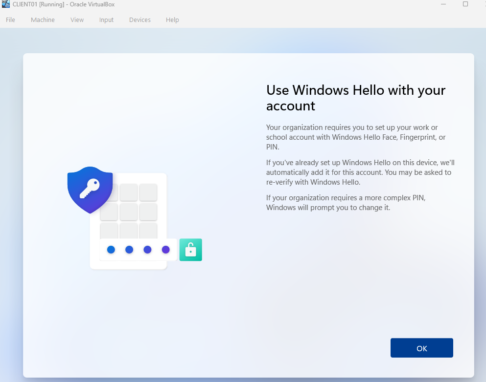

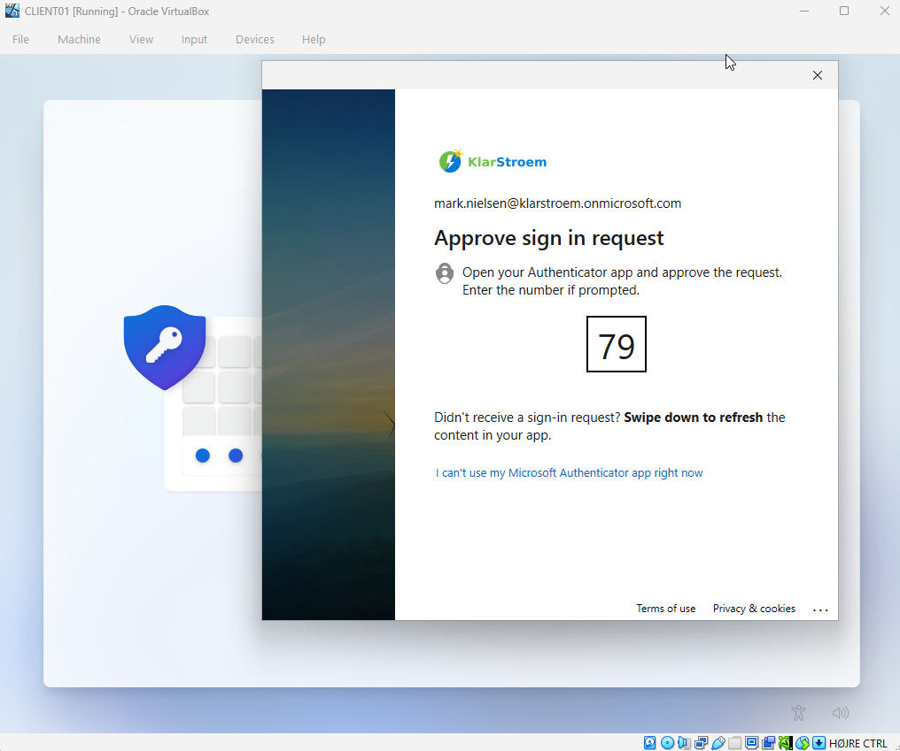

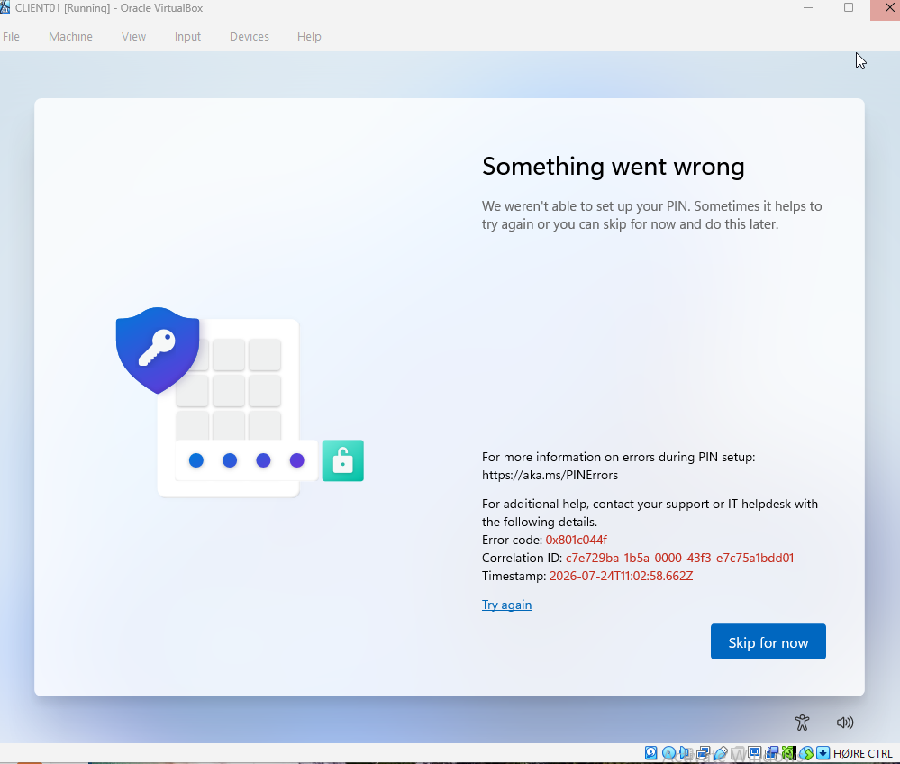

To demonstrate another authentication method, I assumed that Mark no longer had access to the Microsoft Authenticator application. Before restarting the client device, I therefore issued a Temporary Access Pass (TAP) for Mark from the Microsoft Entra admin center.

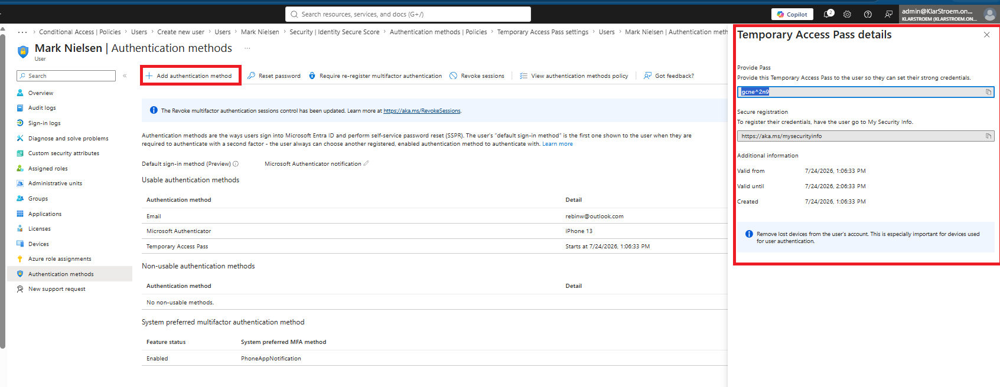

After signing in again with the password, Windows prompted Mark to authenticate using the Temporary Access Pass instead of Microsoft Authenticator.

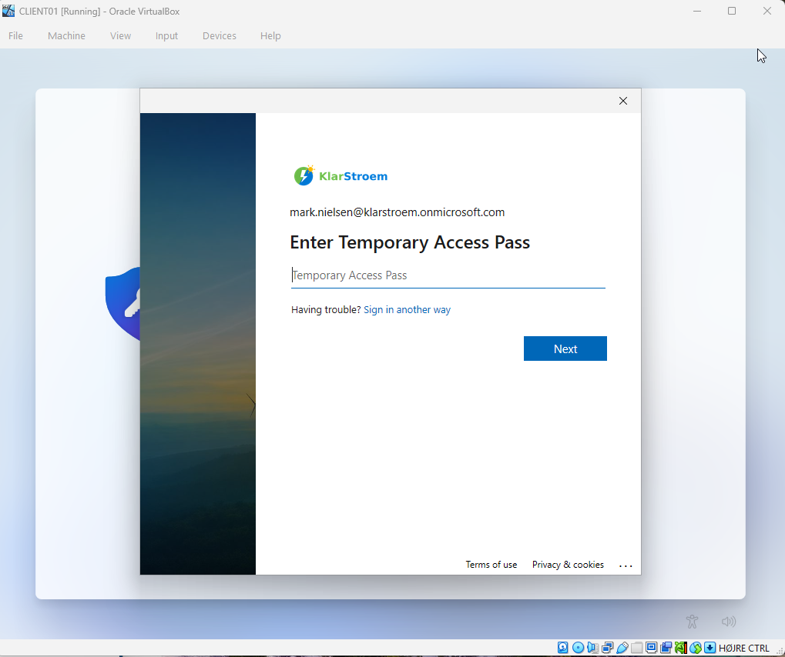

Once the Temporary Access Pass had been verified successfully, Windows asked Mark to create a PIN for Windows Hello for Business.

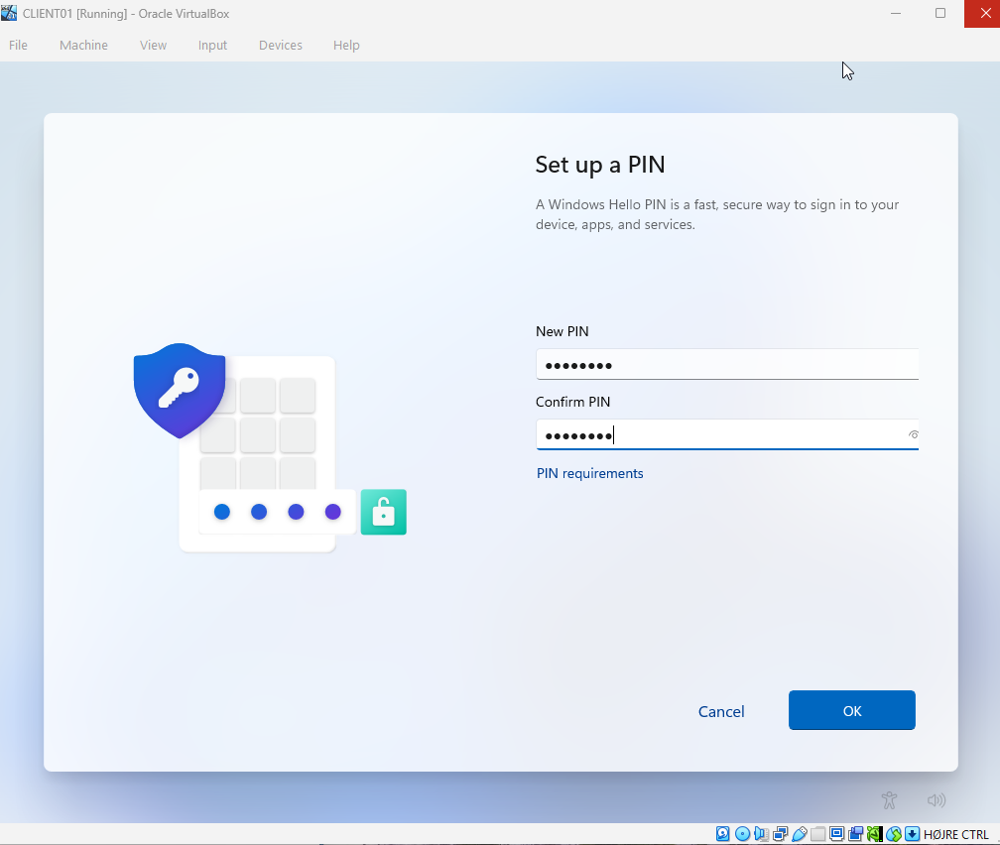

After the PIN had been created, Windows completed the provisioning process and informed the user that the PIN could now be used for future sign-ins. Windows also showed the PIN login option after restarting the client:

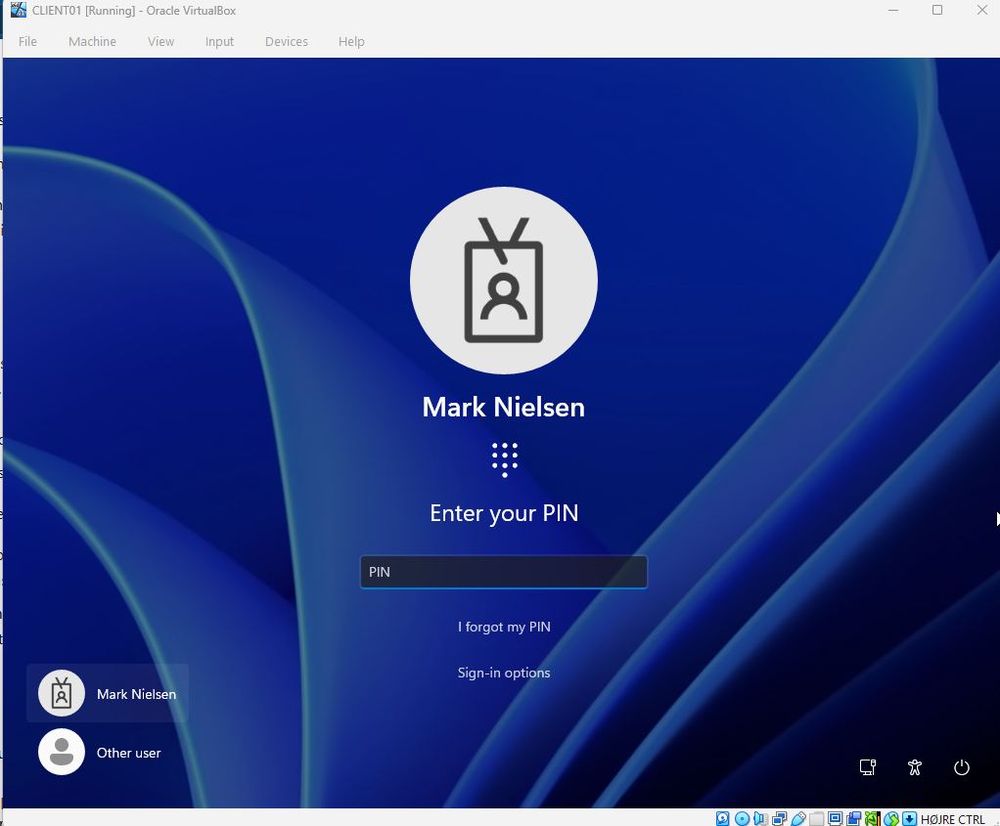

#### Step 6: Verify the Windows Hello for Business deployment
At this point, I expected the PIN to work for future sign-ins. However, after signing out and attempting to sign in using the newly created PIN, the authentication failed even though the Windows Hello for Business provisioning had completed successfully.

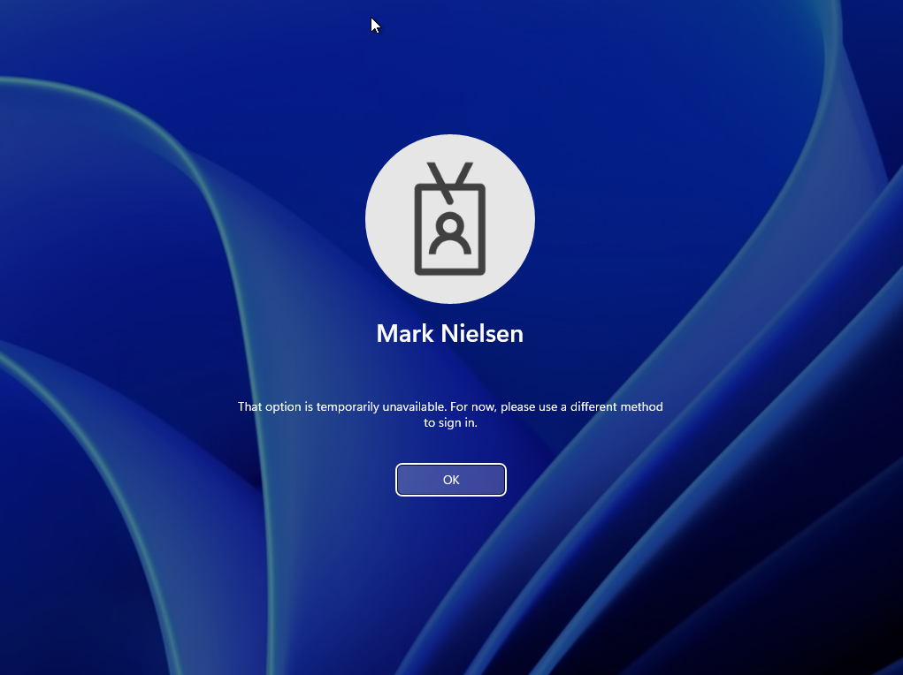

After investigating the issue, I determined that the hybrid environment was missing the Cloud Kerberos Trust configuration required for Windows Hello for Business to authenticate against the on-premises Active Directory.

The complete troubleshooting process and configuration of Cloud Kerberos Trust are documented in the following lab:
- [Configure Cloud Kerberos Trust for Windows Hello for Business](https://github.com/RebinW/Microsoft-SC-300/blob/main/07-hybrid-identity/03-cloud-kerberos-trust.md)

## Verification
#### Test 1: Verify that the authentication method used was WHfB
After completing the Cloud Kerberos Trust configuration, I restarted the client device and signed in using the Windows Hello for Business PIN instead of the user's password.

To verify the authentication, I reviewed the Windows Hello for Business Operational log in Event Viewer. Event ID 5001 confirmed that the user successfully signed in using Windows Hello for Business.

The event also showed:

Credential Type: Software Key
Deployment Type: Cloud Trust

This confirmed that the Windows Hello credential was successfully used to authenticate the user and that the device was using the Cloud Trust deployment model.

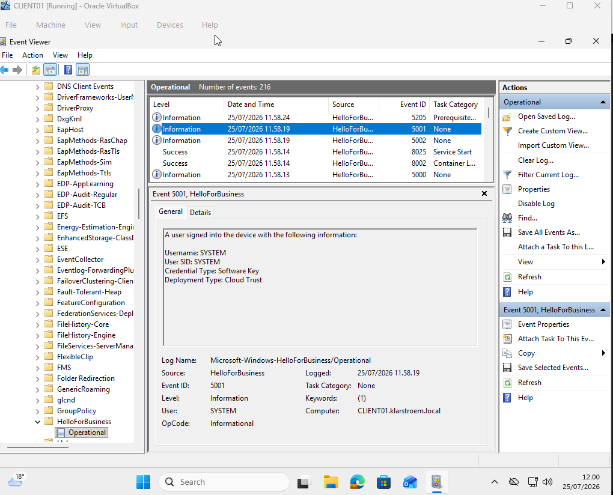

## Results  
The Windows Hello for Business deployment was completed successfully. The policy was deployed through Microsoft Intune and assigned to a pilot device group containing a single hybrid Microsoft Entra joined Windows 11 client.

After the policy had been applied, I successfully provisioned Windows Hello for Business for the test user and configured a PIN protected by the device's TPM. After completing the additional Cloud Kerberos Trust configuration described in the next lab, I was able to sign in using the PIN instead of the user's password.

I also verified the deployment by reviewing the Windows Hello for Business Operational log in Event Viewer, which confirmed that the authentication was performed using the Cloud Trust deployment model.

## Lessons Learned/ Troubleshoot
#### 1. Troubleshooting:
I started by verifying whether Windows Hello for Business had been provisioned successfully on the client. The dsregcmd /status command showed that NgcSet was set to YES, meaning that Windows Hello had been configured and that a key pair had been created for the user.

I also looked at the SSO State section. While CloudTgt was present, OnPremTgt was still set to NO.

At first this seemed confusing, but it actually makes sense.

CloudTgt represents authentication towards Microsoft Entra ID, while OnPremTgt represents a Kerberos Ticket Granting Ticket issued by the on-premises Active Directory. Since Windows Hello uses asymmetric keys instead of the user's password, Active Directory could not issue a Kerberos ticket until Cloud Kerberos Trust had been configured.

This was the first indication that the issue was not related to Windows Hello provisioning itself, but the authentication flow between Microsoft Entra ID and Active Directory.

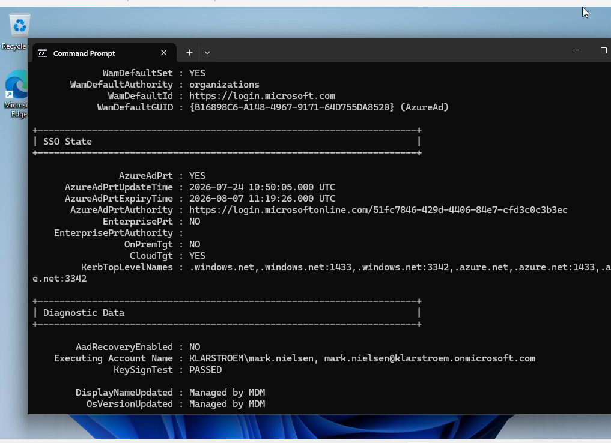

#### 2. Troubleshoot:
I then reviewed the Windows Hello for Business Operational event log. The log confirmed that the PIN authentication failed, but it did not provide enough information.

Although the event confirmed that the problem happened during the sign-in process, it did not explain why the authentication failed.

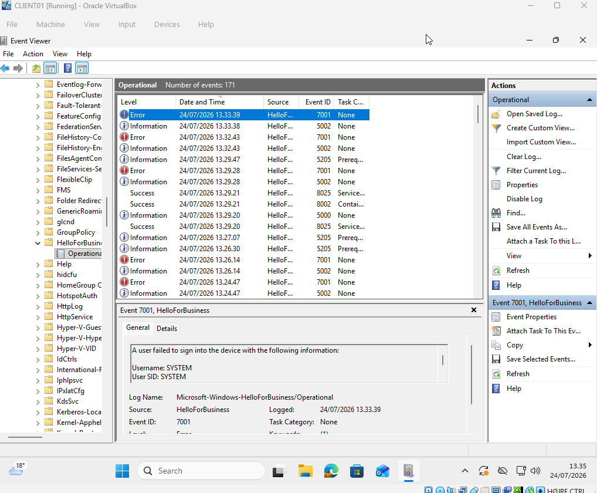

To get additional information, I reviewed the XML details for Event ID 7001.

The event contained authentication error codes, but they were not specific enough to identify the missing configuration. I therefore continued troubleshooting by verifying whether Windows Hello itself had been provisioned correctly.

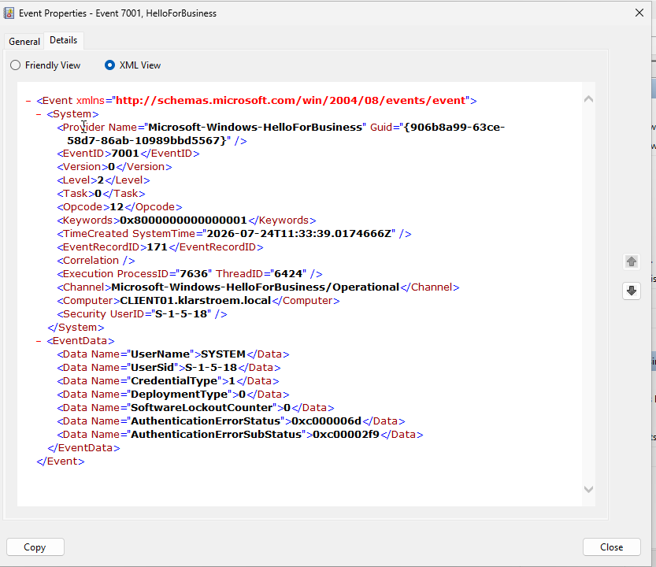

#### 3. Troubleshoot:

At this point I wanted to determine whether Windows Hello had actually created the cryptographic key pair.

I used: certutil -csp "Microsoft Password Key Storage Provider" -key

The command returned the Windows Hello key stored in the Microsoft Passport Key Storage Provider.

This confirmed that Windows Hello provisioning had completed successfully and that the issue was not related to TPM support in the VM or key generation.

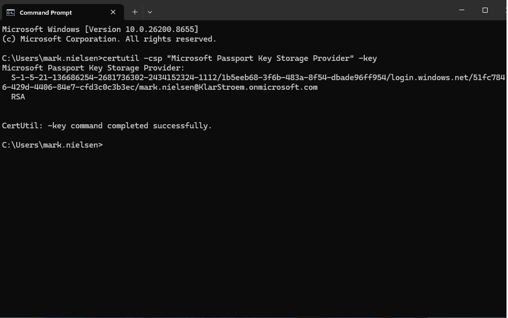

#### 4. Troubleshoot:
I ran *dsregcmd /status* again to verify the Windows Hello configuration.

The output showed:
- NgcSet = YES
- KeySignTest = PASSED

These values confirmed that Windows Hello was fully configured and that the cryptographic key was functioning correctly.

Since both the key and TPM configuration were working as expected, I concluded that the issue had to occur later in the authentication process.

#### 5. Troubleshoot:
After confirming that Windows Hello had been provisioned successfully, I shifted my attention to the authentication flow.

Windows Hello authenticates the user by using the private key stored on the device. However, the client computer was still hybrid joined and therefore depended on Active Directory for Kerberos authentication.

At this point I realized that Active Directory had no mechanism for trusting the Windows Hello authentication performed by Microsoft Entra ID.

I therefore inspected Active Directory and found that the Microsoft Entra Kerberos server object had not been created.

This led me to conclude that Cloud Kerberos Trust had not yet been configured.

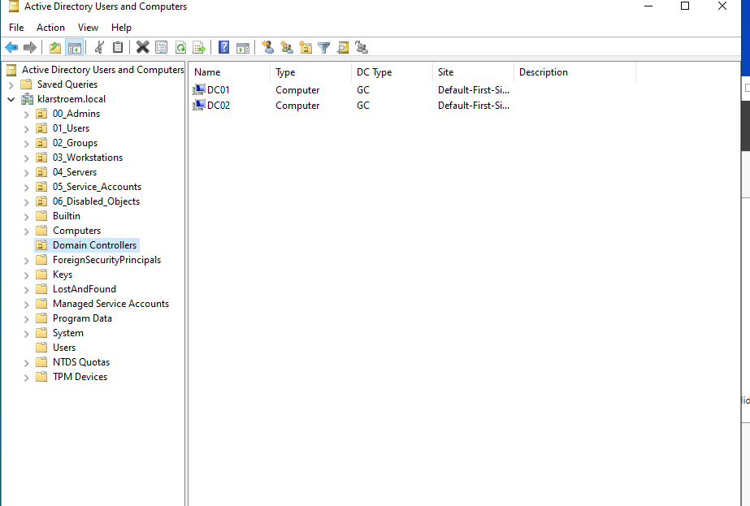

The complete implementation and verification of Cloud Kerberos Trust is documented in the following lab:
- [Configure Cloud Kerberos Trust for Windows Hello for Business](https://github.com/RebinW/Microsoft-SC-300/blob/main/07-hybrid-identity/03-cloud-kerberos-trust.md)
