# Replacing security defaults with a baseline CA policy

## Overview
Security defaults are by default enabled on all new tenants, and provides a solid preconfigured security baseline such as requiring MFA registration for all users in the tenant, blocking legacy authentication, and protecting administrator accounts.

In this lab, I'm going to replace the MFA registration requirement that security defaults provides by implementing my first Conditional Access policy. This will ensure that we have a solid security baseline to start out with and then we can slowly build other policies on top. The most important thing is to ensure that all users accounts have this baseline security and are required to perform MFA when they are accessing resources.

Conditional Access policies can analyze various signals, such as user, device, application, location, and more. Based on these signals it can then automate decisions and enforece policies for accessing specific resources, if configured correctly CA policies really supports the zero-trust mindset.

Assignments/If statements
- Users and Groups: Which users and groups will be included in or excluded from the policy? Does this policy include all users, specific group of users, directory roles, or external users?
- Cloud apps or actions: What application(s) will the policy apply to? What user actions will be subject to this policy?
- Conditions: Which device platforms will be included in or excluded from the policy? What are the organization’s trusted locations?
  
Access controls/Then statement
Grant: Do you want to grant access to resources by implementing requirements such as MFA, devices marked as compliant, or Microsoft Entra hybrid joined devices?
Session controls: Do you want to control access to cloud apps by implementing requirements such as app enforced permissions or Conditional Access App Control?

In future labs we're going to build more complex CA policies where we focus on specific signals such as specific user accounts/user roles, devices, location and resources. We're then going to specify more strict access controls such as requiring specific authentication strengh. 

Configuring CA policies can of course be challanging, but in my opinion the complexity really comes from designing these policies to ensure that they cover and mitigate risks in the organization. This means a company should design and implement the right policies to ensure they are no gabs for an attacker to take advantage of.

## Objectives
- Turn of Security defaults for the tenant
- Configure the baseline CA policy to require MFA on all users
- Ensure to exclude breakglass accounts from the policy
- Verify users must perform MFA before they can sign in
- Verify that breakglass accounts can sign in without the use of MFA

## Environment
- Identity Provider: Entra ID
- Licenses: Microsoft 365 E5
- Tenant: KlarStroem
- Role used: Global Administrator
- License requirements
  - The Conditional Access feature requires at least a Entra ID P1 license for standard rules
  - Creating CA policies with signals from Identity protection (Risky sign-ins, Risky users) Requires a P2 license.

## Implementation
#### Step 1: Disable security defaults
Before we're able to implement CA policies, we first have to disable security defaults. We can do this from the Entra ID Admin portal:
1. Entra ID admin portal
2. Click on the Entra ID tab to the left
3. Click on Overview
4. Click on Properties
5. Click on *Manage security defaults*
6. Then choose Disabled, and then check a justification option
7. Click on Save

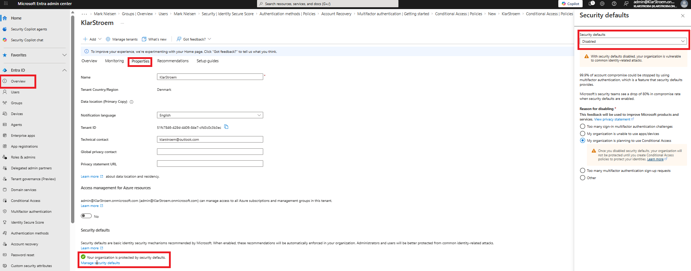

#### Step 2: Navigate to the configuration page
right after I disabled the security default, Entra then automatically took me to the Conditional Access page. To start configuring our first CA policy we simply click on *+ Create new policy*

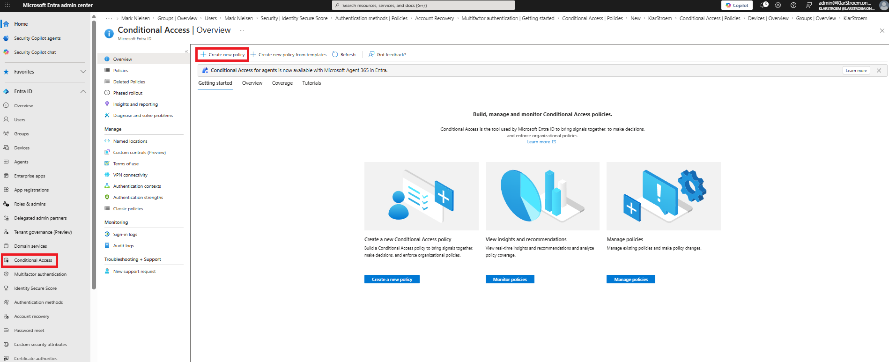

The *Create new policy from template* option right next to *Create new policy* is also extremely helpful when first time starting out with Conditional Access. I took a screenshot that shows they have a template for exactly the purpose we want to achieve, and many other usefull templates.

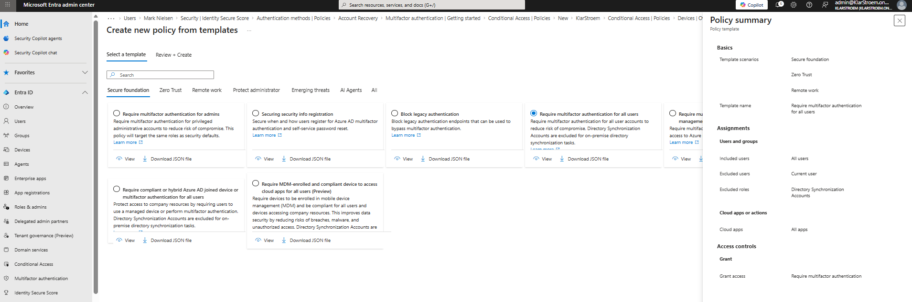

I'm still going to create my policy manually rather than using the template. I want to become familiar with the configuration window, and over time really understand all of the different settings and options. Once I clicked on *Create new policy* it then took me to the configuration page, where I have the policy the *Require MFA for all users* name:

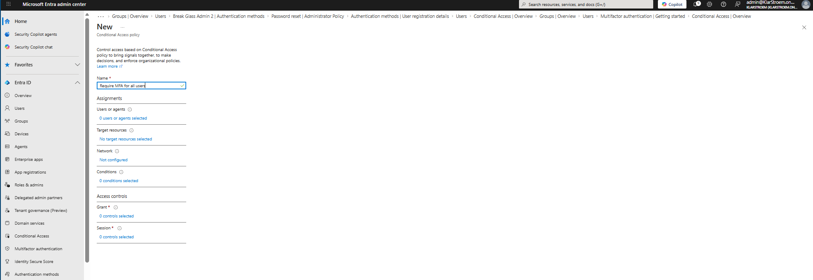

#### Step 3: Configure the Assignments for the policy
**Users or Agents:** This is where we specify the users that the policy is going to affect. I want to ensure that all users in my tenant is going to be required to use MFA, therefore the simplest option is to check the *All Users* box. 

I'm still going to exclude my emergency accounts to not be affected by the policy. Excluding emergency accounts from own policies is considered best practice because these accounts should be able to regain access to the tenant in case of lock out or any mistakes. Microsoft has actually moved away from recommending not to apply MFA for emergency accounts, and even though I'm not requiring MFA on these accounts, then Microsoft does when accessing any admin portal.

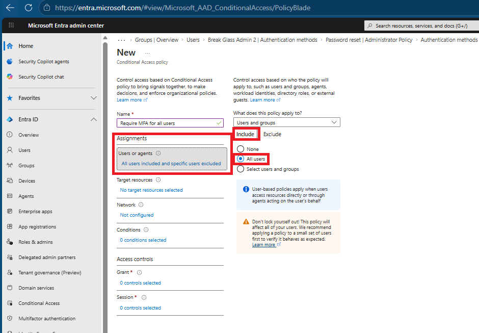

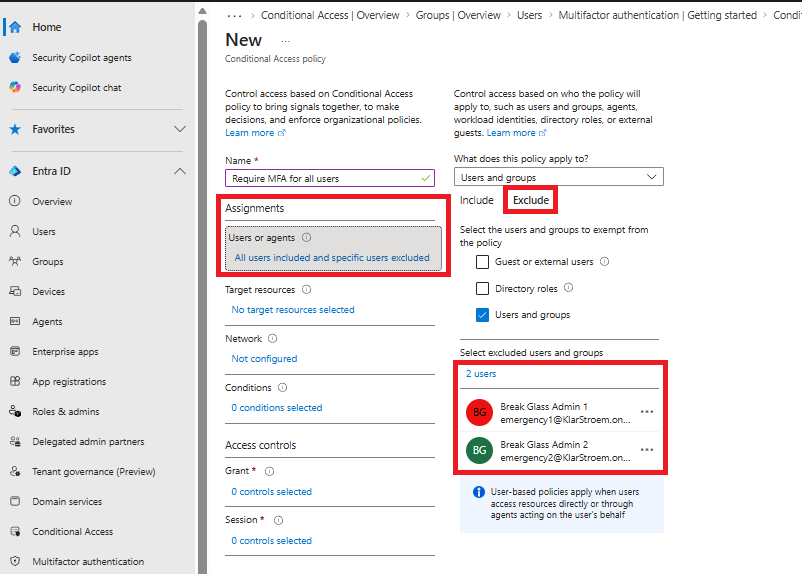

**Target resources:** All resources is selected to ensure the policy applies regardless of which cloud application or service a user is trying to access.

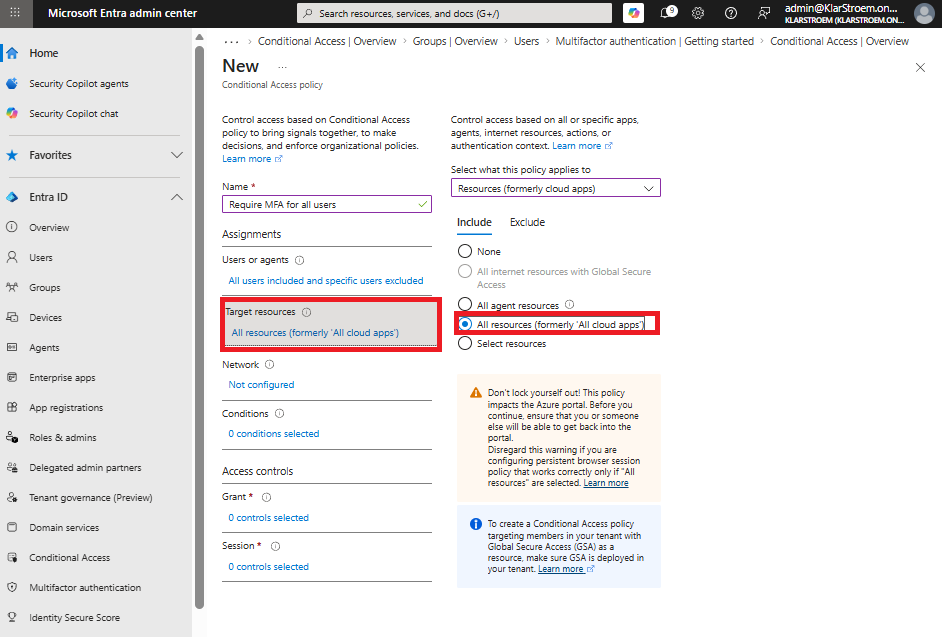

***Network:** I configured the policy to apply from any network or location. This ensures the same requirements are enforced whether users sign in from on-premise, home, or any other location.

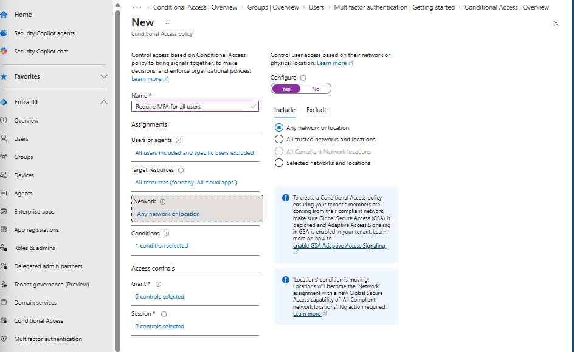

**Conditions:** No additional conditions are configured because this policy is intended to provide a baseline level of protection for all users. The same requirements apply regardless of the device, platform, or sign-in risks.

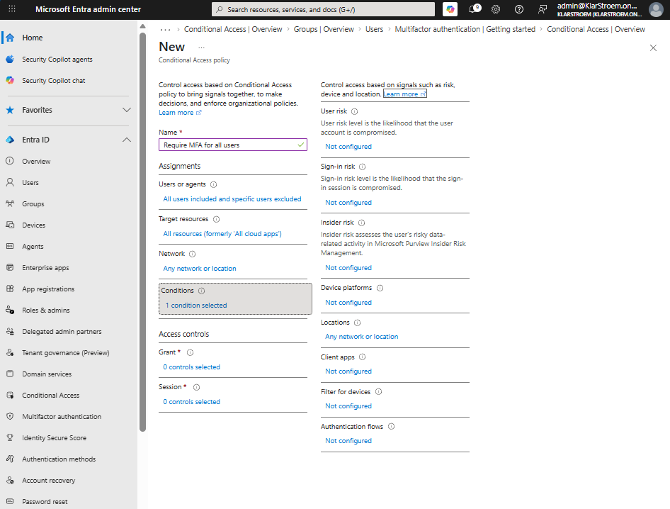

#### Step 4: Configure the Access controls
**Grant:** I chose to check the *Require multifactor authentication* option, this ensures that all users must use MFA when signing in. Users can authenticate using any MFA method that is enabled for their account without requiring a specific authentication method (Require authentication strength)

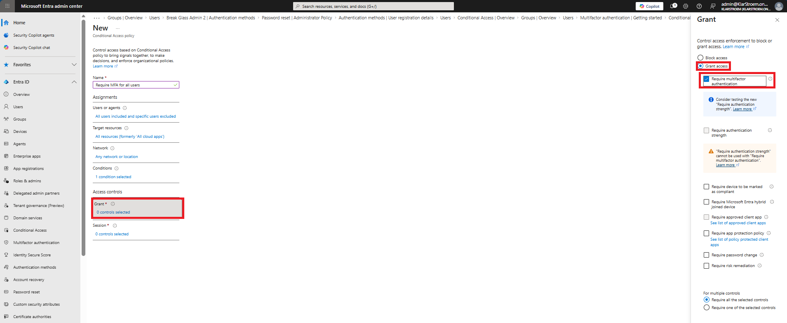

**Session:** Session controls are not configured and left the default settings because they are not required for this baseline policy. Session controls are used for more advanced scenarios, that I'm going to cover in future labs.

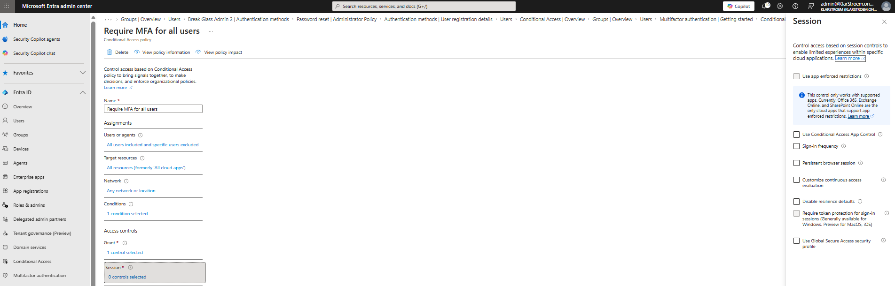

#### Step 4: Enable the policy in Report-only mode
As a best practice, Conditional Acess policies should first be deployed in Report-only mode. This allows us to review the impact of the policy before enforcing it. I'm going to chose this and then quickly test the report-only mode directly here instead of in the verification section:

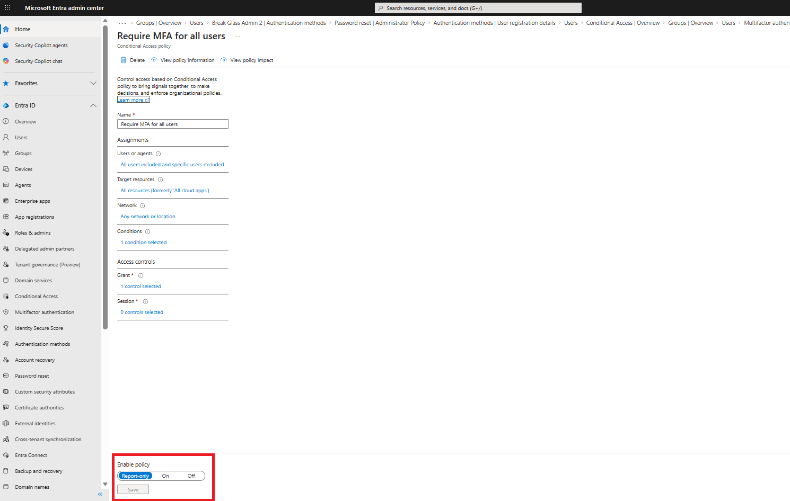

**Investigate and confirm the policy applies:** After I enabled and saved the new CA policy, I then tried to log in with a test user to see if the policy would have applied if not it was set to *Report-only mode*. After I had successfully logged into the My Sign-ins portal, I then waited a few minutes. To investigate user sign-ins and evaluate the report-only mode go to
1. Entra Admin Center -> Entra ID Blade
2. from the drop-down menu -> Conditional Access
3. Under monitoring -> Sign-in logs
4. open the most recent sign-in from the test user
5. Click on the *Report-only* tab

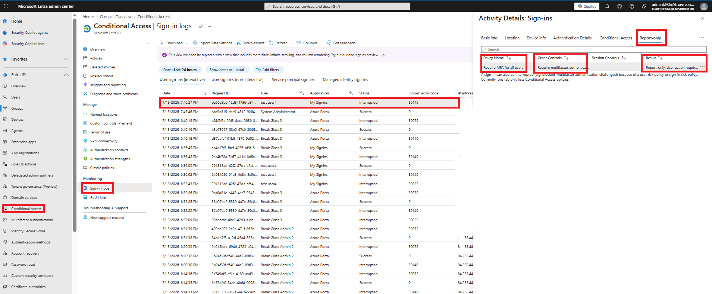

The scrrenshot confirms that the policy is working, looking at the right-hand pane:
- Policy: Require MFA for all users
- Grant control: Require MFA
- Result: Report-only mode: User action required

This means that Entra ID evaluated the and concluded:
- If this policy were enabled, the user would have been required to perform MFA

#### Step 5: Change the policy from report-only mode to on
Normally in a production environment you would leave it in report-only mode and monitor the policy over time before switching it to on. For this lab I'm just going change the policy from report-only to on, then Iøll be able to test it again and make ensure it requires MFA for the same test user.

To change the CA policy from report-only to On go to: 
1. Entra Admin Center -> Entra ID Blade
2. from the drop-down menu -> Conditional Access
3. Policies
4. Click on the policy you want to edit
5. Click on view or edit
6. Under enable policy, change it to on

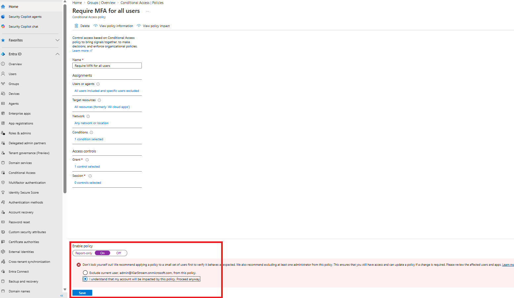

## Verification
#### Test 1:
The verification part is going to be quite simple. We already tested and verified the *report-only mode*, now that we actually set the CA policy to on lets then test whether it is going to require MFA for the same test user.

1. Open a new InPrivate Window
2. Go to the My Sign-ins portal
3. Enter email and password for test user 4

Right after I clicked on next I was presented with the following:

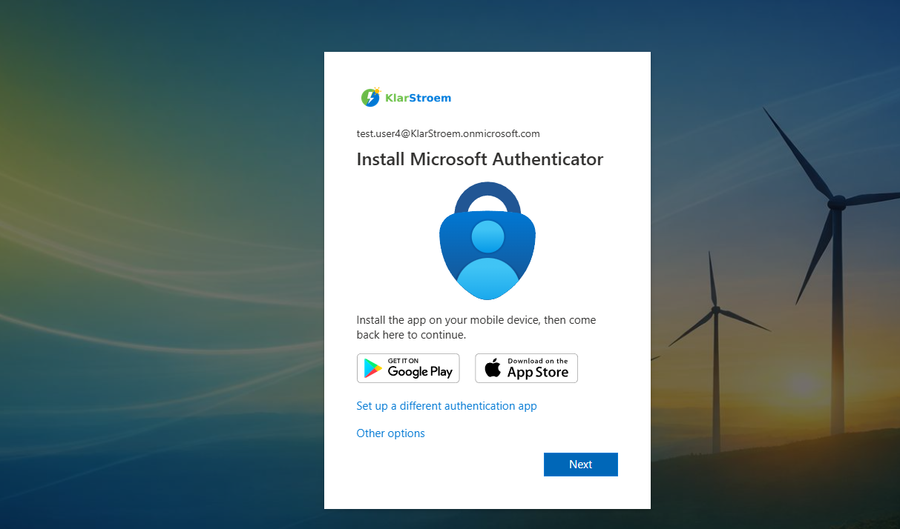

## Lessons Learned

