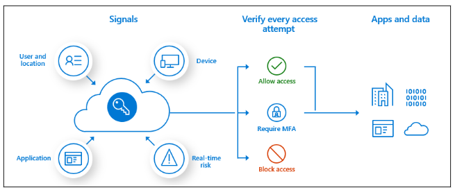
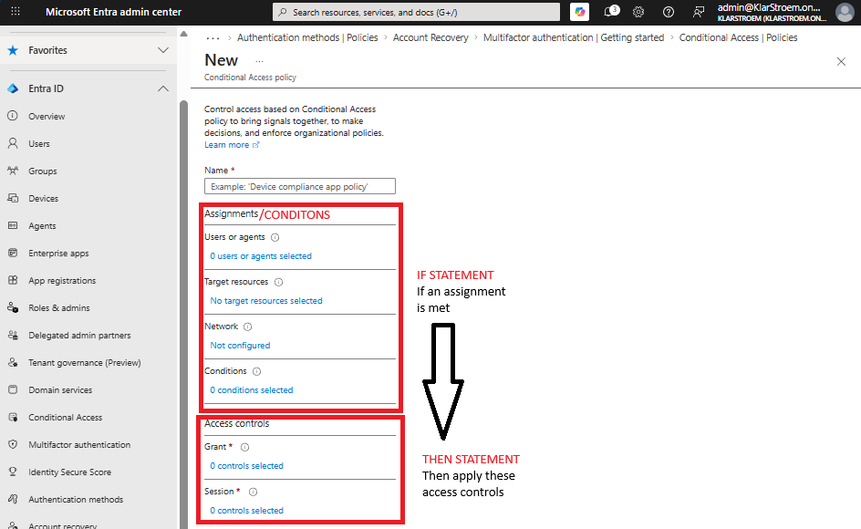

# Replacing security defaults with a baseline CA policy

## Overview
Security defaults are by default enabled on all new tenants, and provides a solid preconfigured security baseline such as requiring MFA registration for all users in the tenant, blocking legacy authentication, and protecting administrator accounts.

In this lab, I'm going to replace the MFA registration requirement that security defaults provides by implementing my first Conditional Access policy. This will ensure that we have a solid security baseline to start out with and then we can slowly build other policies on top. The most important thing is to ensure that all users accounts have this baseline security and are required to perform MFA when they are accessing resources.

Conditional Access policies can analyze various signals, such as user, device, application, location, and more. Based on these signals it can then automate decisions and enforece policies for accessing specific resources, if configured correctly CA policies really supports the zero-trust mindset.

Assignments/If statements
- Users and Groups: Which users and groups will be included in or excluded from the policy? Does this policy include all users, specific group of users, directory roles, or external users?
- Cloud apps or actions: What application(s) will the policy apply to? What user actions will be subject to this policy?
- Conditions: Which device platforms will be included in or excluded from the policy? What are the organization’s trusted locations?
  
Access controls/Then statement
Grant: Do you want to grant access to resources by implementing requirements such as MFA, devices marked as compliant, or Microsoft Entra hybrid joined devices?
Session controls: Do you want to control access to cloud apps by implementing requirements such as app enforced permissions or Conditional Access App Control?

In future labs we're going to build more complex CA policies where we focus on specific signals such as specific user accounts/user roles, devices, location and resources. We're then going to specify more strict access controls such as requiring specific authentication strengh. 

Configuring CA policies can of course be challanging, but in my opinion the complexity really comes from designing these policies to ensure that they cover and mitigate risks in the organization. This means a company should design and implement the right policies to ensure they are no gabs for an attacker to take advantage of.

## Objectives
- Turn of Security defaults for the tenant
- Configure the baseline CA policy to require MFA on all users
- Ensure to exclude breakglass accounts from the policy
- Verify users must complete MFA action before they can sign in
- Verify that breakglass accounts can sign in without the use of MFA

## Environment
- Identity Provider: Entra ID
- Licenses: Microsoft 365 E5
- Tenant: KlarStroem
- Role used: Global Administrator
- License requirements
  - The Conditional Access feature requires at least a Entra ID P1 license for standard rules
  - Creating CA policies with signals from Identity protection (Risky sign-ins, Risky users) Requires a P2 license.

## Implementation
#### Step 1: 

## Verification

## Results  

## Lessons Learned  

Sign-in logs  
Audit logs  
Provisioning logs  
PIM audit history  
Diagnostic settings  
Workbooks 

