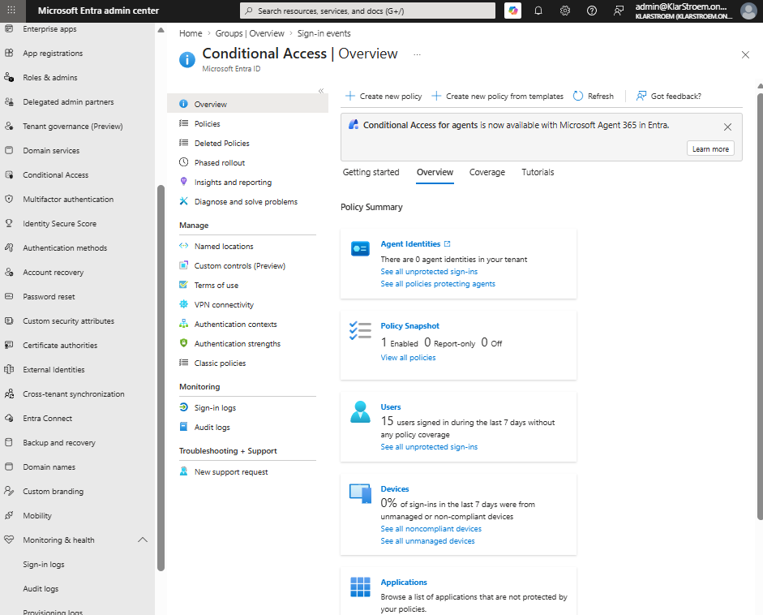
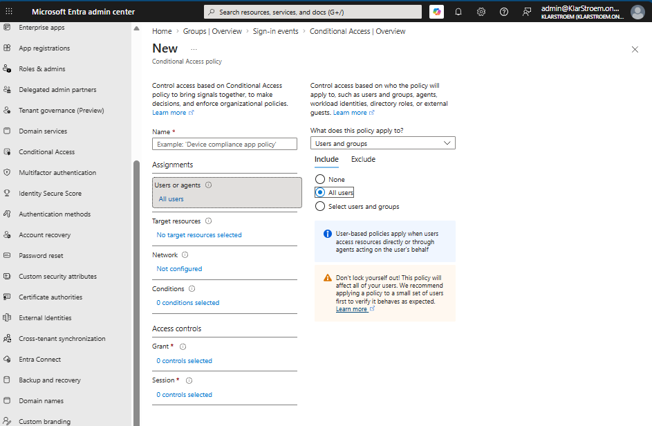
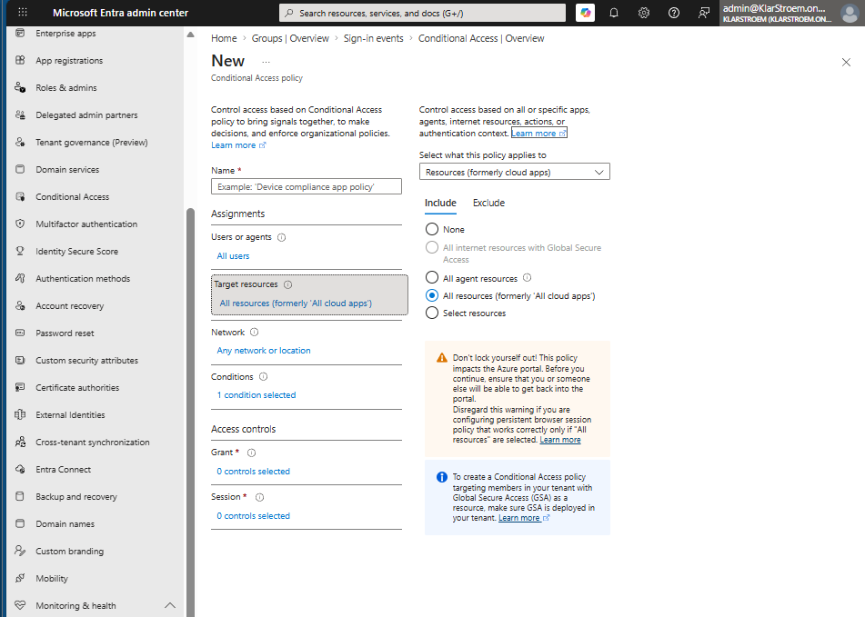
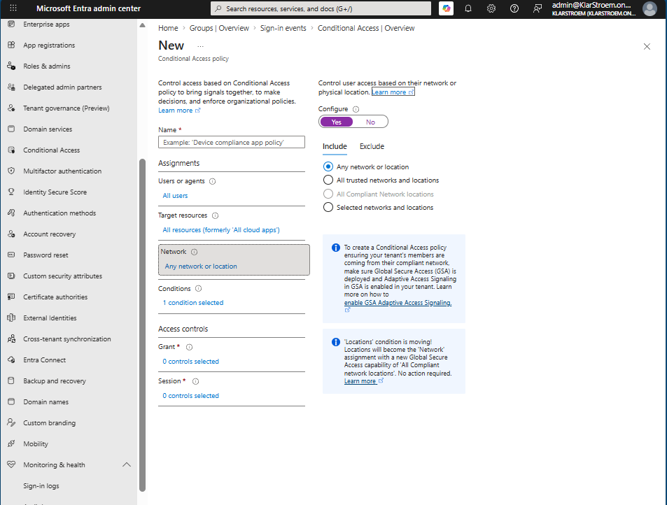
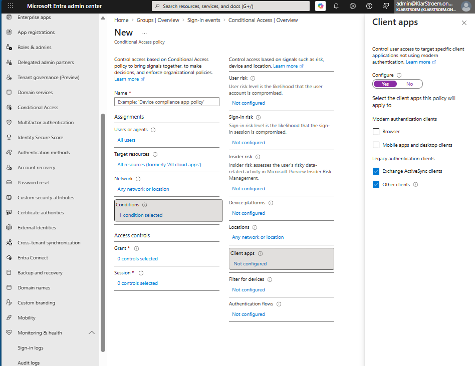
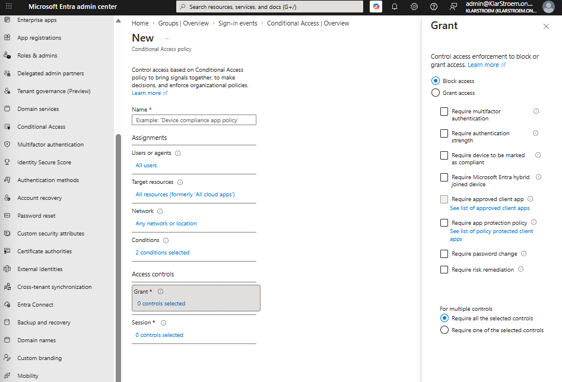
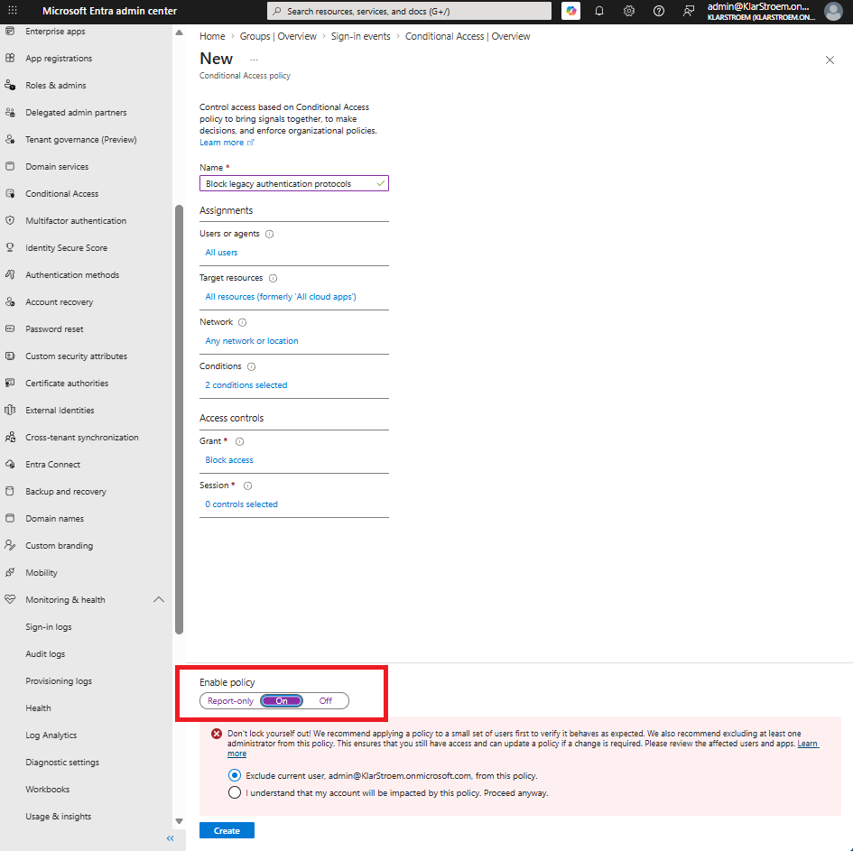
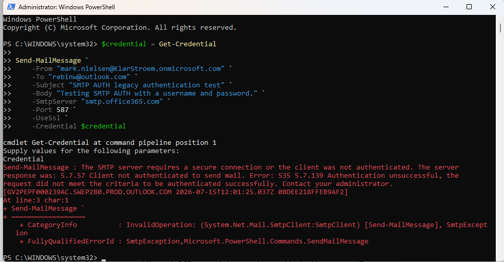
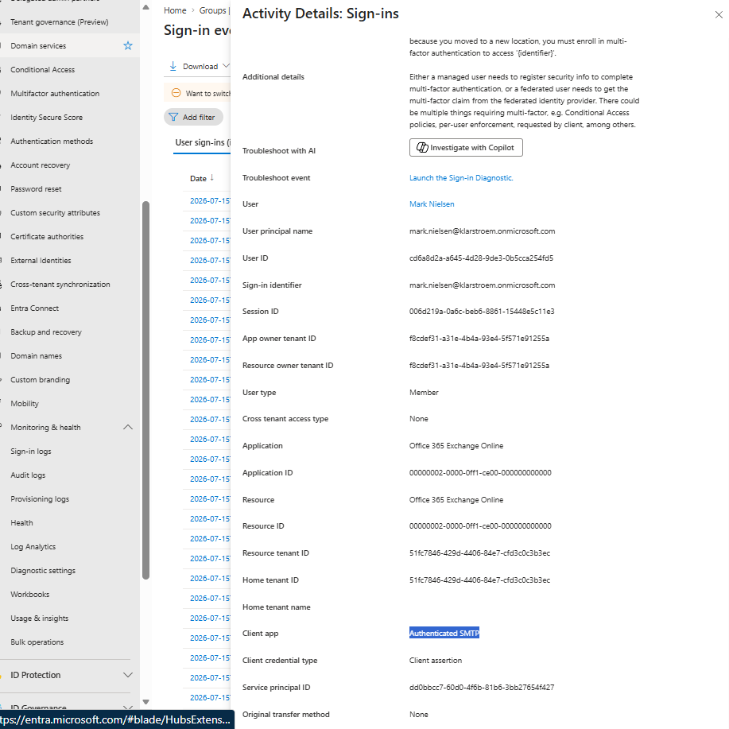
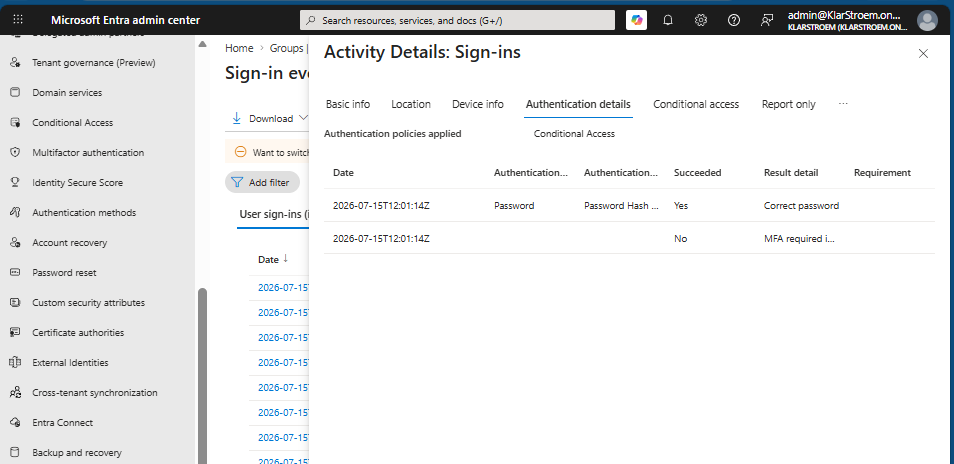

# Blocking legacy authentication protocols

## Overview
Legacy protocols refers to older authentication protocols that rely on a username and password to authenticate a user. Some examples of legacy protocols include IMAP, POP3, SMTP and older Exchange ActiveSync clients. These protocols were designed before modern authentication methods supported by Entra ID and therefore do not support security features such as MFA, CA policies, authentication strenghts, or sign-in risks.

A common misunderstanding is that applications such as Outlook are either *modern* or *legacy*. In reality, the important factor is the authentication protocol being used. For example, a modern version of Outlook authenticates using modern authentication protocols, allowing Entra ID to evaluate CA policies before giving access. An older email client, or even an attacker using a script, might instead connect to the same Exchange online mailbox using IMAP or POP3. If those legacy protocols are still allowed, the connection relies only on a username and a password, bypassing the additional security controls by modern authentication.

Because of this, legacy authentication is a common target for password spraying and credential theft attacks. Even if an organization requires MFA for sign-ins, an attacker may try to authenticate through legacy protocols if they are still enabled.

**Note:** Not every service still supports legacy authentication. Over time, these services such as Micrsoft has removed these support for these protocols, meaning some applications only accept modern authentication. Even if a particular service no longer supports legacy authentication, blocking it with CA is still the best approch. This ensures that any remaining services or applications that still allow legacy authentication connot be used to bypass the security controls.

In this lab, a CA policy is created to block legacy authentication for all users while excluding emergency accounts. By preventing legacy authentication, only modern authentication methods are allowed, ensuring that CA polies and other MS Entra security features are enforced.

## Objectives
- Configure a Conditional Acess policy to block legacy authentication
- Apply the policy to all cloud applications
- Target legacy client authentication using the Client apps condition
- Verify that the policy is configured correctly and applied

## Environment
- Identity Provider: Entra ID
- Licenses: Microsoft 365 E5
- Tenant: KlarStroem
- Role used: Global Administrator
- License requirements
  - Entra ID P1 

## Implementation
#### Step 1: Start the configuration of the CA policy
Lets go ahead and start creating the CA policy to block all legacy authentication protocols. I navigated to
1. Microsoft Entra Admin Center
2. Entra ID blade
3. From the drop down menu I selected Conditional Access
4. In the overview tab I click on *Create new policy*

#### Step 2: Start configuring the *Assignments* for the policy
Before I start configuring the policy, I first needed to give it a name. I chose to name the new policy *Block legacy authentication protocols*

**Users or agents:** In this tab i'm going to choose to apply this policy to all users in my tenant. I do not see any reason to exclude emergency accounts in this situation "Emergency accounts are for regaining access". I therefore simply checked the *All users* box.

**Target resources:** Since the purpose of this policy is to eliminate legacy authentication, it applies to all cloud resources. This ensures that users cannot authenticate using legacy protocols to access one cloud application while being blocked from another. The policy needs to know what resource it should protect.

**Network:** The policy will apply to any network or location because legacy authentication is insecure regardless of where the sign-in comes from.

**Conditions:** Under conditions, the client apps condition is enabled to target legacy authentication clients. Exchange ActiveSync and Other clients are selected, as these are legacy authentication methods such as IMAP, POP3, and SMTP AUTH. It's important to note thta this setting does not target a specific application. Instead, it targets the authentication protocol used by the application. This means that any application trying to authenticate using one of these legacy protocols will be block by the policy.

#### Step 2: Configure the Access controls
**Grant:** The grant control is configured to **Block access**. Since the policy targets legacy authentication clients through the Client apps condition, any sign-in that matches those conditions is blocked/denied.

**Session:** No session controls are configured because this policy block authentication request before a session is even established.

#### Step 3: Review and save the CA Policy
After reviewing the policy configuration, I then enabled the policy and saved it. In a production environment, I would typically deploy a new CA policy in Report-only mode first to evaluate its impact before enforcing it.

## Verification
Prior to implementing the CA policy, I attempted to authenticate using SMTP AUTH by enabling the protocol in Exchange online and using a PowerShell script to sign in with a test account. The Entra sign-in logs confirmed that the request was recognized as an authenticated SMTP client and that username and password were successfully validated. The sign-in still wasn't completed because of MFA was required. This shows that, in my lab environment, additional Microsoft Entra and Exchange online security controls were applied before I was able to directly verify the CA policy.

## Results  
- The policy is enabled
- The policy targets all users
- The policy targets all cloud apps
- The Client apps condition is configured for legacy authentication "Other clients"
- The grant control is set to *Block access*

The CA policy was successfully deployed and configured to block legacy authentication attempts targeting the selected users and cloud applications

## Lessons Learned  

- During testing, I observed that enabling legacy protocols such as SMTP AUTH does not necessarily mean Basic Authentication is available. Exchange Online and Microsoft Entra provide additional security controls beyond the mailbox protocol settings.
