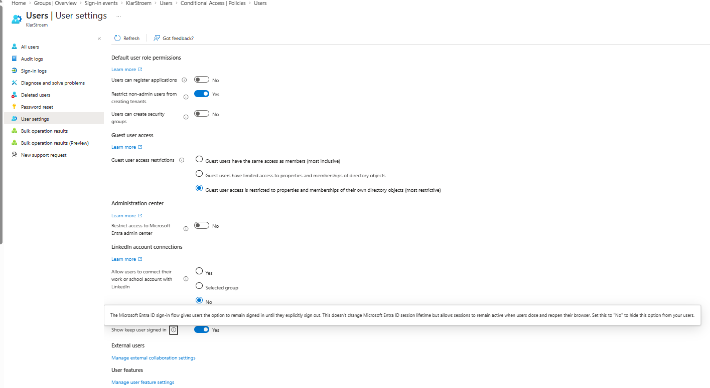
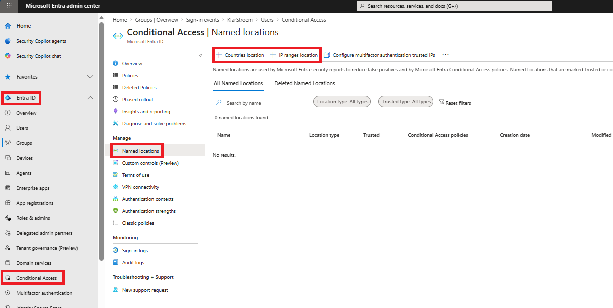
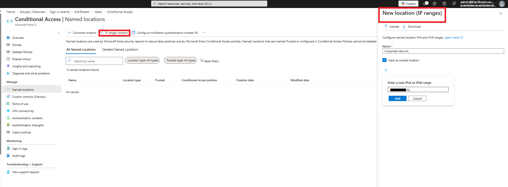
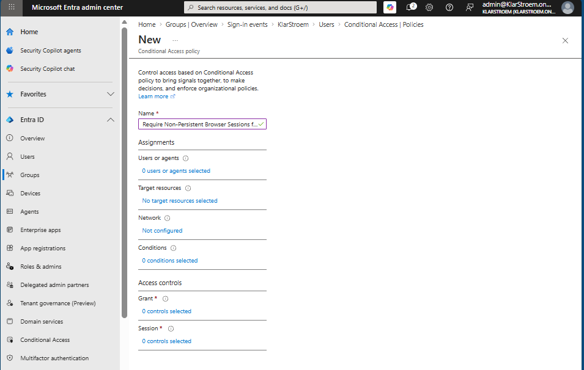
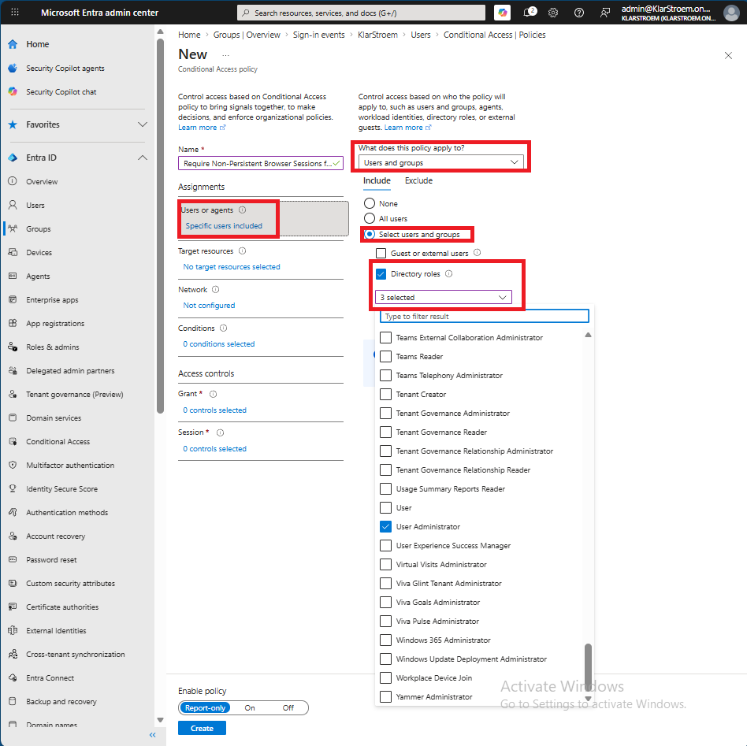
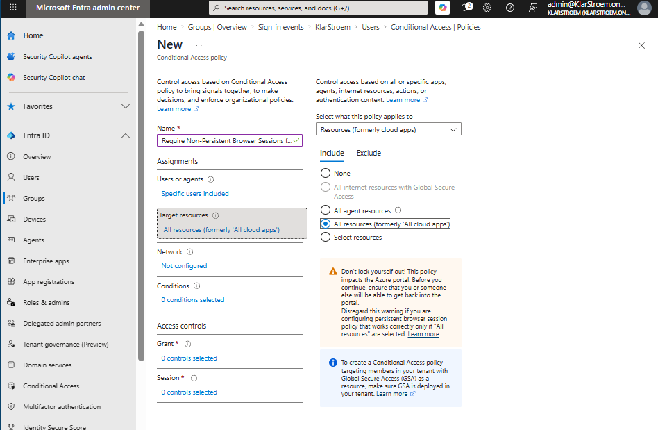
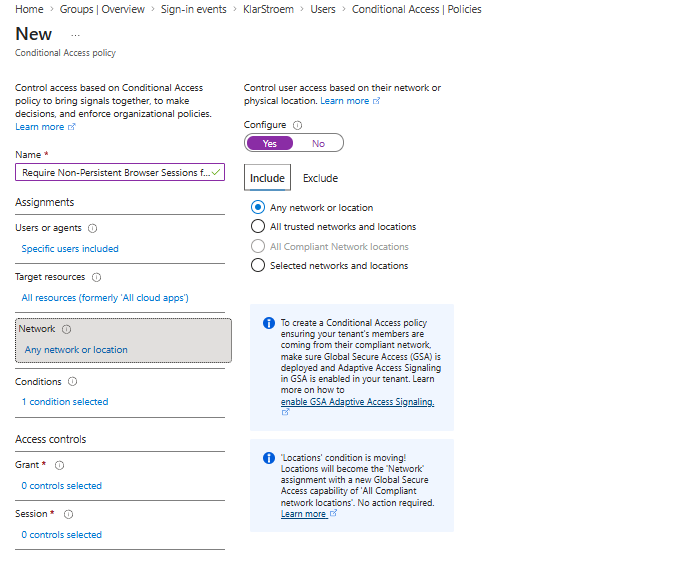
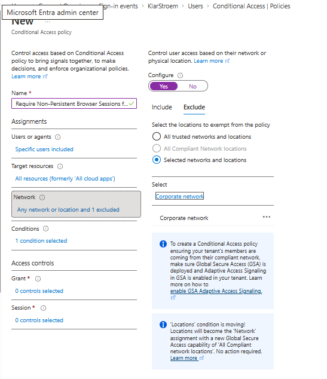

# Require Non-Persistant browser sessions for administrators

## Overview
Organizations often allow their employees to remain signed in to Microsoft 365 resources to improve the user experience. This is of course very convinient for the users, but it may not be appropriate for users with privileged roles. If an administrator closes their browser on a shared or untrusted device, a persistent browser sessions cloud increase the risk of unauthorized access.

In this lab, I will configure a Conditional Access policy that requires administrators to sign in again after closing their browser when accessing Microsoft 365 from outside the organization's trusted network. To achieve this, I will create a named location representing the corporate network and apply a non-persistent browser sessions to administrators connecting from any other location. This shows how Conditional Access session controls can enforce different browser session behavior for specific users without changing the default experience for the rest of the organization. 

## Objectives
- Create a named location representing the organization's trusted network
- Configure a CA policy that enforces non-persitant browser sessions for administrators
- Apply the policy only when administrators access Microsoft 365 from outside the trusted network
- Understand how CA session controls provides more granular control than tenant-wide "Keep me signed in" setting

## Environment
- Identity Provider: Entra ID
- Licenses: Microsoft 365 E5
- Tenant: KlarStroem
- Role used: Global Administrator
- License requirements
  - Entra ID P1 as a minimum for creating CA policies

## Implementation
Before implementing the CA policy, it is important to understand the default browser session behaviour in Entra ID. In my tenant, the **Show option to stay signed in** setting is enabled under *User settings*. this allows users to choose whether they want to remain signed in after successful authentication. 

Since this is a tenant-wide setting, the same applies to all users. The intend of this lab is to override the default behaviour for administrators when they access Microsoft 365 from outside the trusted network. When administrators connect from the trusted network, the default browser session behaviour should apply to them as well.

#### Step 1: Creating a named location representing a trusted network
Since I want to apply the CA policy to enforce non-persistant browser session only when admins aren't on a trusted network, I then first need to configure and let Entra know what networks are considered trusted. 

To create a named location and mark it as trusted, I navigated to:
1. Microsoft Entra Admin center
2. Click on the Entra ID Blade in the navigation menu
3. From the drop down click on *Conditional Access*
4. Once Inside the CA window click on named locations

In the screenshot above, I also highlighted the two different options to create a named location:
- *countries location:* This options is used when wanting to specify a trusted or untrusted location based on countries
- *IP ranges location:* This options is used when wanting to be more precise and specific on the exact IP ranges/ addesses we consider trusted

Since we want to apply the CA policy to be enforced when administrators are outside the corporate network "trsuted", then it would not make sense to specify Denmark as a trusted location, this would mean that the policy would only apply if a administrator left the country. Therefore I'm going to specify a specific IP range and mark is as trusted. I'm going to use my own Public IP address to represent the trusted corporate network. I therefore click on the *IP ranges location* option

As the screenshots above shows, I simply gave the network a name, mark it as *Trusted* and specified the IP range, in my case I gave it a /32 subnetmask because I only have 1 public IP available.

#### Step 2: Start creating the CA policy
Now, I'm ready to start creating the actual Confditional Access policy, I therefore from the same CA window click on: policies -> New policy

It then took me straight to the *New Conditional Access policy* window, and from here I started creating the policy by first giving it a name *Require Non-Persistent Browser Sessions for Administrators*

#### Step 3: Configure the CA policy's assignments

**Users or agents:** Here i'm going to specify the users the policy is going to apply to. Since I want the policy to apply to administrators in my tenant, I then chose *Users and groups* -> *Select users and groups* -> *Directory roles*. From here I only selected three administrator roles those being the user administrator, global administrator, and the Privileged role administrator. 

We could also have created a dynamic security group that would have all privileged admin roles populated autmatically and then apply the policy to that group. Since this lab focuses on session controls and CA policies, I then chose to simply avoid that and apply it to those three roles as an example.

**Target resources:** All cloud resources are selected because the goal is to control the browser session rather than access to specific application. Also, the Persistent browser session control requires the policy to target all resources, ensuring the session behavior is applied consistently across Microsoft 365

**Network:** The policy is configured to apply from any location expect trusted corporate network. This ensures that administrators working from the corporate network will have the same default browser session behaviour as other, while administrators connecting from any other location are required to use non-persistent browser sessions.

**Conditions:** No additional conditions are configured. The required scope is already defined through the users, target resources, and network locations. Since the goal is to control browser sessions behavior based on where admins are connecting from, no additional are necessary.

#### Step 4: Configure the Access controls
**Grant controls:** No grant controls are configured because the purpose of the policy is not to block or restrict sign-in in any way. Instead the policy uses a session control to manage the browser session after a successful sign-in

**Session controls:** Under session controls, the *Persistent browser session control* is the one we want to apply and configure. This setting determines whether a browser session should remain active after the user closes and reopens the browser. Two options are available *Always persistent* and *Never persistent*

If always persistent is selected, administrators connecting from outside the trusted network would always remain signed in after closing and reopening the browser. This is the opposite of want I want the policy to do, and wouldn't manke any sense since the default behavior on the trusted network is exactly that.

Therefore, I selected *Never persistent*. This ensures that administrators connecting from outside the trusted network are required to authenticate again after they close their browser, while administyrators connecting from the trusted network continue to use the tenan't default browser session behavior.

So the finished logic of the CA policy is:

**IF**
- User = Global admin, User admin or Privileged role admin **AND**
- Resources = All cloud apps **AND**
- Location *not equals* Corporate network

**Then**
- Never persistent browser session

## Verification

## Results  

## Lessons Learned  

Sign-in logs  
Audit logs  
Provisioning logs  
PIM audit history  
Diagnostic settings  
Workbooks 
