# OAuth Consent and Enterprise Application Lifecycle

## Overview

In a previous lab, I worked with app registrations and enterprise applications in Microsoft Entra ID. When we register an application, we define which permissions the application is allowed to request. These permissions are not granted simply because they have been added to the app registration. Consent must still be given before the application receives access.

Once an application is used inside a tenant, a service principal is created. This service principal appears under Enterprise applications and represents the application inside the local tenant. From here, administrators can inspect the permissions that have been granted, see whether consent was given by a user or an administrator, review which users are using the application and control how access to the application should work.

While studying Microsoft Defender for Cloud Apps and shadow IT, I came across another part of this process that I had not fully understood before. Users do not necessarily need permission to register applications before they can start using third-party applications with their organizational identities.

The setting that allows users to register applications controls whether users are allowed to create new app registrations inside the organization’s own tenant. This is different from a user signing in to an existing third-party application through Microsoft Entra ID.

For example, a user might visit a cloud application such as Dropbox and select Sign in with Microsoft. The application has already been registered by its publisher. It then redirects the user to Microsoft Entra ID and requests permission to access certain information. If the user is allowed to consent to the requested permissions and accepts the consent prompt, a service principal representing the third-party application is created automatically inside the organization’s tenant.

The user has therefore not registered a new application. The user has consented to an application that already exists. Microsoft Entra then creates the local enterprise application required to represent the trust relationship between the tenant and the third-party application.

This is important because many people confuse application registration with user consent. An organization might prevent ordinary users from registering applications while still allowing them to consent to third-party applications. In a large organization, this could result in many enterprise applications appearing over time as employees sign in to different cloud services with their work accounts.

This is also related to shadow IT, although the two concepts are not exactly the same. Shadow IT includes applications used without the organization’s approval, including applications accessed through personal accounts. In those cases, no enterprise application or consent grant necessarily exists inside Microsoft Entra. Defender for Cloud Apps might still detect the application through network traffic or connected security products.

This lab focuses on the scenario where users access third-party applications through their organizational identities. I will demonstrate what happens when a user gives consent, how the enterprise application is created, where the granted permissions are stored and how administrators can control whether users are allowed to provide consent.

I will also explore the available user consent settings, including blocking user consent, limiting consent to applications from verified publishers and allowing Microsoft to manage user consent settings. Finally, I will review how an administrator can investigate the application through enterprise applications, sign-in logs, audit logs and permission grants.

## Objectives
The objective of this lab is to understand how Microsoft Entra ID handles user consent when employees sign in to third-party applications with their organizational identities.

During the lab, I will:
- Review the tenant’s current user consent configuration under Enterprise applications > Consent and permissions > User consent settings.
- Compare the available consent options:
  - Let Microsoft manage your consent settings.
  - Allow user consent for apps from verified publishers, for selected permissions.
  - Do not allow user consent.
- Understand the difference between allowing users to register applications and allowing users to consent to existing third-party applications.
- Test what happens when an ordinary user signs in to a third-party application using an organizational account.
- Review the permissions requested by the third-party application before granting consent.
- Confirm whether Microsoft Entra automatically creates a service principal, shown as an enterprise application, after the user grants consent.
- Inspect which user granted consent and which delegated permissions were granted.
- Review the related sign-in logs and audit logs to follow the authentication and consent process.
- Understand what happens when the requested permissions fall outside the permissions that the user is allowed to consent to.
- Explore how an organization can restrict user consent and use the admin consent workflow for applications requiring approval.
- Understand how unmanaged third-party applications can accumulate inside a large tenant when many users sign in to cloud applications with their work accounts.
- Relate application consent to shadow IT and Microsoft Defender for Cloud Apps, while recognizing that shadow IT also includes applications used through personal accounts without any Entra service principal or consent grant.

## Environment
- Identity Provider: Entra ID
- Licenses: Microsoft 365 E5
- Tenant: KlarStroem
- Role used: Global Administrator
- License requirements
  - For this lab so for none  

## Implementation
Before testing how Microsoft Entra ID handles third-party applications, I will first review the current user consent configuration for the tenant. These settings determine whether ordinary users are allowed to grant consent to applications requesting delegated permissions on their behalf.

Navigate to:
- Enterprise applications -> Consent and permissions -> User consent settings

Three different options are available:
1. **Let Microsoft manage your consent settings (Recommended):** This is the default configuration for my tenant. With this option, Microsoft automatically applies its recommended user consent policies. Users are allowed to consent only to applications and permissions that Microsoft considers appropriate according to its current guidelines. These recommendations are updated by Microsoft over time.

2. **Allow user consent for apps from verified publishers, for selected permissions:** This option gives the organization more direct control. Users are only allowed to consent to applications published by verified publishers, and only when the requested delegated permissions are included in the configured permission policy.

3. **Do not allow user consent:** Users are not allowed to grant consent to any third-party application. If an application requires consent, an administrator must approve the request before the application can access organizational data

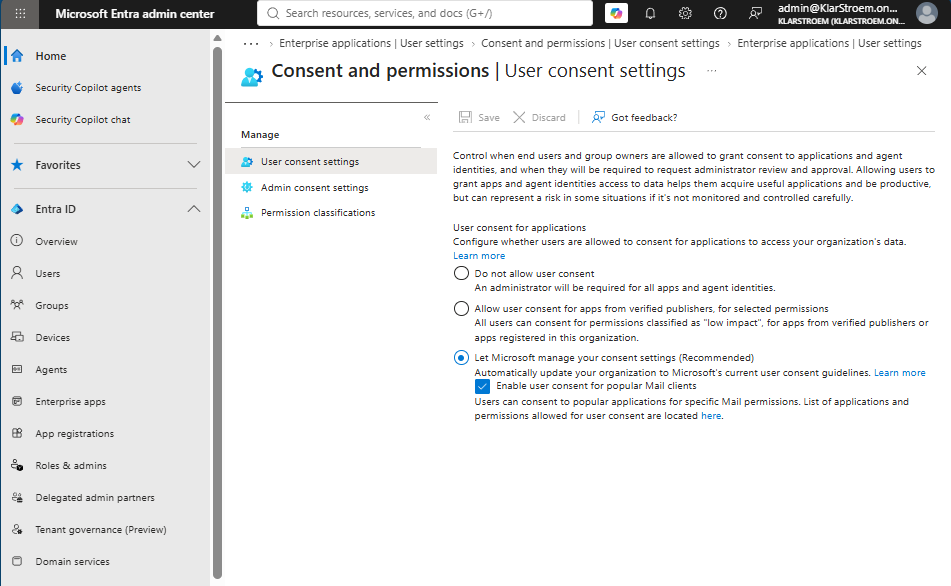

Observation: At first glance, these settings appear to control whether users are allowed to use third-party applications. In reality, they control something more specific.

They determine whether users are allowed to grant delegated OAuth permissions to third-party applications on behalf of themselves.

This is an important distinction because it is easy to confuse user consent with application registration. Preventing users from registering applications does not prevent them from signing in to existing third-party applications using their organizational accounts.

#### Step 1: Sign in to Dropbox using an organizational account
Before beginning the test, I verified that no Dropbox enterprise application existed in the tenant.

I then browsed to Dropbox.com and selected Sign up, followed by Continue with Microsoft.

For the sign-in, I used the test user Mark, which is an ordinary user without any administrative roles assigned.

After entering Mark's credentials, Microsoft Entra ID required multi-factor authentication. This was expected because a Conditional Access policy in the tenant requires MFA for all users.

Once MFA was completed successfully, Microsoft Entra ID displayed the Permission requested window. Dropbox requested delegated permissions, including:

- Sign you in and read your profile (openid, profile)
- View your email address (email)
- Maintain access to data you have given it access to (offline_access)

Since the tenant was using the default user consent configuration, Mark was allowed to grant consent by selecting Accept.

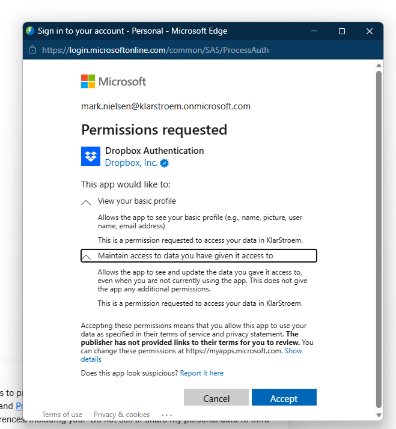

After consent was granted, Dropbox continued its account creation process and displayed the Get started with Dropbox page.

When selecting Agree and sign up, Dropbox returned the following messages:

- Additional verification is required to complete this request.
- There was a problem completing this request.

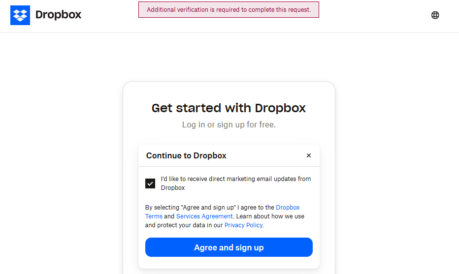
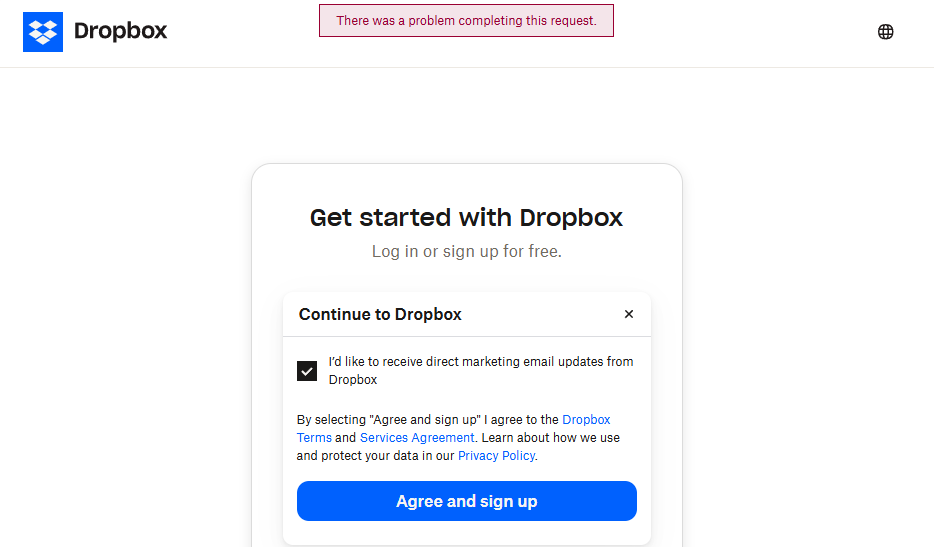

At this stage, it is clear that the Dropbox account was not created successfully. However, it is not yet possible to determine whether the failure occurred within Microsoft Entra ID or on the Dropbox side.

#### Step 2: Verify the changes inside the tenant
Although Dropbox reported an error during the final account creation process, the next step is to verify whether Microsoft Entra ID successfully completed the authentication and OAuth consent flow.

The first observation is that a new Enterprise Application named Dropbox Authentication has automatically been created inside the tenant.

This confirms that Microsoft Entra ID created a service principal representing the Dropbox application after Mark successfully authenticated and granted consent.

Opening the Enterprise Application shows the same management options as any other enterprise application, including Users and groups, Permissions, Sign-in logs, Provisioning and Single sign-on.

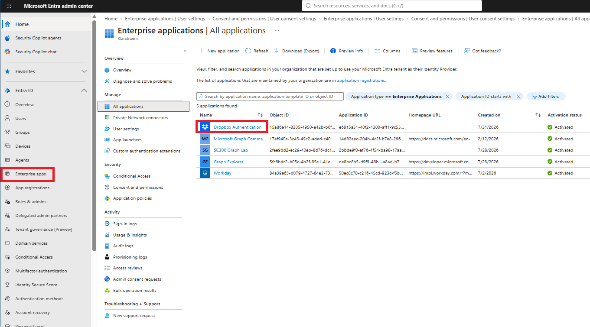

**Users and Groups:**  
Under Users and groups, Mark has automatically been added as a user of the application.

This is expected because Mark was the first user to authenticate to Dropbox and grant consent to the requested delegated permissions.

At this point, no administrator has assigned Mark to the application manually. The assignment was created automatically as part of the consent process.

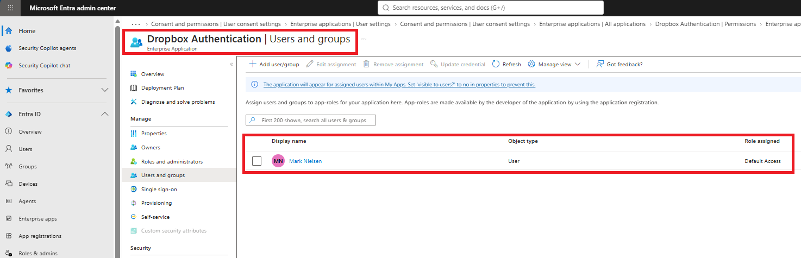

**Permissions:**  
The Permissions blade provides additional information about the permissions granted during the sign-in process.

Under User consent, the same delegated permissions that were displayed on the consent screen are now listed.

These include:
- email
- openid
- profile

Each permission shows:

Permission type: Delegated
Consent type: User consent
Granted by: Mark
Total users granted: 1

This confirms that the permissions were granted by Mark during the consent process and not by an administrator.

Notice that no administrator consent has been granted.

The Enterprise Application therefore shows the option Grant admin consent for <Tenant Name>. If an administrator grants consent, future users would not be prompted to approve these delegated permissions themselves, assuming the requested permissions are covered by the administrator's consent.

#### Step 3: Review the sign-in logs and audit logs
Although Dropbox reported an error after the consent process, the next step is to determine whether Microsoft Entra ID successfully completed the authentication and OAuth consent flow.

**Sign-in logs**

The Enterprise Application sign-in logs show two authentication events for Dropbox Authentication.

The first sign-in completed successfully. This corresponds to the authentication performed by Microsoft Entra ID after Mark entered his credentials, completed MFA and granted consent to the requested delegated permissions.

A second sign-in appears with the status Interrupted.

Although Microsoft Entra ID records that the sign-in was interrupted, the available log information does not identify the exact cause of the interruption. Since the service principal was created, the delegated permissions were granted and the audit logs show that the consent process completed successfully, the interruption appears to occur after Microsoft Entra ID has finished its part of the authentication flow.

Therefore, the available evidence suggests that the failure occurred during Dropbox's account creation process rather than within Microsoft Entra ID itself.

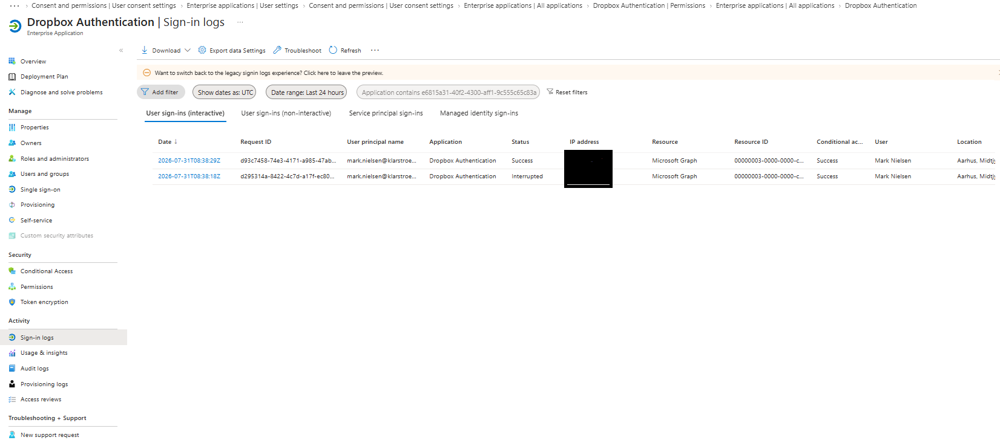

**Audit logs**

The audit logs provide a detailed overview of the changes made to the tenant during the consent process.

The following activities were recorded:

Consent to application
Add app role assignment
Add delegated permission
Add service principal

Together, these events confirm that Microsoft Entra ID successfully completed the OAuth consent flow.

First, Mark granted consent to the permissions requested by Dropbox.

Microsoft Entra ID then recorded the delegated permission grant, created the necessary assignment between the user and the Enterprise Application, and finally created a service principal representing Dropbox within the tenant.

These audit events match the changes observed in the Enterprise Application during the previous step.

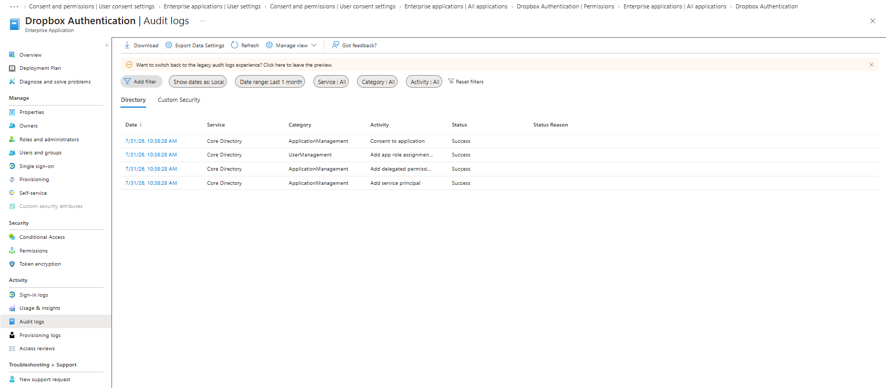

**Observation**

Although Dropbox was unable to complete the account creation process, Microsoft Entra ID successfully completed every part of the authentication and consent process.

The evidence supporting this conclusion includes:
- The user successfully authenticated.
- Conditional Access required MFA before access was granted.
- The requested delegated permissions were granted through user consent.
- A new Enterprise Application was created automatically.
- A service principal representing Dropbox was created.
- Mark was associated with the application.
- All related events were recorded in the audit logs.

The interruption therefore appears to occur after Microsoft Entra ID has handed control back to Dropbox.

## Verification
The implementation demonstrated that an ordinary user was able to grant delegated permissions to a third-party application when the tenant was using the default user consent configuration. As a result, Microsoft Entra ID automatically created an Enterprise Application representing Dropbox inside the tenant.

To verify that this behavior was controlled by the tenant's user consent settings, I repeated the test after modifying the configuration.

#### Test 1: Disable user consent
To verify the behavior, I first deleted the Dropbox Enterprise Application that had been created during the previous implementation.

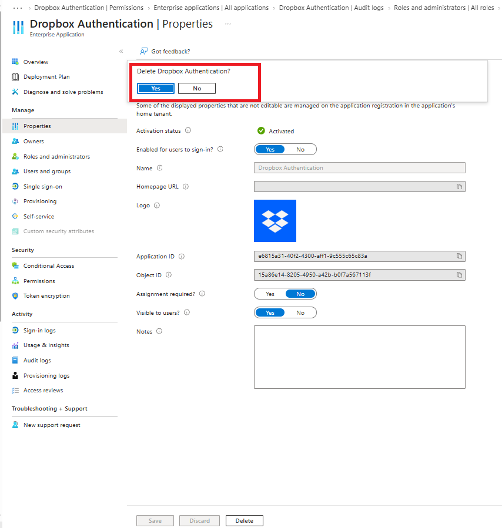

I then navigated to:

Enterprise applications → Consent and permissions → User consent settings

Instead of using the default configuration, I selected:

"Do not allow user consent"

This setting requires administrator approval before users are allowed to grant delegated permissions to third-party applications.

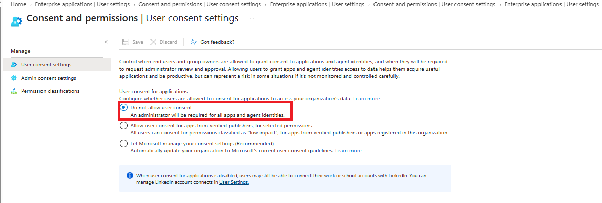

After saving the configuration, I repeated the same test by browsing to Dropbox and selecting Continue with Microsoft.

After authenticating as Mark and completing MFA, Microsoft Entra ID no longer displayed the permission consent window.

Instead, the following message was displayed:

"Need admin approval"

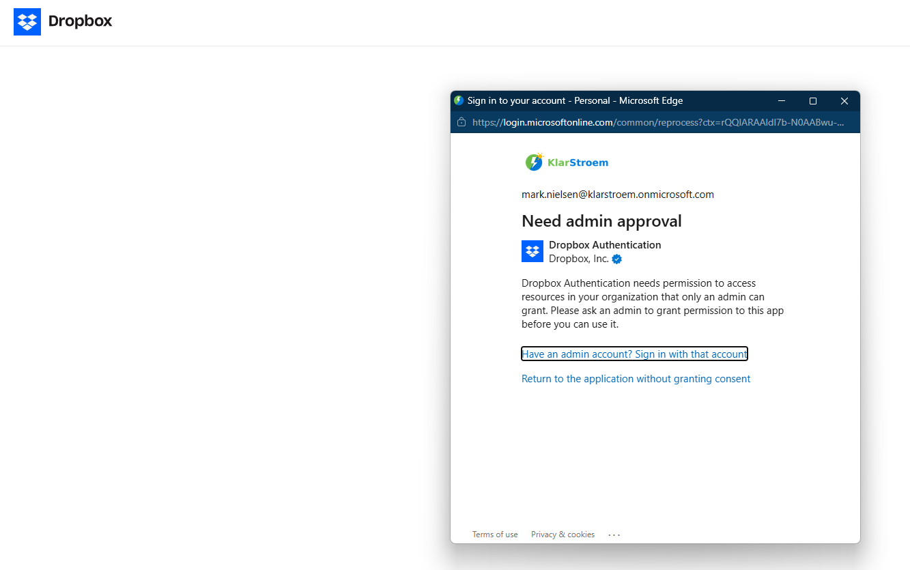

This confirms that Mark was no longer permitted to grant delegated permissions to Dropbox.

Since user consent was blocked, Microsoft Entra ID required an administrator to approve the application before it could receive access to organizational data.

## Results  

## Lessons Learned  

Sign-in logs  
Audit logs  
Provisioning logs  
PIM audit history  
Diagnostic settings  
Workbooks 
