# HR-Driven Identity Provisioning Phase 1

## Overview
The goal of this lab is to build an HR-driven identity provisioning solution for my hybrid environment, using OrangeHRM as the source for employee data.

In a real organization, the HR system will often be the starting point for the identity lifecycle. When a new employee joins the organization, information such as their name, department, job title and start date already exists in HR. Instead of manually creating the same user again in Active Directory, I want to use this HR data to drive the provisioning process automatically.

For this lab, the intended flow is:
OrangeHRM → Custom PowerShell Connector → Microsoft Entra API-Driven Provisioning → On-Premises Provisioning Agent → Active Directory → Entra Connect → Microsoft Entra ID

OrangeHRM does not have a prebuilt Microsoft Entra provisioning integration like some larger HR platforms, so I will build the first part of the integration myself. The PowerShell connector will authenticate to OrangeHRM, retrieve employee records through its REST API and later send the required data to Microsoft's API-driven provisioning service.

This first phase focuses on getting the OrangeHRM side working. I will configure OAuth authentication, build the PowerShell connector, securely handle the refresh token and automate the connector using Windows Task Scheduler.

By the end of this phase, I want a persistent process that retrieves current employee records from OrangeHRM automatically without requiring me to manually authenticate or start the connector each time.

The next phase will take the retrieved HR data and use it to provision users into my on-premises Active Directory environment.

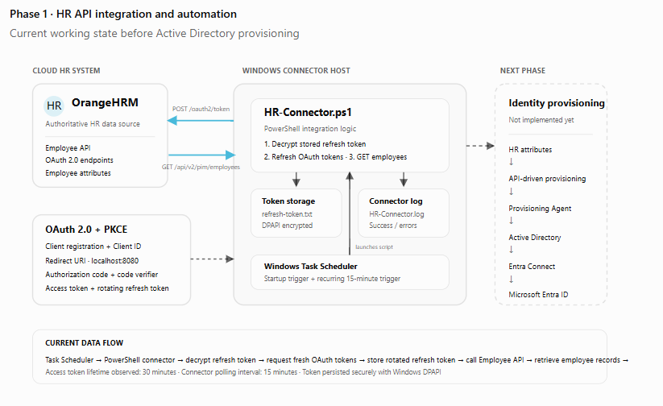

## Objectives
- Configure OrangeHRM as an HR source
- Register an OAuth client
- Implement OAuth 2.0 authorization with PKCE
- Securely store and rotate refresh tokens
- Retrieve employee records through the OrangeHRM REST API
- Build a PowerShell-based HR connector
- Automate the connector using Windows Task Scheduler
- Log connector executions and failures
- Prepare HR data for identity provisioning into Active Directory

## Environment
- HR System: OrangeHRM
- HR Integration: OrangeHRM REST API
- Authentication: OAuth 2.0 with PKCE
- Connector: Windows PowerShell
- Token Protection: Windows DPAPI
- Automation: Windows Task Scheduler
- Directory: Active Directory Domain Services
- Cloud Identity: Microsoft Entra ID
- Synchronization: Microsoft Entra Connect

## Implementation
As mentioned in the overview, I decided to use OrangeHRM as the HR application for this lab. I chose it because it was advertised as open source, although I later found out that the hosted version is a 30-day trial. For this lab, that is more than enough.

I could have used something simpler, such as a CSV file or generated HR data, since API-driven provisioning is not tied to a specific HR system. I decided to use an actual HR application instead because I wanted the setup to be closer to how HR-driven provisioning would work in a real organization.

If you would like to recreate this lab for yourself using the same HR Application, this is the [Official documentation](https://api-starter-orangehrm.readme.io/reference/authorization?utm_source=chatgpt.com) provided by OrangeHRM for configuring the Oauth client.

#### Step 1: Register the OrangeHRM API Client
Before configuring anything, it is important to understand why I need to register a client in OrangeHRM in the first place.
For this lab, later I am going to use Microsoft Entra API-driven provisioning rather than one of Microsoft's prebuilt HR provisioning integrations. This means I need to build the integration between my HR source and Microsoft's provisioning service myself.

If I were using Workday, for example, Microsoft already provides applications such as *Workday to Active Directory User Provisioning*. In that scenario, much of the integration between Workday and the Microsoft provisioning service has already been built.  

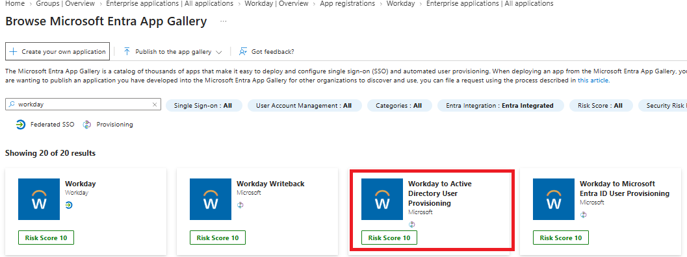

OrangeHRM does not have the same prebuilt HR provisioning integration available in the Microsoft Entra application gallery, so I will build the source integration myself using PowerShell.

The connector will have three main jobs:
1. Retrieve employee data through the OrangeHRM REST API
2. Process and map the HR attributes into the format required by Microsoft's API-driven provisioning service
3. Send the resulting data to the API-driven provisioning endpoint, where the Microsoft provisioning service can process it and provision the identity into Active Directory through the on-premises provisioning agent.

At this stage, I have a problem. My PowerShell connector cannot start requesting employee information from OrangeHRM. OrangeHRM first needs to know which application is requesting access and whether that application has been authorized.

This is where the OAuth client registration comes in.

I created a new OAuth client in OrangeHRM called: *IAM Lab Connector*
  
When the client is registered, OrangeHRM generates a unique Client ID. This Client ID identifies my connector when it communicates with the OrangeHRM authorization server.

If you are familiar with Microsoft Entra app registrations, the idea is similar to the Application (client) ID. It identifies the application making the request. The Client ID itself is not a password or secret.

I also configured the following redirect URI: *http://localhost:8080*

**Registering the API Client in OrangeHRM:**
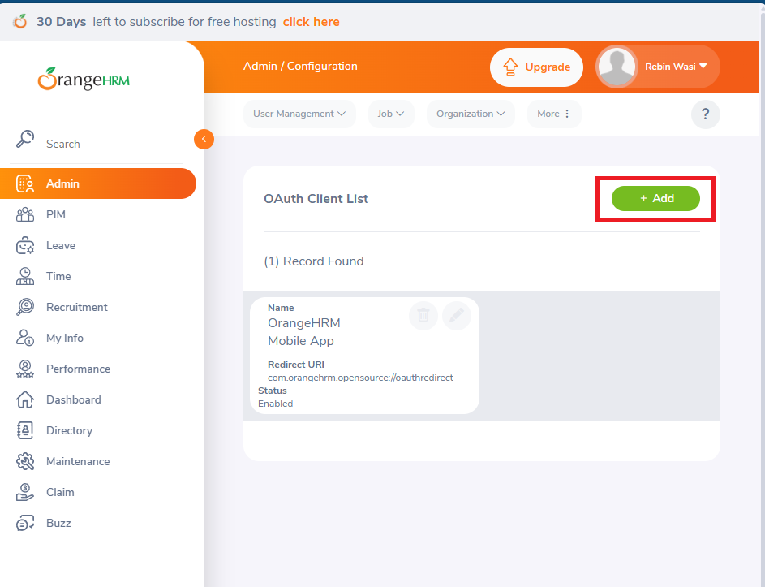
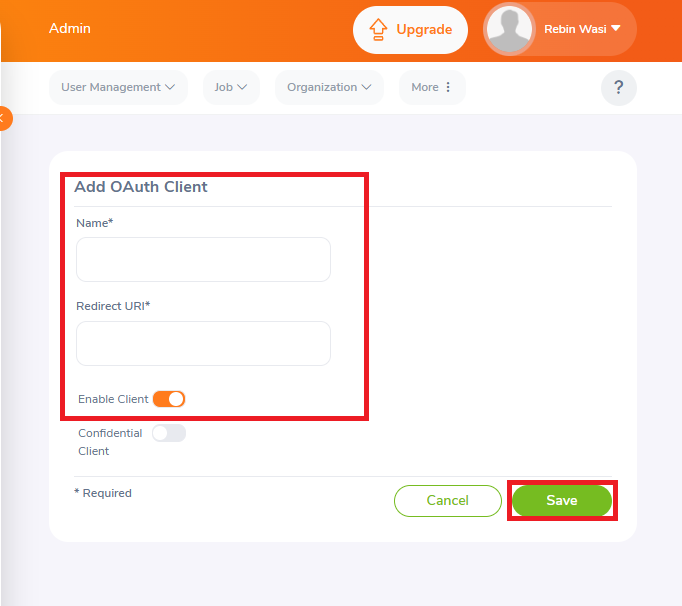
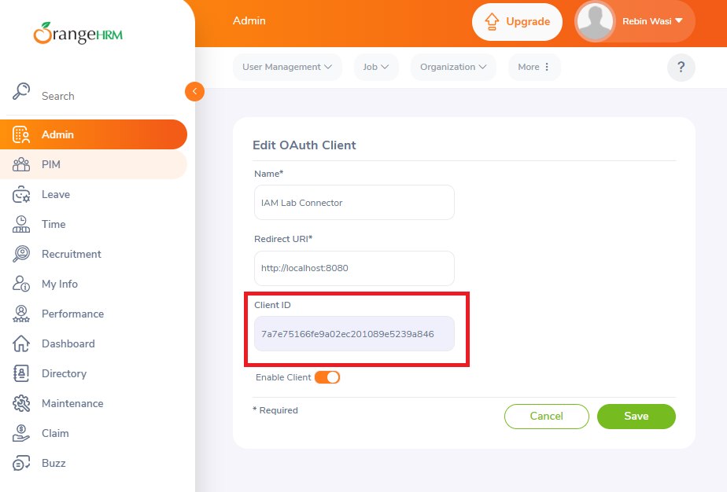

The redirect URI is part of the OAuth authorization process. OrangeHRM will only redirect the authorization response to a URI that was registered for this client. During the initial authorization process, OrangeHRM will redirect the browser to this address with an authorization code. That code will later be exchanged for the tokens required to access the API.
At this point, I have not retrieved any employee data yet. I have simply registered the application that will become my connector and received the Client ID required for the next stage of the OAuth flow.

**Quick overview for clarity:**
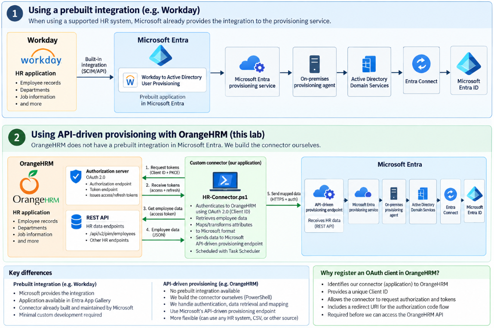

At this point, the OAuth client has been registered in OrangeHRM and we have received a unique Client ID. The Client ID identifies the connector we are going to build whenever it communicates with OrangeHRM.

The next step is to start building the PowerShell connector and associate it with the registered OAuth client by including the Client ID in our authorization requests. This will allow us to begin the OAuth authorization process and eventually authenticate to the OrangeHRM API.

#### Step 2: Generate the PKCE Code Verifier and Code Challenge
Now that the OAuth client is registered, the next step is to prepare the PKCE authorization flow.
PKCE stands for Proof Key for Code Exchange. It adds protection to the OAuth 2.0 Authorization Code flow by making sure that the application exchanging the authorization code is the same application that originally started the authorization request.

For this, I first generate two related values:
- Code Verifier: A random value that I keep locally and do not send during the authorization request.
- Code Challenge: A SHA-256 hash is created from the code verifier and converted to Base64 URL format. This is the value that I send to the OrangeHRM authorization server.

During the authorization request, I send the code challenge to OrangeHRM. After I have authenticated and authorized the application, OrangeHRM will return an authorization code.

When I later exchange that authorization code for tokens, I send the original code verifier. OrangeHRM performs the same SHA-256 calculation and checks whether the result matches the code challenge from the original authorization request.

This means that stealing the authorization code by itself would not be enough to exchange it for tokens. The original code verifier is also required.

**I used PowerShell to generate a random code verifier and then create the corresponding SHA-256 code challenge.**  
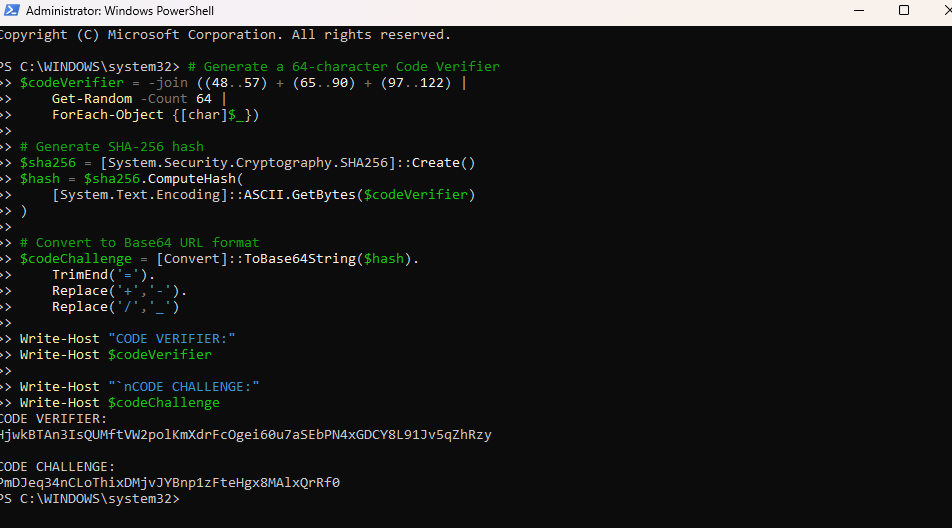

The output gives me both values needed for the next part "requesting the authorization code" of the authorization flow. I keep the code verifier because I will need it again when exchanging the authorization code for tokens.

**To better understand why these values are needed:**
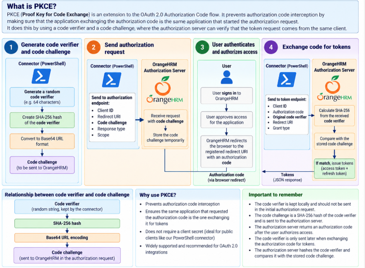

#### Step 3: Obtaining the authorization code
Now that I have the Client ID, redirect URI, code verifier and code challenge, I have everything needed to start the authorization request.

The purpose of this request is to send the required information to the OrangeHRM authorization endpoint and ask the user to authorize my registered client.

Instead of manually building a long authorization URL:
- http://your-ohrm-url.com/web/index.php/oauth2/authorize?response_type=code&state=your_state&code_challenge_method=S256&code_challenge=your_challenge&client_id=your_client_id&redirect_uri=your_redirect_uri

**I used PowerShell to construct it from the values generated in the previous steps for better clarity:**  
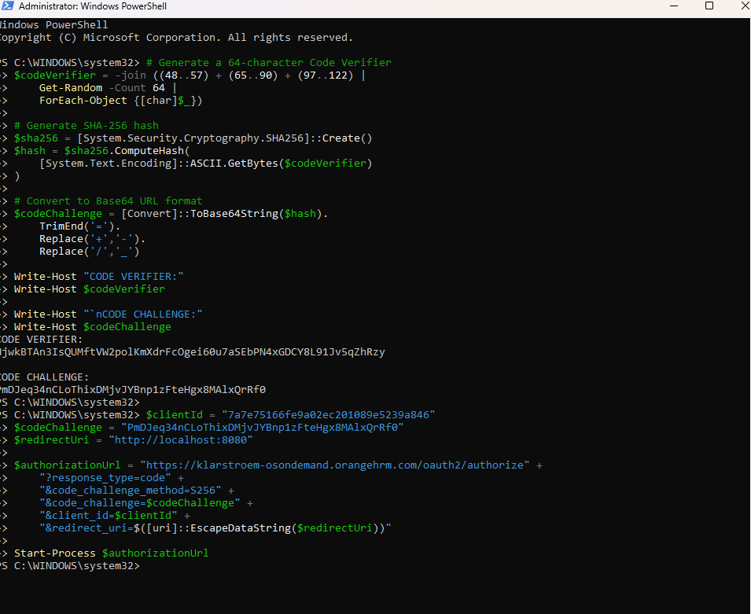

There are a few important values being sent in this request:
- response_type=code tells OrangeHRM that I am using the Authorization Code flow and expect an authorization code back.
- code_challenge_method=S256 tells OrangeHRM that the PKCE code challenge was generated using SHA-256.
- code_challenge contains the challenge generated from my original code verifier in Step 2. 
- client_id identifies the OAuth client I registered in Step 1.
- redirect_uri tells OrangeHRM where the browser should be redirected after authorization. This must match the redirect URI registered for the client.

When I run Start-Process, PowerShell opens the authorization URL in my browser. I then authenticate to OrangeHRM and approve the authorization request.
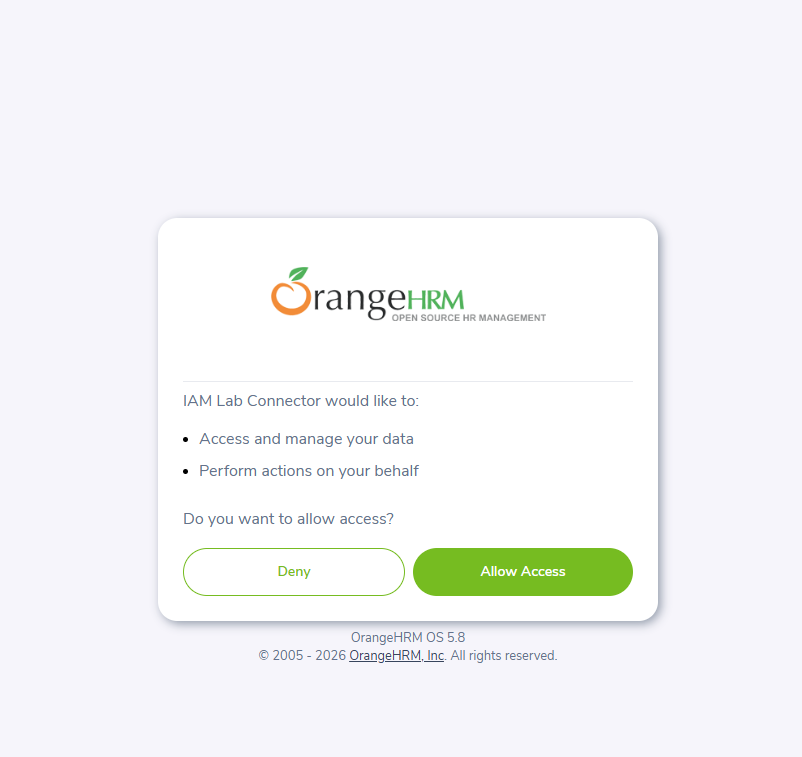

After successful authorization, OrangeHRM redirects the browser to my registered redirect URI:
- Example: http://localhost:8080/?code=**AUTHORIZATION_CODE**

The redirect contains an authorization code in the URL. This is the value I need for the next step.

The important part here is that the authorization code is not an access token. At this stage I still cannot use it to request employee data. It is a short-lived, temporary code that I will exchange for tokens in the next step.

OrangeHRM has successfully authorized the request and returned an authorization code. We still do not have access to the employee API. In the next step, I will exchange the authorization code, together with the original PKCE code verifier, for an access token and refresh token.

**NOTE: The authorization process should be completed in one session. If the authorization transaction or authorization code expires, I generate a new PKCE pair and start the authorization flow again**

#### Step 4: Exchange the Authorization Code for Tokens
At this point, OrangeHRM has authorized my client and returned an authorization code. The authorization code itself does not give me access to the employee API. I now need to exchange it for tokens at the OrangeHRM token endpoint.

For this request, I need several values collected during the previous steps:
- Client ID, identifies the OAuth client registered in Step 1
- Authorization code, returned by OrangeHRM in Step 3
- Code verifier, the original PKCE value generated in Step 2
- Redirect URI, the same URI registered for the client
- Grant type, set to authorization_code
  
**I created the request body in PowerShell:**  
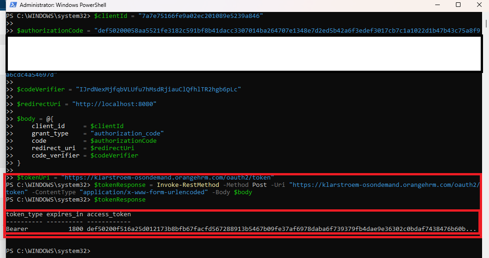

**I then send this information to the OrangeHRM token endpoint:**
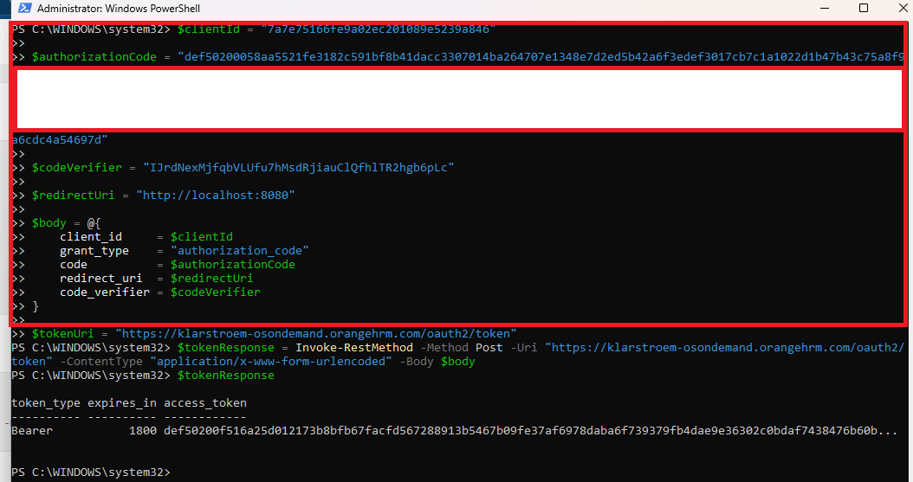

This is also where the PKCE process from Step 2 comes back into play.

OrangeHRM received the code challenge during the original authorization request. I am now sending the original code verifier. OrangeHRM verifies that the code verifier corresponds to the previously supplied code challenge.

The response contains the access token that I will use to authenticate requests to the OrangeHRM API. It also contains a refresh token, which becomes important later when I automate the connector.

Before moving on, I wanted to verify that the access token actually worked. I used it as a Bearer token in the Authorization header and sent a GET request to the OrangeHRM employee API.

**To make the returned data easier to inspect, I converted the response to JSON:**
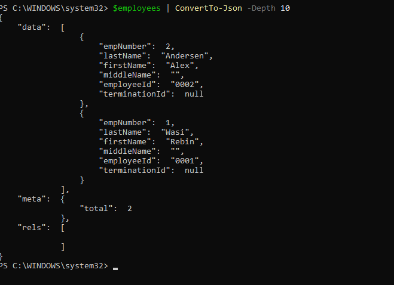

The request successfully returned the employee records stored in OrangeHRM, confirming that the access token was valid and that the client was now able to authenticate to the OrangeHRM REST API.

**The next problem is persistence. The access token has a limited lifetime, so I do not want to repeat the entire authorization process every time it expires. In the next step, I will use the refresh token to obtain new tokens and start turning this manual process into an automated connector/process.**

#### Step 5: Build the PowerShell HR Connector
So far, I have completed the OAuth authorization flow manually and confirmed that the access token allows me to retrieve employee records from OrangeHRM.

The next step is to turn this into an actual connector. I created a PowerShell script called HR-Connector.ps1 and saved it under: **C:\HR-Connector\HR-Connector.ps1**

The goal is to move away from manually requesting authorization and tokens every time the connector runs. Instead, the script will use the refresh token obtained in the previous step to request a new access token and refresh token automatically.

The connector will then use the new access token to retrieve the latest employee records from the OrangeHRM API.

At this stage, the connector will perform the following process:
1. Read stored refresh token
2. Request new tokens from OrangeHRM
3. Receive new access token + refresh token
4. Store the new refresh token
5. Use access token as Bearer token
6. GET /api/v2/pim/employees
7. Retrieve employee records
8. Log the result

There is one important security problem we need to solve before building the complete script.

We do not want to save the refresh token as plain text in the PowerShell script or in a normal text file. The refresh token provides long-lived access to the authorization flow and therefore needs to be protected.

For this reason, I created a dedicated folder for the connector and used Windows Data Protection API, **DPAPI**, to encrypt the refresh token before storing it locally.

#### 5.1 - Creating the Connector Folder and Secure the Refresh Token  
Before building the actual connector script, I created a dedicated folder to keep the connector files together, in Powershell: *New-Item -ItemType Directory -Path "C:\HR-Connector" -Force*

The folder will eventually contain the PowerShell connector, the encrypted refresh token, and the connector log.

At this point I already have a refresh token from the OAuth flow in the previous step. I need to keep this token between executions because the connector will use it to request fresh access tokens without requiring me to complete the  authorization process again.

I do not want to store the refresh token in plain text. Instead, I used Windows Data Protection API, DPAPI, to protect it before writing it to disk.

**First, I placed the refresh token obtained in Step 4 into a SecureString, in Powershell:**
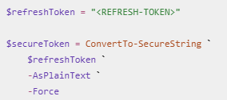

**I then encrypted the SecureString and stored the encrypted value in the connector folder:**
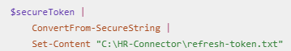

**The resulting file contains the encrypted representation of the refresh token rather than the original token in plain text.**
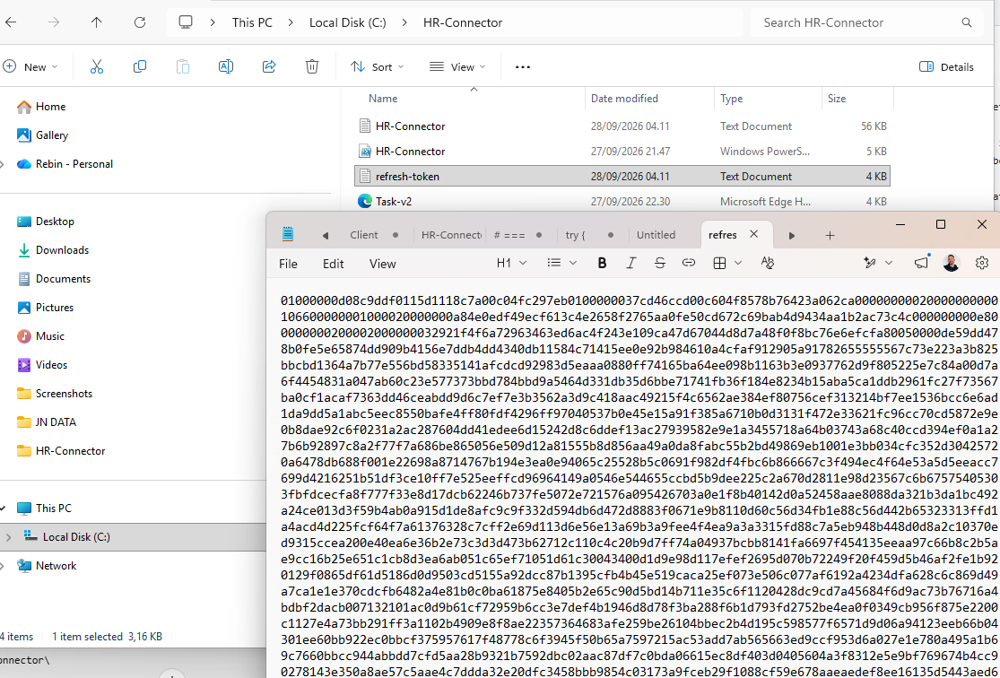

DPAPI ties the encrypted value to the Windows user account that protected it. This is important for the automation later because the scheduled task needs to run under the same Windows account in order to decrypt and use the stored token.

At this point, the refresh token is stored and protected locally. The next part is to build HR-Connector.ps1, which will read and decrypt this value, exchange it for fresh tokens, replace the stored refresh token, and retrieve employee records from OrangeHRM.

#### 5.2: Build the PowerShell HR Connector
I created a PowerShell script named:
- *C:\HR-Connector\HR-Connector.ps1*

The purpose of this script is to handle the OrangeHRM side of the integration without requiring me to manually repeat the OAuth authorization process each time it runs.

Each execution of the connector will:
1. Read the encrypted refresh token from disk.
2. Decrypt it using Windows DPAPI.
3. Send the refresh token to the OrangeHRM token endpoint.
4. Receive a new access token and refresh token.
5. Encrypt and replace the stored refresh token.
6. Use the new access token as a Bearer token.
7. Send a GET request to the OrangeHRM employee API.
8. Retrieve the current employee records.
9. Write the result of the execution to a log file.

**The complete script is available here:** [HR-Connector.ps11](./screenshots/HR-Connector.ps11.txt)

#### 5.3: Test the Connector Manually  
Before automating the connector, I wanted to make sure the complete script worked correctly when executed manually.

**I ran the connector directly from PowerShell:**  
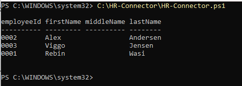

The connector successfully completed the full process:
1. Read the encrypted refresh token from local storage.
2. Decrypted the refresh token using DPAPI.
3. Used the refresh token to request new tokens from OrangeHRM.
4. Received a new access token and refresh token.
5. Encrypted and stored the new refresh token, replacing the previous one.
6. Used the access token to authenticate to the OrangeHRM Employee API.
7. Retrieved the current employee records.

The returned employee records confirmed that the connector was successfully authenticating to OrangeHRM and retrieving HR data without requiring me to repeat the interactive authorization flow.

**I also checked the connector log, the log confirmed that each part of the connector completed successfully:**  
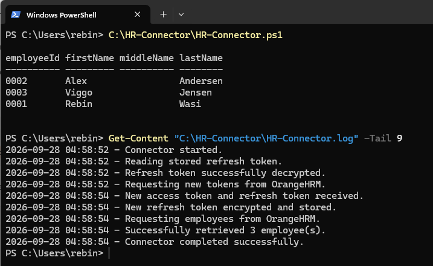

At this point, the connector works without manually generating a new authorization code whenever the access token expires. As long as the stored refresh token remains valid, the connector can use it to obtain fresh tokens and continue accessing the OrangeHRM API.

The connector is still being started manually, though. The next step is to automate its execution using **Windows Task Scheduler**.

#### Step 6: Automate the Connector with Windows Task Scheduler
At this point, the connector works, but I still have to start it manually. The final step is therefore to automate the process using Windows Task Scheduler.

The goal is to run `HR-Connector.ps1` automatically every 15 minutes and also run it when the Windows machine starts.

To start configuring and automating the task, I then opened Task Scheduler on my PC and choose **Create task** to start the process.

#### 6.1 General Configuration
Under the **General** tab, I created a new task called:

*OrangeHRM HR Connector*

I configured the task to run whether the user is logged on or not. This allows the connector to run in the background without requiring an active PowerShell session.

I also enabled **Run with highest privileges**.

The task runs under the same Windows user account that was used to encrypt the refresh token with DPAPI. This is important because the connector needs access to the same user context in order to decrypt the stored refresh token.
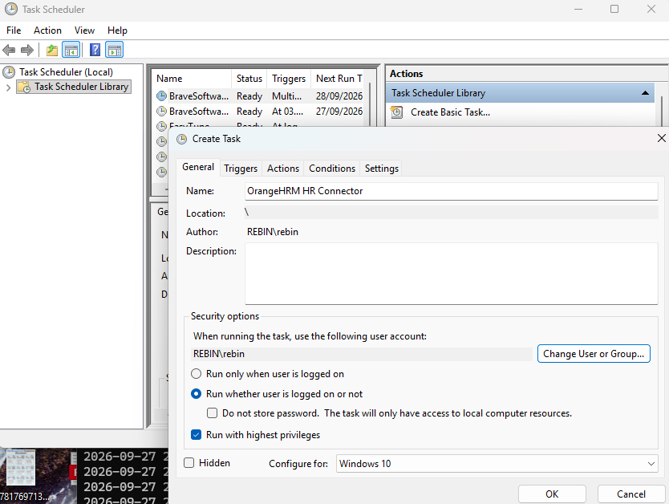

#### 6.2 Configure the Triggers

I configured two triggers.

The first trigger runs the connector every 15 minutes:

- Trigger: Daily
- Repeat task every: 15 minutes
- Duration: Indefinitely

This provides the recurring execution needed for the connector to continuously retrieve updated HR data.
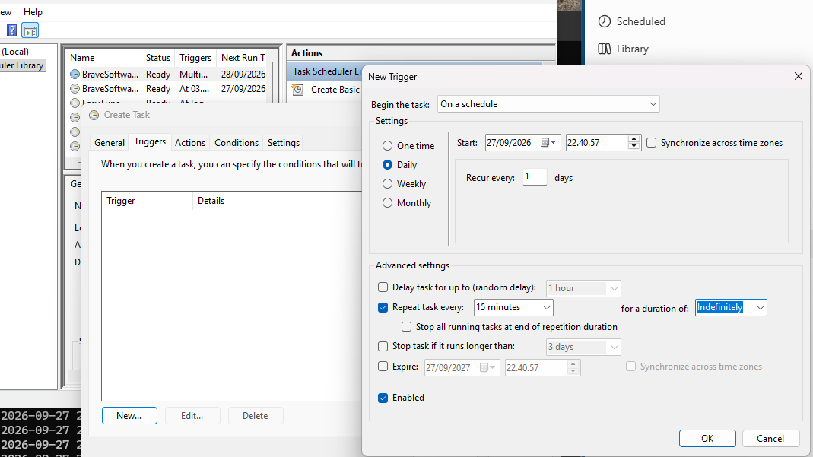

I also added an **At startup** trigger.

This makes sure the connector starts again after the Windows machine has been restarted instead of waiting for the next scheduled execution.
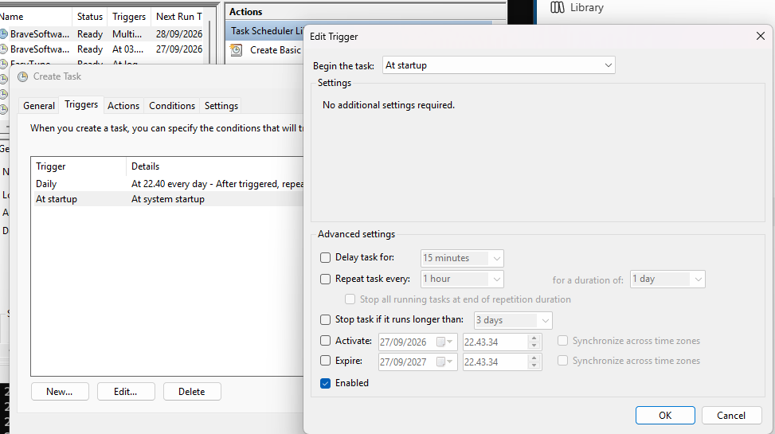
Together, the two triggers provide both recurring execution and startup recovery.

#### 6.3 Configure the PowerShell Action

Under the **Actions** tab, I configured Task Scheduler to start PowerShell and execute the connector script.

The -File argument tells PowerShell which script to execute, while -NoProfile starts PowerShell without loading the user's profile and -ExecutionPolicy RemoteSigned specifies the execution policy for this process.

The Start in value sets the working directory for the process to the connector folder.
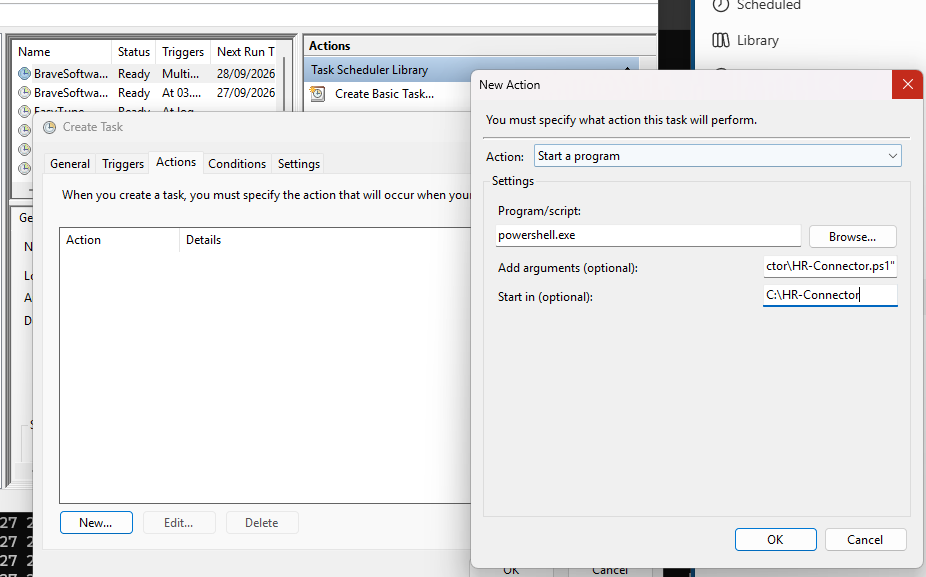

#### 6.4 Configure Failure Handling
Finally, I configured the task settings.
The task is configured to:
- Run as soon as possible if a scheduled execution is missed.
- Restart after 1 minute if the task fails.
- Attempt a maximum of 3 restarts.
- Stop an execution if it runs for longer than 1 hour.
- Prevent a second instance from starting if the previous execution is still running.

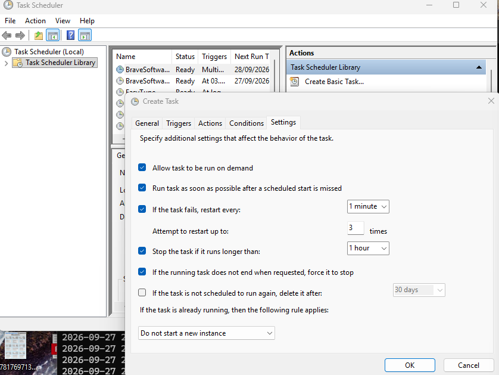

The retry configuration is especially useful for temporary failures such as network or DNS availability during system startup.

For Task Scheduler to recognize a failed connector execution, the PowerShell script must also return a non-zero exit code when an error occurs. This allows Task Scheduler to distinguish a successful execution from a failed one and apply the configured retry behavior.

With the scheduled task configured, the connector no longer needs to be started manually. Windows Task Scheduler launches the PowerShell connector, which retrieves fresh OAuth tokens and queries OrangeHRM for employee data automatically.

## Verification
Although I verified the individual components throughout the lab, I wanted to finish by testing the complete connector and confirming that the automation continued working after a system restart.

Before performing the final test, I added a fourth employee to OrangeHRM. This gave me a simple way to confirm that the connector was retrieving the latest employee data from the HR system.

The connector had previously completed a scheduled execution successfully at approximately `13:41`.

I then restarted the Windows machine.

After Windows started again, the **startup trigger** automatically launched the connector at `13:52:43`. The connector successfully decrypted the stored refresh token and attempted to contact OrangeHRM. The first request failed because DNS was not yet available and the OrangeHRM hostname could not be resolved.

The important part was that no manual action was required.

The normal **15-minute scheduled trigger** remained active after the restart. At `13:55:58`, approximately 15 minutes after the previous **scheduled** execution, Task Scheduler launched the connector again.

This time the complete process succeeded:

- The stored refresh token was decrypted.
- New access and refresh tokens were requested from OrangeHRM.
- The new refresh token was encrypted and stored.
- The connector authenticated to the OrangeHRM API.
- All 4 employee records were successfully retrieved.
- The connector completed successfully.

I also executed the connector manually afterwards to display the employee records and confirmed that the newly added employee was included in the response.

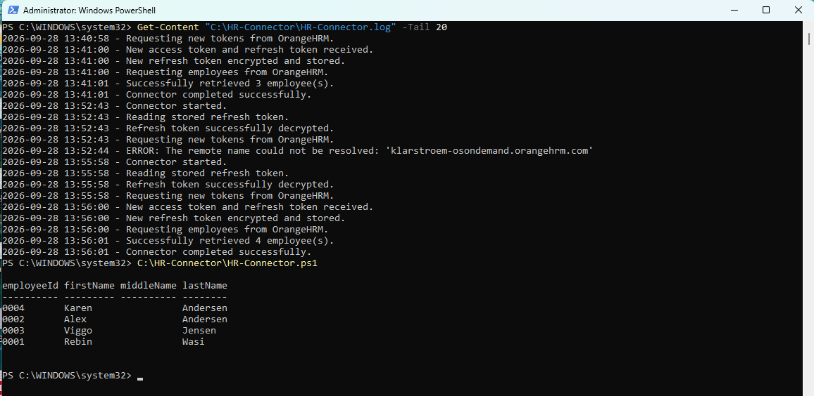

The final test confirms that both Task Scheduler triggers are working as intended. The connector starts automatically after a system reboot and continues running on its 15-minute schedule without requiring manual authentication or intervention.

## Results  
Phase 1 of the HR-driven identity provisioning integration is now complete.

At this stage, I have successfully built and automated the connection between OrangeHRM and the PowerShell HR connector. The complete process has been tested from end to end and is working as expected.

The solution now successfully:
- Identifies the connector using the registered OAuth Client ID.
- Authenticates to OrangeHRM using OAuth 2.0.
- Uses the stored refresh token to obtain new access and refresh tokens without repeating the interactive authorization flow.
- Protects the refresh token locally using Windows DPAPI.
- Uses the access token to authenticate to the OrangeHRM REST API.
- Retrieves current employee records from OrangeHRM.
- Automatically runs the connector every 15 minutes and after a system restart using Windows Task Scheduler.
- Logs successful executions and errors for troubleshooting.

This completes the first part of the integration. I now have an automated process for retrieving HR data from the source system.

The next phase will focus on getting this data into on-premises Active Directory using Microsoft Entra API-driven provisioning and the on-premises provisioning agent. Since Entra Connect is already configured in my hybrid environment, users created in Active Directory will then synchronize to Microsoft Entra ID.

Once the complete provisioning flow is working, I can start expanding the HR data with additional attributes and use those attributes for more advanced identity governance scenarios, including automated joiner, mover and leaver processes.

## Lessons Learned  
This lab gave me a much better understanding of what actually happens behind an API-based integration. Before starting, I understood OAuth mostly from a theoretical perspective. Building the authorization flow myself made the relationship between the Client ID, PKCE, authorization code, access token and refresh token much clearer.

One of the biggest lessons was that getting a successful API request is only a small part of building an integration. The first time I retrieved the employee records from OrangeHRM, the connection worked, but it still depended on manually obtaining and managing the tokens. Turning that into a persistent connector required handling token refresh, protecting the refresh token with DPAPI, logging executions and automating the script with Windows Task Scheduler.

I also learned quite a bit from troubleshooting the automation. After a reboot, for example, the startup trigger successfully launched the connector, but the first API request failed because DNS was not yet available. The next scheduled 15-minute execution succeeded without any manual intervention.

I attempted to configure Task Scheduler to retry the connector one minute after a failed execution, but I was not able to get this behavior working consistently. Rather than treating it as completed functionality, I decided to rely on the recurring 15-minute trigger for this phase of the lab and leave more advanced retry handling as a future improvement.

Another important takeaway was that I do not need to know every PowerShell command by memory. What matters more is understanding what the script is supposed to do, being able to read the individual parts, troubleshoot them and understand how they fit into the overall identity provisioning process.

At this point, I have a much clearer understanding of how an HR system, REST API, OAuth authorization and a custom connector work together as the first part of an HR-driven identity provisioning solution.
