# Hybrid-join a device from on-prem to Entra ID

## Overview
In a previous lab, I joined a Windows Client to my on-premise Active Directory domain. Thiis allowed users to sign in using their domain account instead of a local account and made the device a trusted part of the on-premise environment.

The users in my environment are already synchronized to Entra ID using Password Hash Synchronization, and Seamless Single Sign-On has also been enabled. This means users are able to access Entra ID protected resources without entering their password again, as Windows uses Kerberos to help establish the first cloud authentication.

Although this provides a SSO experience, the device itself is still only trusted by Active Directory. It has no identity in Entra ID and therefore connot take advantage of features such as Primary Refresh Tokens, device-based Conditional Access, Windows Hello for Business, Intune enrollment, or compliance policies.

In this lab, I will join the existing domain-joined Windows client to Entra ID, creating a hybrid Microsoft Entra joined device. After the device is joined, Windows is able to obtain a Primary Refresh Token, this allows users to authenticate *silently* to Microsoft Entra protected applications across both browsers and supported desktop applications. This creates a more seamless SSO experience while also enabling additional security and device management capabilities that we can implement in future labs.

## Objectives
- Explain the difference between a domain joined device and a Hybrid Microsoft Entra joined device
- Compare the authentication flow before and after Hybrid Microsoft Entra join
- Configure Hybrid Microsoft Entra join using Microsoft Entra Connect Sync
- Synchronize and register the Windows client with Entra ID
- Verify that the device successfully becomes hybrid-joined
- Verify that Windows obtains a Primary Refresh Token
- Demonstrate how the PRT enables seamless SSO to Microsoft Entra protected applications
- Validate that Conditional Access policies are still enforced when a PRT is used

## Environment
- Identity Provider: AD DS + Entra ID
- Licenses: Microsoft 365 E5
- Tenant: KlarStroem
- Role used: Local Administrator account and Global Administrator in Entra ID
- License requirements
  - For this lab so for none  

## Implementation
Before the implementation and hybrid joining the Windows client, it's useful to understand how authentication works in the current environment. The following section enplains the authentication flow for a domain-joined device using Password Hash Synchronization and Seamless SSO. Understanding this flow makes it easier to see what changes once the device becomes Hybrid Microsoft Entra joined.

As shown in the diagram, choosing Seamless SSO together with PHS allows users to access Entra protected cloud resources without entering their credentials a second time. After the user has successfully authenticated to Active Directory using Kerberos, Windows is able to present a Kerberos ticket during the first cloud sign-in. Microsoft Entra validates the ticket and, if authentication is successful, it then issues the required tokens and the browser session cookie. This creates a single sign-on experience between the on-premise AD environment and Entra ID.
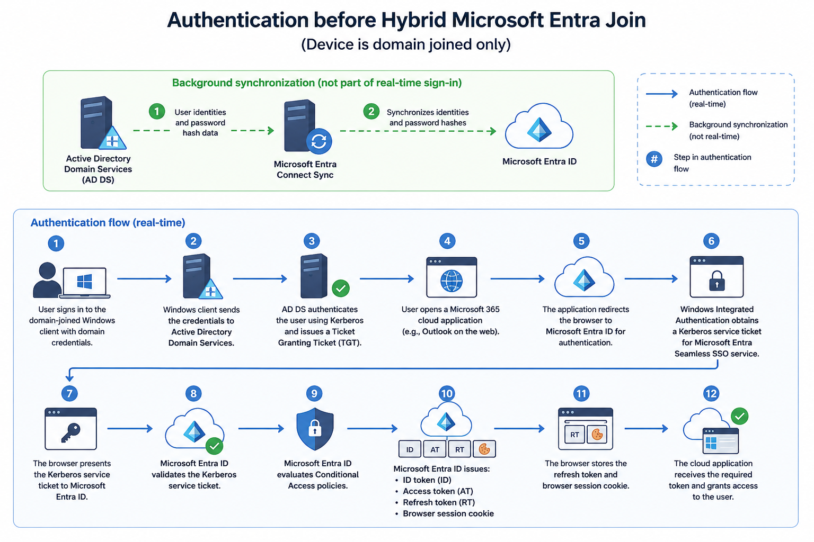

So the question is, if it already works, why would we Hybrid join the device? The main reason, and the one I'll focus on in this lab, is the Primary Refresh Token (PRT). Instead of relying on Kerberos every time a new cloud authentication needs to be established, Windows is able to use the PRT to authenticate the user silently across supported browsers **AND** desktop applications. This creates an even better sign-on experience. 

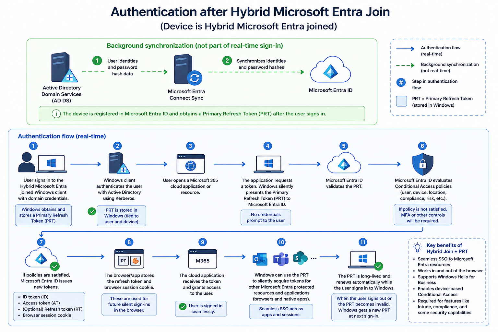

As mentioned in the overview, the PRT is only one of the benefits. Hybrid Microsoft Entra joining a device also allows us to use features such as device-based Conditional Access policies, Windows Hello for Business, Intune enrollment, compliance policies and so on. Those features build on the device being trusted by both AD and Microsoft Entra ID.

#### Step 1: Configure device options
The first step in the process of hybrid-joining the device is start the configuration in Microsoft Entra Connect Sync tool. This means we'll have to make the configuration on our synchronization server where we previously congifured synchronization using PHS and SSO. 

On our synchronization server, open the Microsoft Entra Connect sync application, and choose the *Configure device options*:

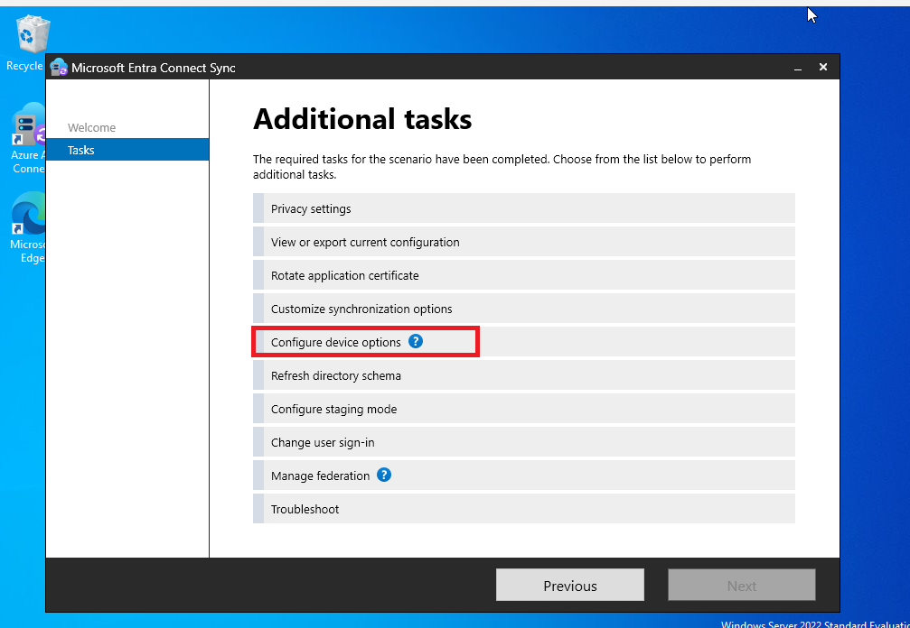

#### Step 2: Connect to the Entra tenant
It then wanted me to connect to the Entra tenant, and therefore I typed the global administrator credentials to ensure I had the required permissions:

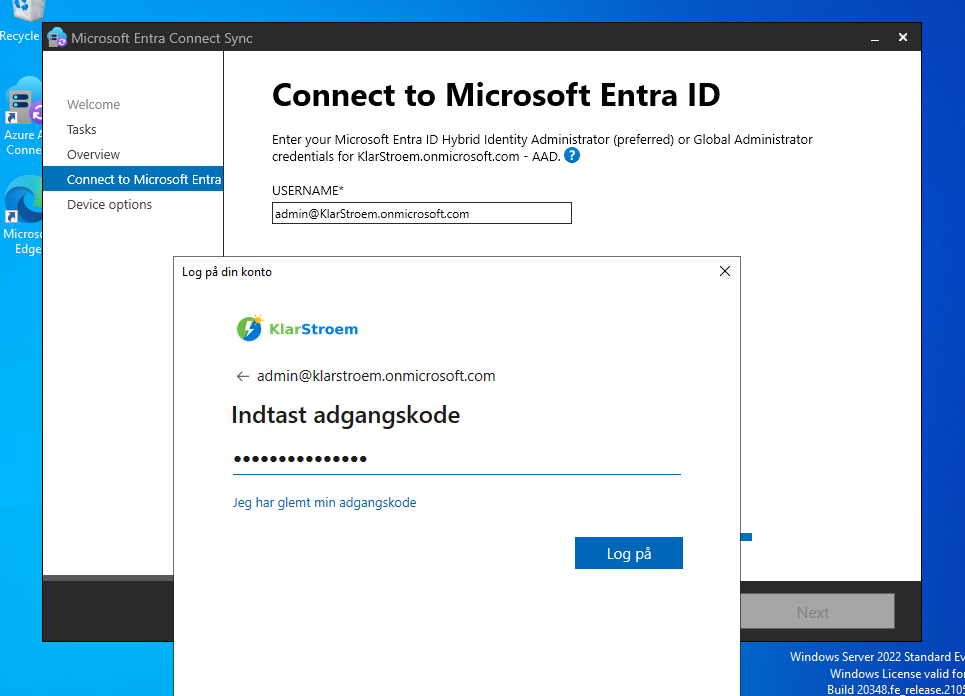

#### Step 3: Choose device options
The wizard also provides the options *Configure device writeback* and *Disable device writeback*. Device writeback is used to sync device objects from Entra ID back to on-premise AD environment. Since the goal of this lab is to hybrid join an existing domain-joined Windows device, then I'm choosing the *Configure Hybrid Microsoft Entra ID join* option:

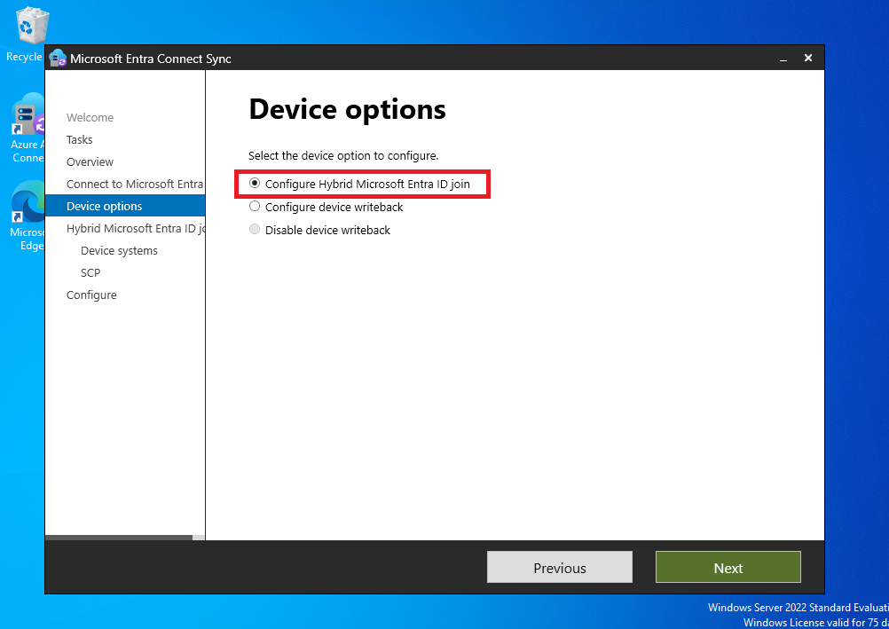

#### Step 4: Choose the clients OS
Next It wanted be to choose the operating system used by the domain-joined clients. There are no other options than choosing an Windows OS. This also shows that both domain-joining and hybrid-joining a client is limited to Windows OS, meaning the feature doesn't support any other OS like MAC OS or Linux.

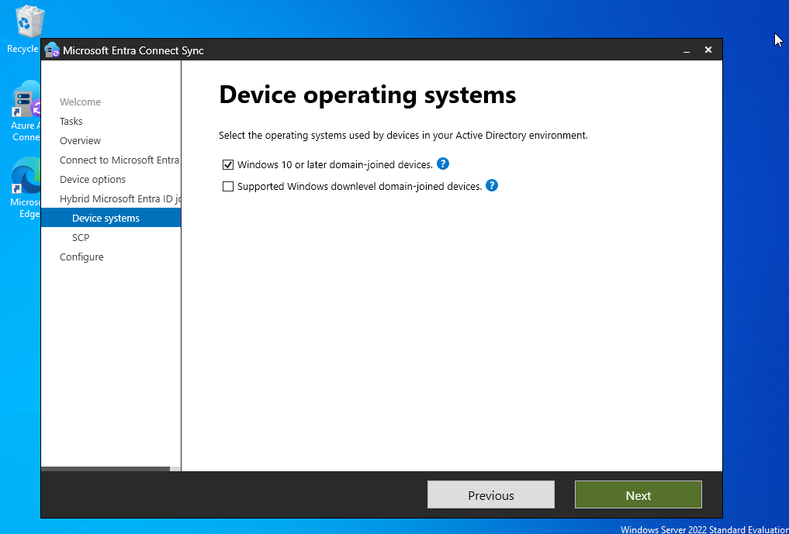

#### Step 5: Configure SCP
The next step is to configure the Service Connection Point. This is one of the most important parts of the set-up because it's what allows our domain-joined Windows device to discover the Microsoft Entra tenant they should register with.

Since my lab environment only contains a single Active Directory forest (klarstroem.local), I simply select that forest.

The authentication Service is set to Microsoft Entra ID because that's the identity provider I want my devices to register with. In other words, this tells the devices which Microsoft Entra tenant they should contact when completing the hybrid join process.

Finally, Microsoft Entra connect aks for the Enterprise admin credentials. These credentials are only needed to create the SCP inside Active Directory. Once the SCP has been created, Windows devices are able to read the information stored in it and automatically discover the correct Entra tenant when they attempt to register.

The SCP itself doesn't authenticate the device or store any credentials. It just acts as a pointer that tells domain-joined devices where they should register in Microsft Entra ID. The actual device registration takes place later, when Windows contacts Entra after the SCP has been configured.

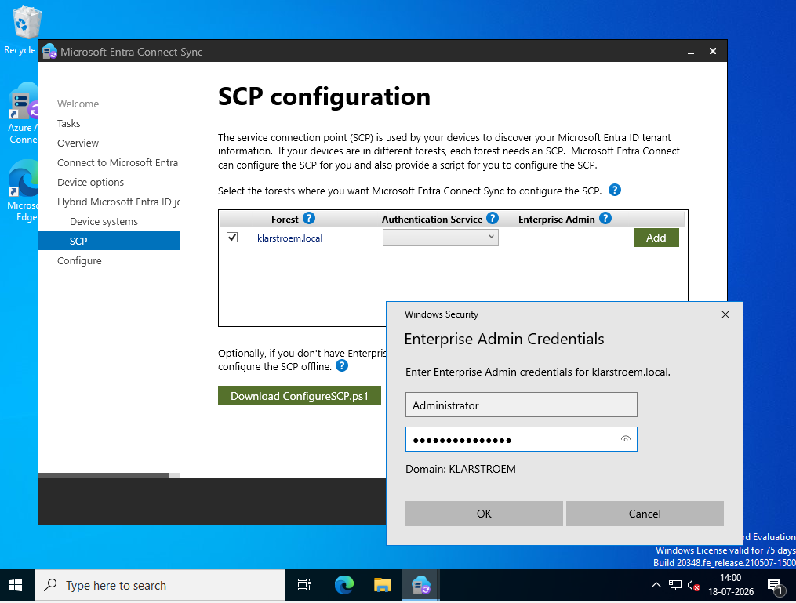

Lastly, I clicked on next and the configuration in the wizard was complete:

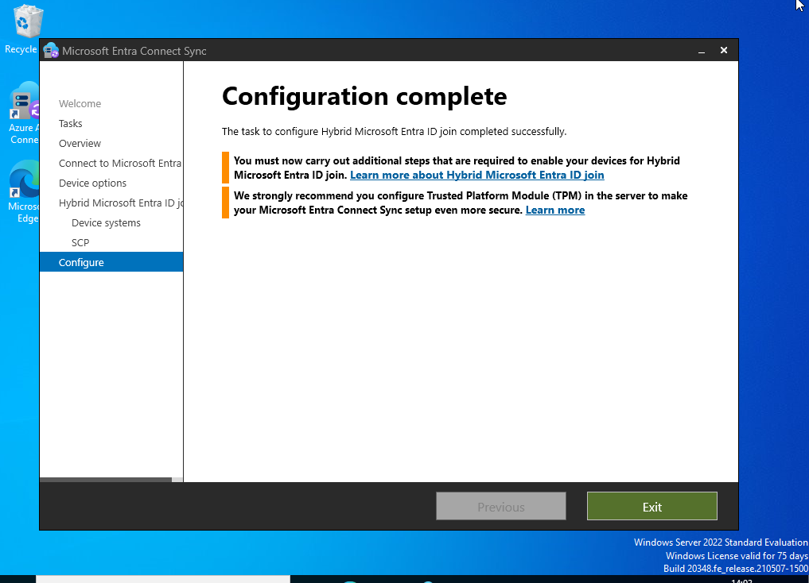

#### Step 6: from pending to registered in Entra ID
After completing the configuration wizard and forcing a delta synchronization on the synchronization server, I could see that the device had appeared in my Microsft Entra tenant. At first, I thought the device had completed the Hybrid join process, but that wasn't actually the case. The device object had only been synchronized from Active Directory to Entra. The device itselæf still hadn't completed its registration and was therefore shown with a status of *Pending*:

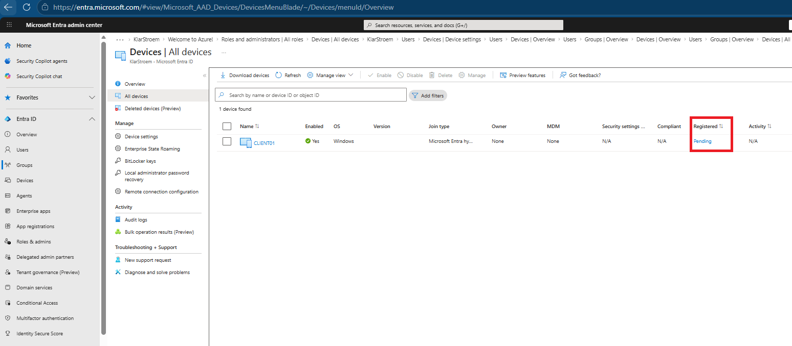

Normally, Windows completes this registration automatically after the device starts or when the automatic device registration task runs. Since this is a lab environment and I didn't want to wait, I decided to trigger the registration manually

To do that, I opened PowerShell as the administrator on the client PC and ran the following command: dsregcmd /debug /join. This command forces Windows to immediately start the Hybrid Microsoft Entra Join process. I also used the debug parameter to get more information about what Windows was doing during the registration.

After a few seconds, the command completed successfully and the output showed *AzureADJoined: YES*

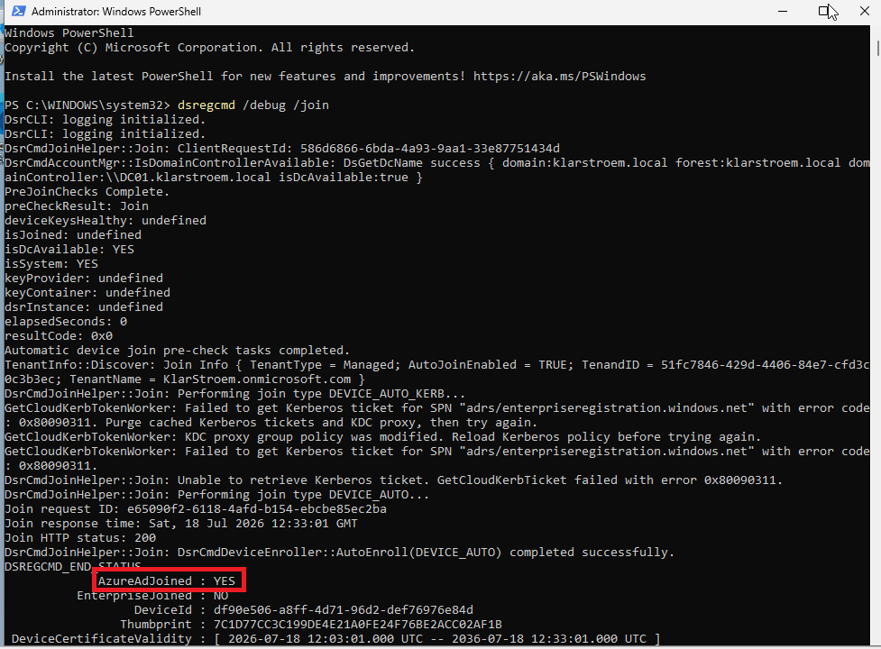

At the same time, the device status in Entra changed from *Pending* to a completed Hybrid Microsoft Entra Joined device.

This also confirmed that the Hybrid Join configuration was working correctly. The client was able to discover the Service Connection Point, contact Entra ID, and successfully complete the device registration process.

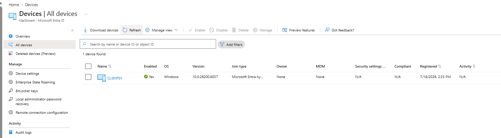

## Verification
#### Test 1: Confirming that the device recieved a PRT
To verify that the Hybrid Microsoft Entra joined device was working as expected, I restarted the client and signed in using the same domain user. After logging in, I ran the dsregcmd /status to check the device authentication state.

As shown in the screenshot below, the SSO State section reports *AzureADPrt: YES*. This confirms that Windows successfully obtained a Primary Refresh Token from Entra ID. Since the PRT is tied to both the user and the Hybrid joined device, Windows can use it to silently request new tokens for Microsoft Entra protected applications.

The output also shows the token's issue time and expiry time. In my lab, the PRT is valid for around 14 days before it needs to be renewned.

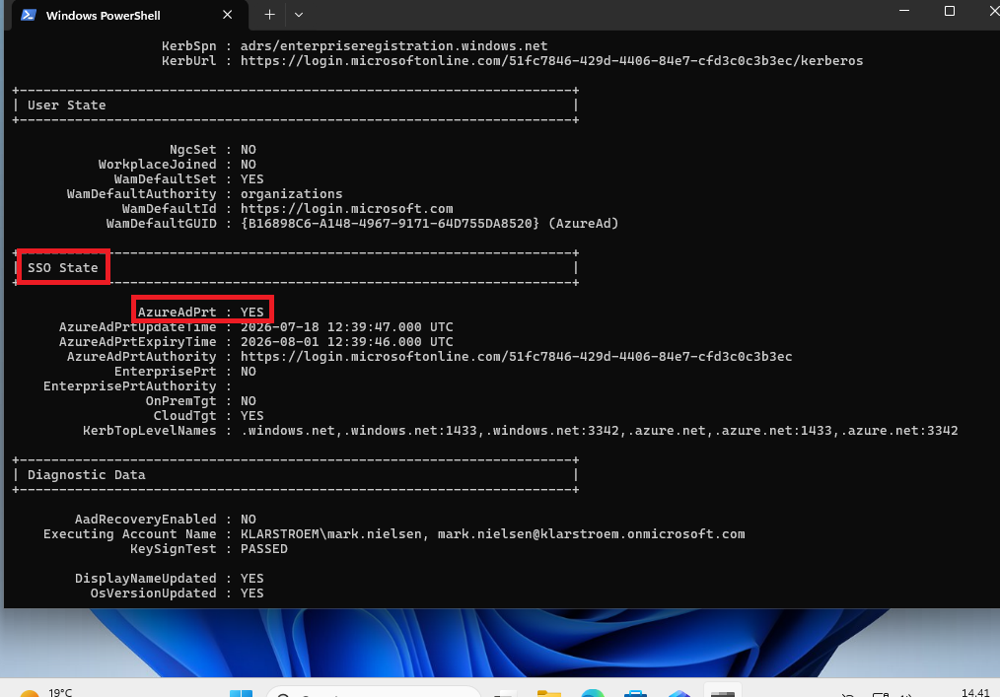

#### Test 2: Verifying that the PRT is being used
The next step was to verify that Windows was actually using the PRT when accessing Entra ID resources.

My tenant has a conditional access policy that requires MFA for all users. Because of this, the first time I accessed a cloud resource after signing in to Windows, I was still promted to complete MFA. this is expected because a PRT does not bypass Conditional Access policies. Microsoft Entra always evaluates CA before issuing new tokens.

After completing MFA, I restarted the client once more and signed in using the same user. This time, when I accessed a cloud resource, I wasn't promted for MFA. Instead, I was signed in automatically.

To understand why, I checked the Microsoft Entra sign-in logs. As shown in the screenshot below, both the first factor requirement and the MFA requirement were marked as *Previously satisfied*.

This shows that Entra reused the existing authentication context instead of promting for MFA again. Windows presented the PRT to Microsoft Entra, and because the previous MFA challange was still considered valid, Microsoft Entra silently issued the required tokens without asking to complete MFA again.

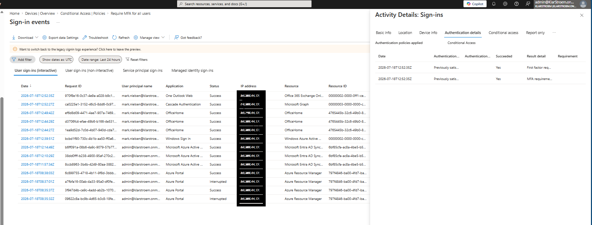

## Results  
Although Windows used the PRT to authenticate the user silently, Conditional Access policies were still evaluated. The sign-in logs showed that the MFA requirement was marked as *Previously satisfied* demonstrating that the existing authentication context was reused instead of requirering the user to perform MFA again.

## Lessons Learned  
