# Configure Cloud Kerberos Trust for Windows Hello for Business

## Overview
Windows Hello for Business had already been deployed successfully on the client device, and the user was able to create a PIN. The problem was that the PIN could not be used to sign in to the hybrid Microsoft Entra joined device.

The reason is that the device is still joined to the on-premises Active Directory domain. Active Directory normally issues a Kerberos Ticket Granting Ticket after validating the user's password. With Windows Hello for Business, the user does not enter the Active Directory password. The PIN only unlocks the private key stored on the device, so Active Directory needs another way to trust the authentication.

Cloud Kerberos Trust solves this problem by connecting the Windows Hello authentication in Microsoft Entra ID with the Kerberos authentication used by on-premises Active Directory. After Microsoft Entra ID validates the Windows Hello credential, the device is able to obtain the Kerberos tickets needed to sign in and access on-premises resources.

In this lab, I configure Microsoft Entra Kerberos in the hybrid environment and enable Cloud Kerberos Trust for the pilot device through Microsoft Intune. I then verify that the required Kerberos objects have been created, that the client has received the Cloud Trust policy, and that the user can successfully sign in with the Windows Hello for Business PIN.

## Objectives
- Understand why Cloud Kerberos Trust is required when deploying Windows Hello for Business in a hybrid identity environment
- Configure Microsoft Entra Kerberos to establish trust between Microsoft Entra ID and the on-premises Active Directory domain
- Create and deploy an Intune configuration policy that enables Cloud Kerberos Trust for Windows Hello for Business
- Configure the Microsoft Entra Kerberos Server by using the AzureADHybridAuthenticationManagement PowerShell module
- Verify that the Microsoft Entra Kerberos Server object has been created successfully in Active Directory
- Confirm that the client device has received the Cloud Kerberos Trust policy and is able to obtain Kerberos tickets for on-premises authentication
- Validate that Windows Hello for Business PIN sign-in works successfully after Cloud Kerberos Trust has been configured

## Environment
- Identity Provider: Entra ID
- Licenses: Microsoft 365 E5
- Tenant: KlarStroem
- Role used: Global Administrator
- License requirements
  - For this lab so for none  

## Implementation
#### Step 1: Configure Microsoft Entra Kerberos
The first step was to configure Microsoft Entra Kerberos in the hybrid environment. I performed this configuration on Sync01, which is the server where Microsoft Entra Connect is installed.

I first opened PowerShell as an administrator and installed the AzureADHybridAuthenticationManagement module:

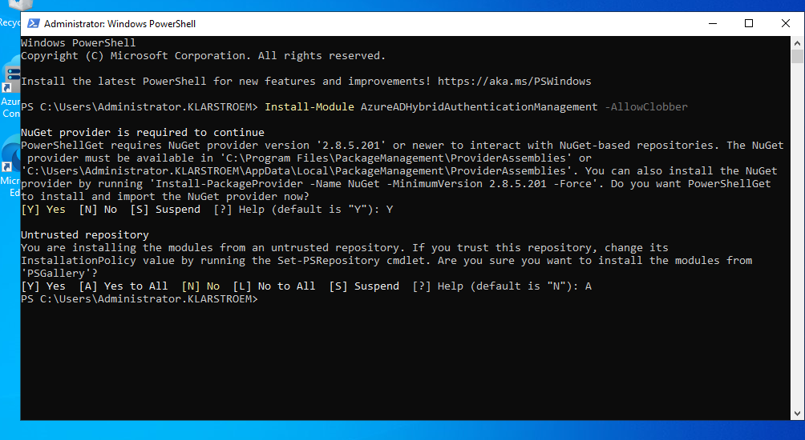

This module contains the PowerShell commands needed to create and manage the Microsoft Entra Kerberos server object in both the on-premises Active Directory domain and Microsoft Entra ID.

After installing the module, I verified that the required commands were available by running:

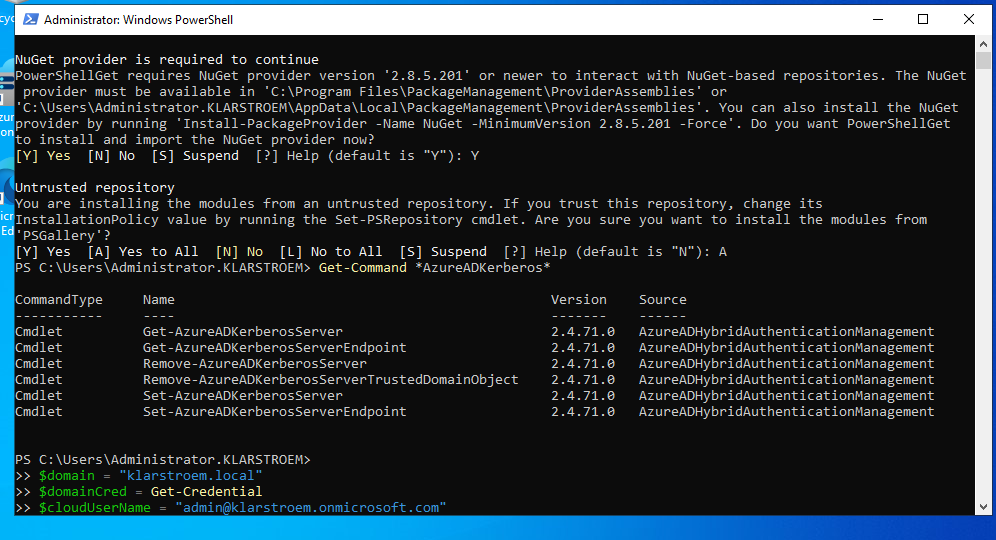

The result showed several commands, including Set-AzureADKerberosServer and Get-AzureADKerberosServer. This confirmed that the module had been installed and imported correctly.

I then specified the on-premises Active Directory domain and provided credentials for a Domain Administrator:

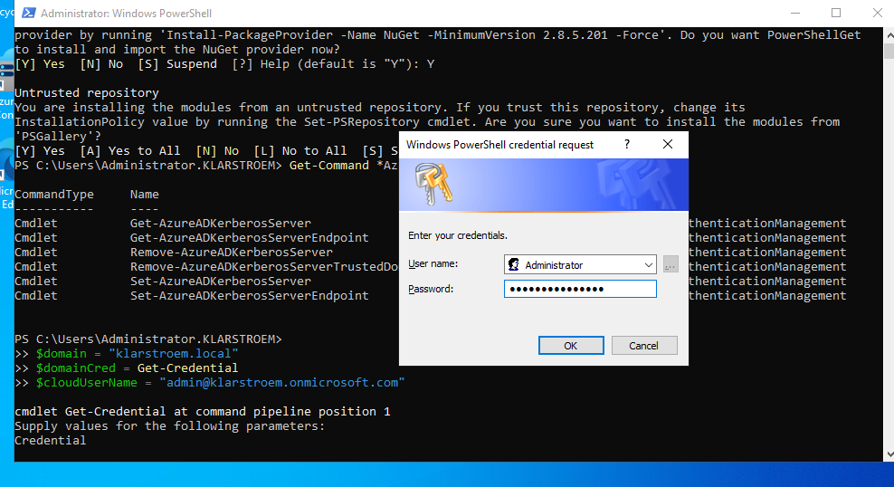

The domain credentials are required because the command needs permission to create the Microsoft Entra Kerberos objects inside the on-premises Active Directory domain. They are not used to install the PowerShell module.

I also specified the user principal name of a Microsoft Entra administrator:

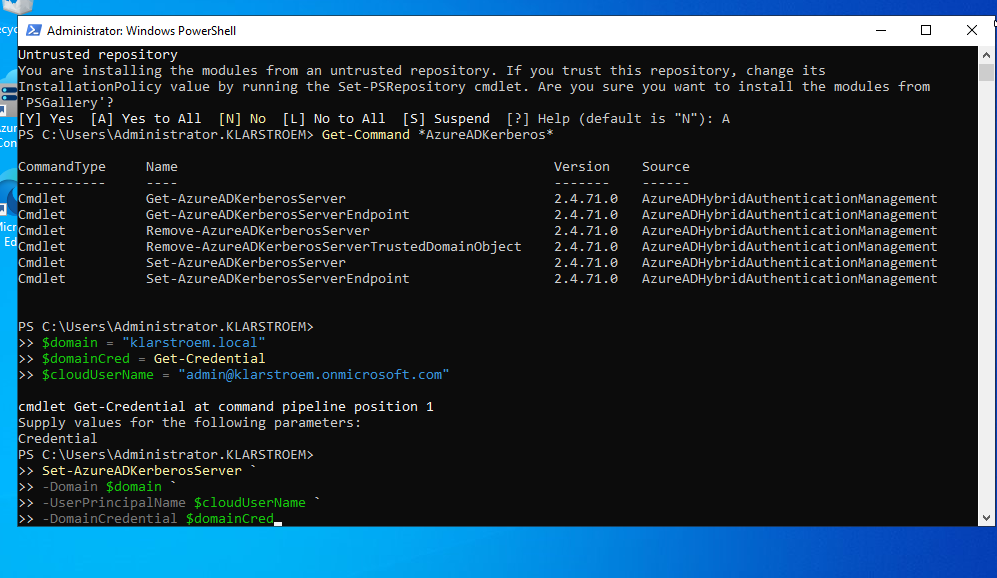

This value identifies the cloud administrator that will be used when connecting to Microsoft Entra ID. The actual cloud authentication happens when the next command is executed, where an interactive sign-in window is opened and the administrator completes any required MFA.

I then ran the following command:

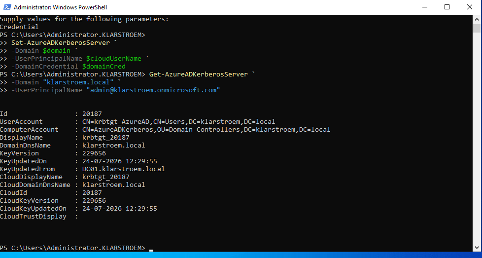

This command creates the Microsoft Entra Kerberos server object in the on-premises Active Directory domain and publishes the required Kerberos information to Microsoft Entra ID. Microsoft describes the AzureADKerberos object as a logical read-only domain controller object. It is not connected to a physical server and is only used by Microsoft Entra ID to support the issuing of Kerberos Ticket Granting Tickets for the domain.

After the command completed successfully, I opened Active Directory Users and Computers and refreshed the Domain Controllers OU. I could now see a new computer object named AzureADKerberos, confirming that the Microsoft Entra Kerberos server object had been created successfully.

The AzureADKerberos object appearing in the Domain Controllers OU does not mean that another domain controller has been deployed. It is a logical RODC-style object used to establish the required Kerberos trust between Microsoft Entra ID and the on-premises Active Directory domain.

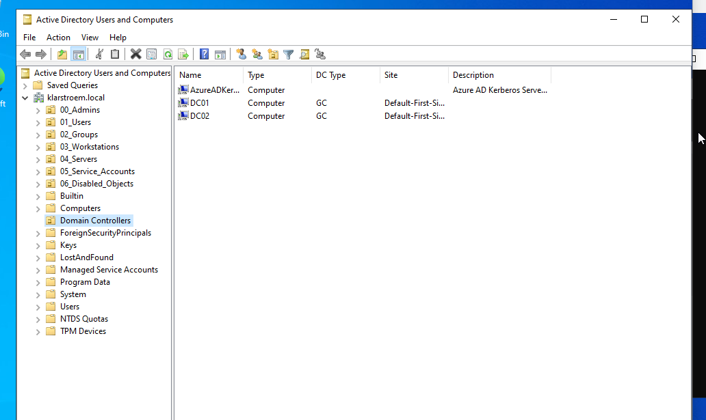

#### Step 2: Configure Cloud Kerberos Trust in Intune
After configuring Microsoft Entra Kerberos on the synchronization server, the next step was to configure the Windows client devices. This was done by creating a configuration profile in Microsoft Intune.

The purpose of this policy is to instruct Windows devices to use Cloud Kerberos Trust when authenticating to on-premises Active Directory with Windows Hello for Business. Without this policy, the client continues using the default authentication method and Windows Hello for Business cannot obtain an on-premises Kerberos Ticket Granting Ticket.

I navigated to: *Devices -> Windows -> Configuration* and created a new configuration profile using the following settings:
- Platform: Windows 10 and later
- Profile type: Settings catalog

The Settings Catalog provides access to individual Windows configuration settings, including those required for Windows Hello for Business and Cloud Kerberos Trust.

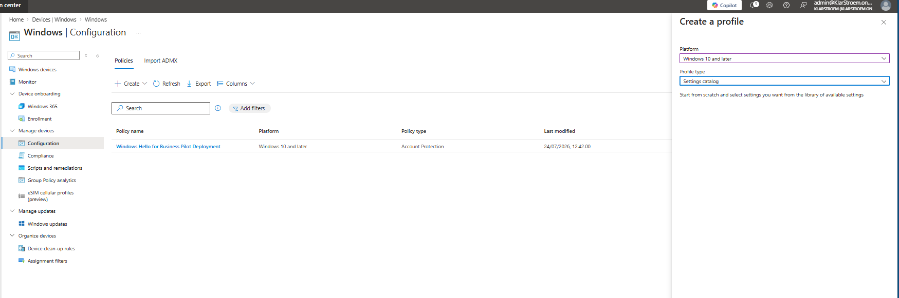

Inside the Settings Catalog, I searched for Windows Hello and selected the setting: 
- Use Cloud Trust For On Prem Auth

This setting enables Cloud Kerberos Trust on the Windows client. When enabled, Windows Hello for Business requests an on-premises Kerberos TGT through Microsoft Entra ID instead of relying on certificate trust or key trust.

One thing worth mentioning is that the setting is added in a disabled state by default. Simply selecting the setting is not enough. It must also be changed to Enabled before the policy is assigned (Found out this the hard way).

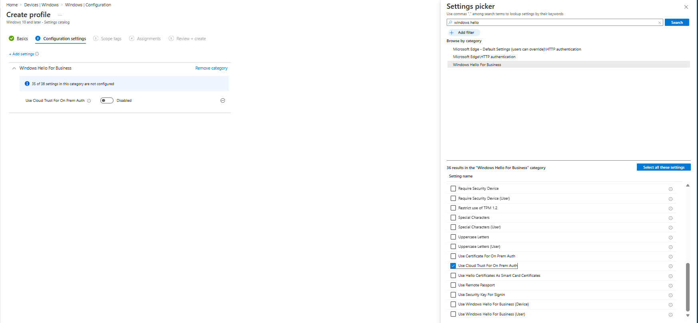

After enabling the setting, I assigned the policy to my Windows Hello Pilot Devices security group.

Using a pilot group allowed me to test the deployment on a single client device before considering a broader deployment across the environment.

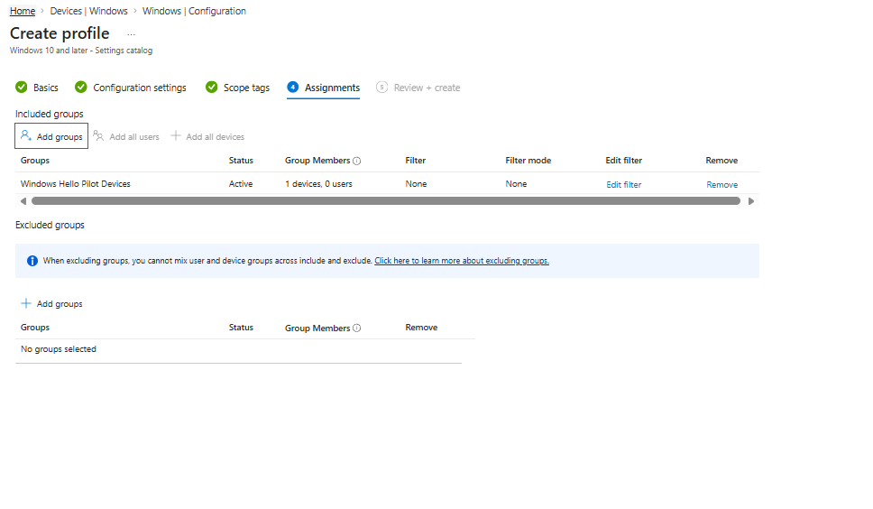

Before creating the profile, I reviewed the configuration to verify that:
- Use Cloud Trust For On Prem Auth was set to Enabled.
- The policy was assigned to the Windows Hello Pilot Devices group.

After verifying the configuration, I created the policy.

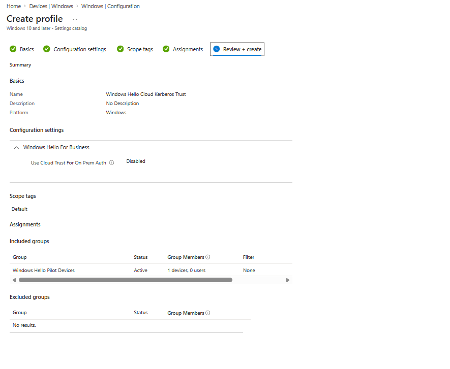

## Verification
#### Test 1: Verify policy has been applied to the pilot group/Client 
Before the new policy was applied, I checked the client registry. The output showed: *UseCloudTrustForOnPremAuth = **0x0***, this confirmed that Cloud Kerberos Trust had not yet been enabled on the client device.

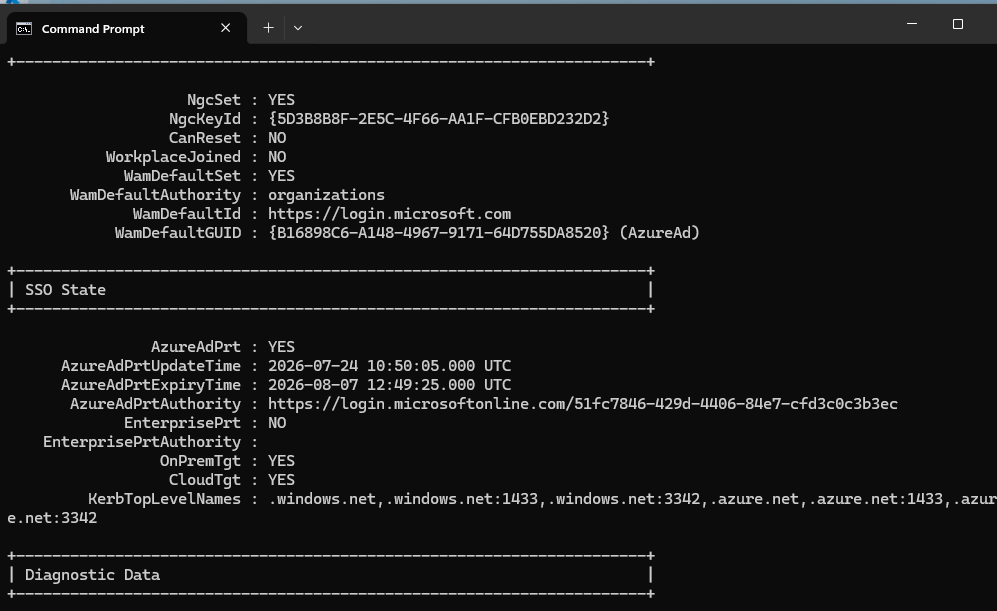

After the Intune policy synchronized to the device, I ran the same registry command again. The value had changed to: UseCloudTrustForOnPremAuth = **0x1**

This confirmed that the Intune policy had been successfully applied and that the client was now configured to use Cloud Kerberos Trust for Windows Hello for Business authentication against the on-premises Active Directory environment.

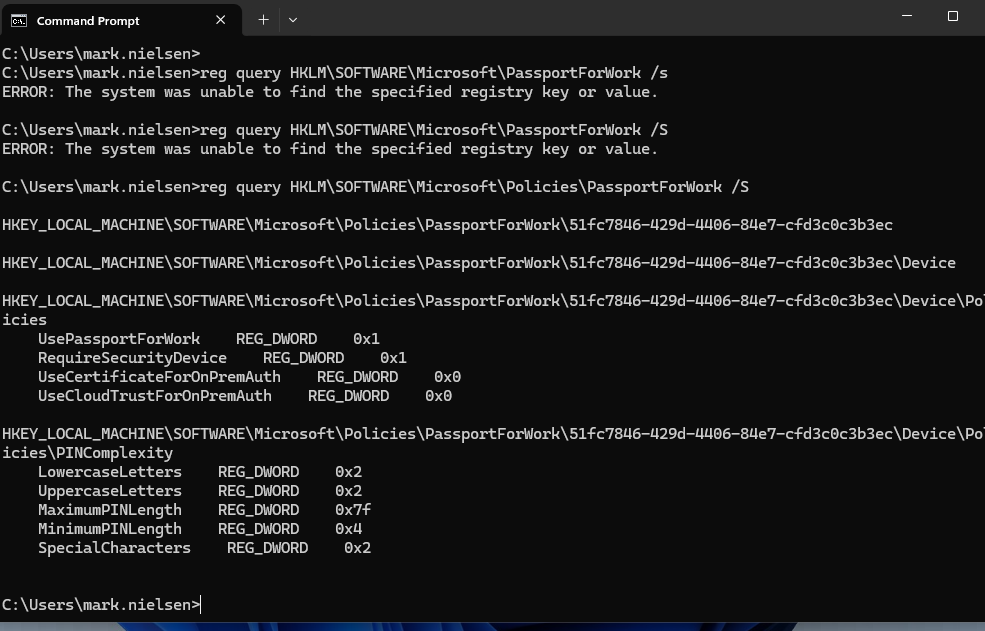

The registry confirms that the client has received and applied the Cloud Kerberos Trust configuration. The final validation is to verify that Windows Hello for Business is able to authenticate to the on-premises Active Directory using Cloud Kerberos Trust. That verification is documented in the [Windows Hello for Business lab](), where the user successfully signs in with a PIN after Cloud Kerberos Trust has been configured.

## Results  

## Lessons Learned  

Sign-in logs  
Audit logs  
Provisioning logs  
PIM audit history  
Diagnostic settings  
Workbooks 
