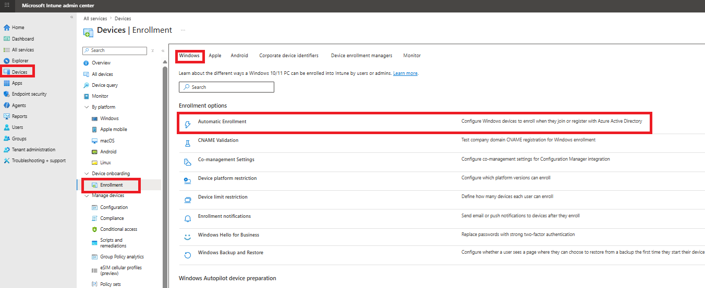
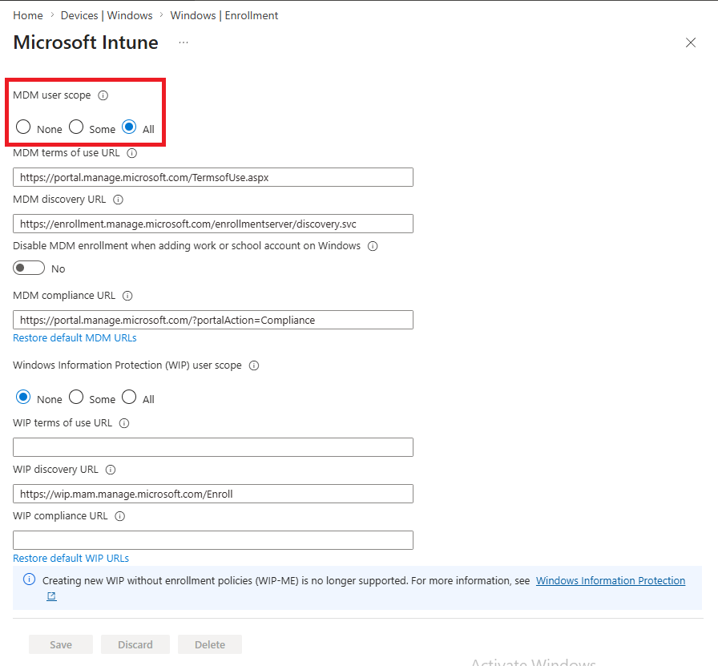
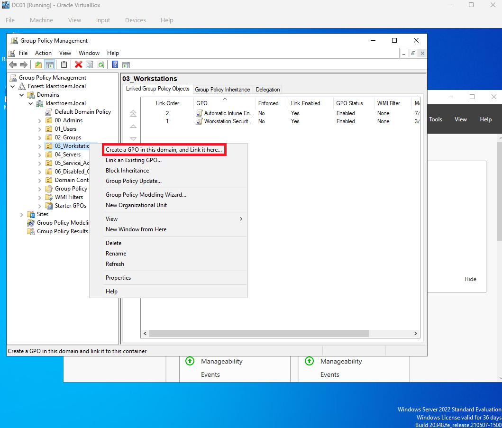
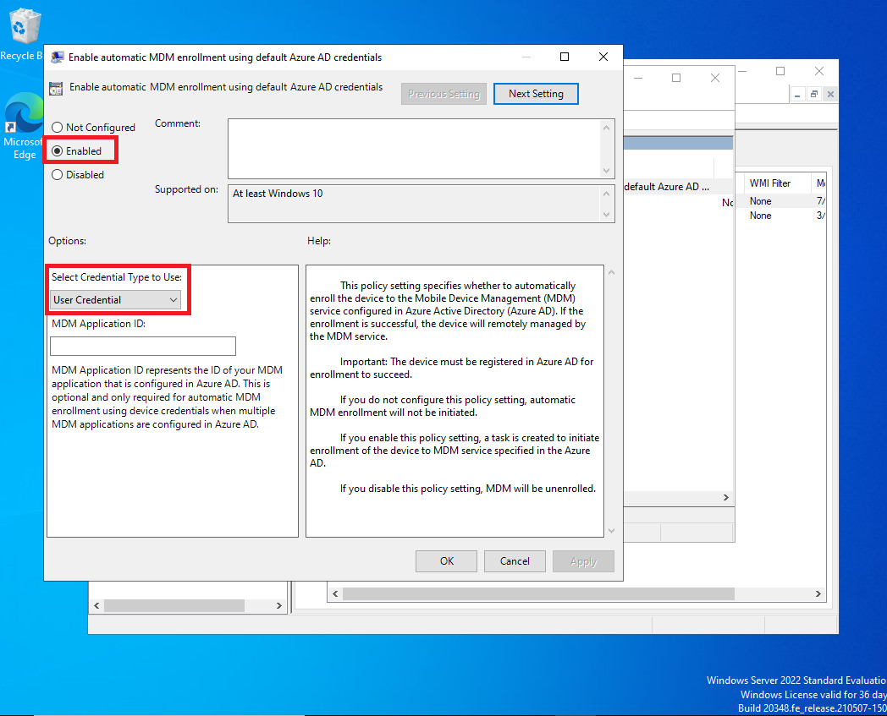
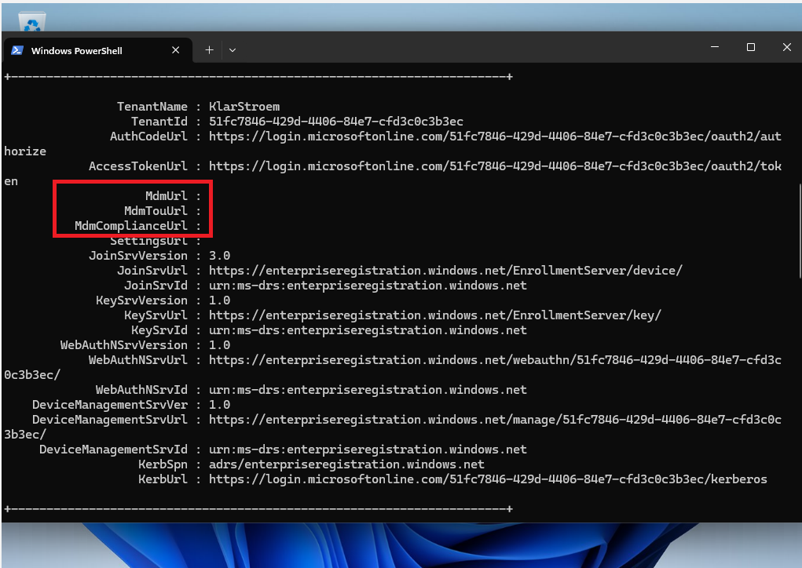
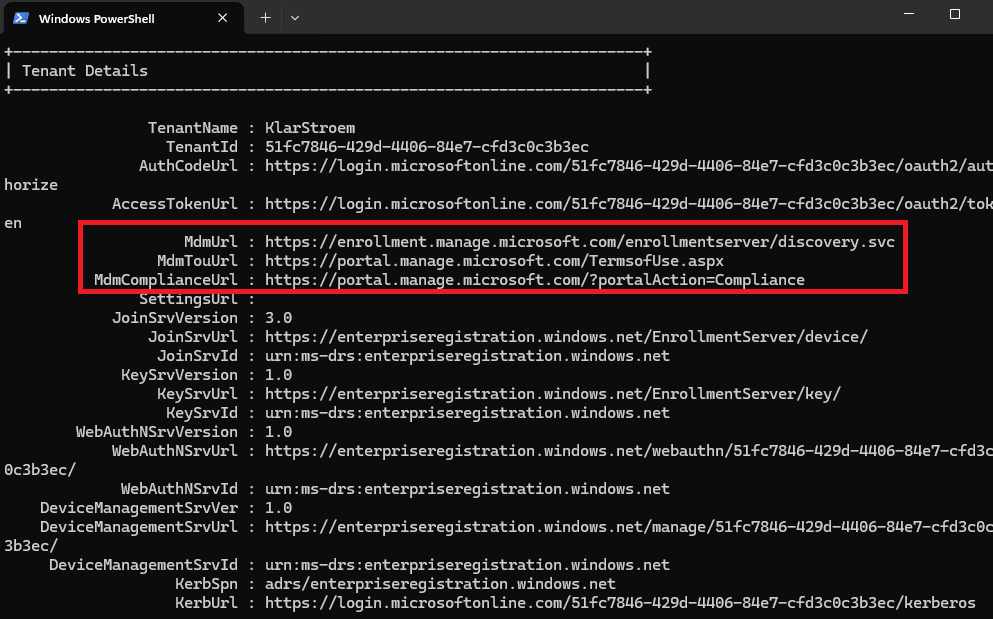
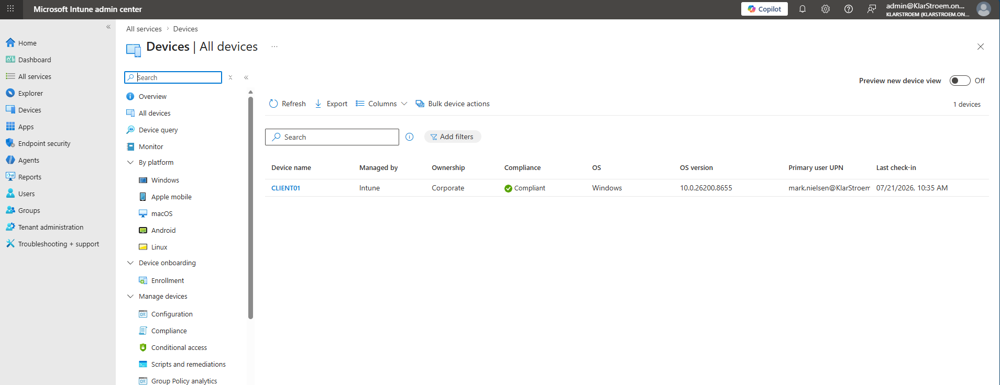
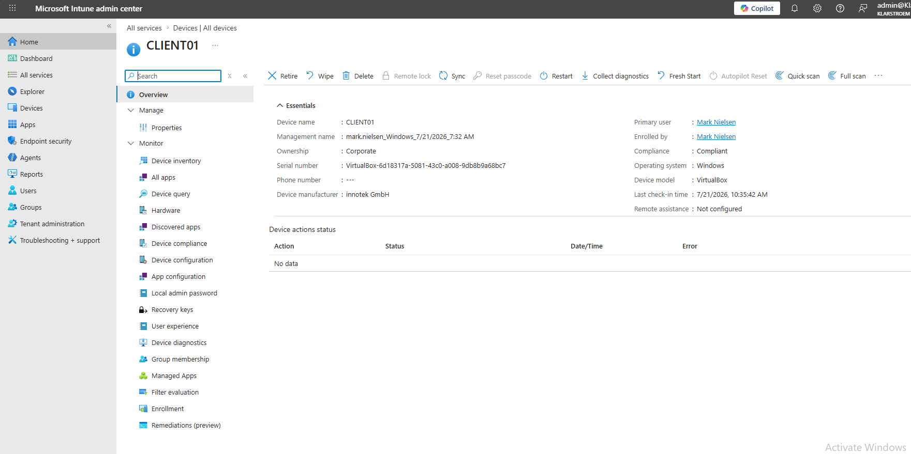

# Automatically enroll Entra joined device into Intune

## Overview
In a previous lab, I hybrid Microsoft Entra joined the client device "CLIENT01", allowing Microsoft Entra ID to establish trust with the device and issue a Primary Refresh Token to users after they sign in. While this enables seamless SSO to Entra protected applications, the device itself is not managed.

To manage Windows devices centrally, they must first be enrolled into Microsoft Intune. Intune makes it possible to configure and enforce security settings across managed devices from a central location. This includes deploying Windows Hello for Business, creating device compliance policies, configuring BitLocker, and later using CA policies that require a device to be compliant before access is granted to company resources.

In this lab, I'll configure automatic device enrollment for Hybrid Microsoft Entra joined devices. This requires configuring MDM enrollment in Intune and enabling automatic enrollment through Group Policy in the On-premise Active Directory environment. Once the configuration is complete, the client device will automatically enroll into Intune after the user signs in, allowing the device to be managed from the Intune admin center.

## Objectives
- Explain why Hybrid Entra joined devices must be enrolled into Intune before they can be centrally managed
- Configure automatic MDM enrollment in Intune for users within the enrollment scope
- Create and link a Group Policy that enables automatic MDM enrollment for Hybrid Entra joined devices
- Verify that the client device automatically enrolls into Intune after the user signs in
- Verify that the device is successfully manageged by Microsoft Intune and appears in the Intune admin center
  
## Environment
- Identity Provider: Entra ID
- Licenses: Microsoft 365 E5
- Tenant: KlarStroem
- Role used: Global Administrator
- License requirements
  - Users in scope for automatic Intune enrollment must have a P2 license

## Implementation
#### Step 1: Configure MDM enrollment in Intune
The first step in the process is to configure *Automatic Enrollment* in Microsoft Intune. In Microsoft Intune admin center navigate to:
1. Devices in the navigation menu to the left
2. Device onboarding -> Enrollment
3. In the Windows tab -> Automatic Enrollment

#### Step 2: Configure Automatic Enrollment
The first step is to configure the *MDM user scope*. This setting chooses which users are allowed to automatically enroll devices into Intune. In this lab, I selected **All**, meaning that every licensed user in the tenant is allowed to automatically enroll their devices.

Automatic enrollment only happens if several requirements are met. The device must already be registered with Microsoft Entra ID, in this case as a Hybrid Microsoft Entra joined device, the user must be included in the MDM user scope, the user must have a Microsoft Intune license, and automatic enrollment must be configured through Group Policy on the Domain controller. Once these requirements are met, Windows automatically enrolls the device into Intune after the user signs in.

The remaining settings in this configuration specify the URLs used by Windows during the enrollment process. The default values are automatically set by Microsoft Intune and do not need to be configured or modified. The **MDM Terms of use URL** allows Windows to locate the Microsoft Intune enrollment service, while the **MDM Compliance URL** is used when checking the device's compliance status after enrollment.

The last section, the **Windows Information Protection (WIP) user scope** determines which users are allowed to use WIP. WIP is another feature used to help protect data on Windows devices and isn't required for automatic enrollment. Since my lab focuses on enrolling devices into Intune, I left this setting as **None**

#### Step 3: 
After configuring the automatic enrollment in Intune, the next step is to create a Group Policy that enables automatic MDM enrollment on domain-joined devices. Although the client device is already Hybrid joined, Windows won't automatically start the enrollment process based on Intune configuration alone. The Group Policy tells Windows to begun automatic enrollment after a user signs in with their Entra account. Once Windows starts the enrollment process, it contacts Entra ID, discovers the Intune enrollment service, and enrolls the device into Intune.

So the next step is to create the actual Group policy that enables automatic enrollment for my Windows devices. Since this is a computer policy, it must be linked to the OU containing the domain-joined devices that should automatically enroll into Intune. In my environment, my client computer is located in the *Workstations* OU. Therefore, I created and linked the Group policy directly to this OU.

To do this, I opened Group Policy Management on the domain controller, right-clicked on the Workstations OU, and selected *Create a GPO in this domain, and link it here* I named the policy *Automatic Intune Enrollment* before opening it for configuration.

After creating and linking the Group Policy, the next step is to configure it to enable automatic MDM enrollment. To do this, I right-clicked on the Group policy and selected **Edit**.

The policy i located under:
- *Computer configuration -> Policies -> Administrative Templates -> Windows components -> MDM*

Here I opened the Group Policy named **Enable automatic MDM enrollment using default AD credentials**

By default, the policy is set to *Not configured*. I of course changed it to *Enabled* and selected *User credentials* as the credential type before clicking **Apply** and then **OK**

I selected *User credentials* because the enrollment process is initiated when a licensed Entra user signs in to the Hybrid joined device. Windows uses the signed-in user's identity to authenticate with Entra ID and complete the enrollment process into Intune.

## Verification
#### Test 1: Verify the device hadn't discovered the enrollment service
Before restarting the client device, I first verified that the device had not yet discovered the Microsoft Intune enrollment service. To do this, I opned PowerShell and ran the command: **dsregcmd /status**

Under the *Tenant details* section, I noticed that the **MDM URL, MDM TOU URL**, and the **MDM Compliance URL** fields were all empty. This confirmed that the device had not yet recieved the Intune enrollment information and therefore hadn't started the enrollment process.

#### Test 2: Verify enrollment on the client PC
After I had configured the automatic enrollment settings in Intune and the Group Policy on the domain controller, I then restarted the client PC and signed in using my licensed user, **Mark Nielsen**. Since Mark is included in the MDM user scope and has a valid license, Windows automatically started the enrollment process after sign-in. I waited a few minutes to allow the enrollment to complete.

To verify that the enrollment was successfull, I ran the same command again: **dsregsmd /status**

This time, under *Tenant details*, the **MDM URL, MDM TOU URL**, and the **MDM Compliance URL** fields were all populated. This confirms that Windows had successfully discovered the Intune enrollment service and completed the enrollment process.

#### Test 3: Verify enrollment in Intune
The last test was to verify that the device also appered in Intune as well. I opened the Intune admin center and navigated to *Devices -> All devices* Here I could verify that the client device had successfully enrolled into Intune. The device was listed as **Compliant**, and Intune also displayed additional information such as the primary user, enrollment user, ownership, and many other details.

## Results  
In this lab, I successfully configured automatic device enrollment for Hybrid Microsoft Entra joined devices. This required configuring automatic MDM enrollment in Intune and enabling automatic MDM enrollment through Group Policy in the on-premise domain controller. After signing in with a licensed user, I verified that the client device automatically enrolled into Microsoft Intune and could be managed from the Intune admin center

## Lessons Learned  
The biggest takeaway from this lab was understanding that automatic enrollment requires configuration on both the cloud and the on-premises side. Configuring automatic enrollment in Microsoft Intune determines which users are allowed to enroll devices, while the Group Policy instructs Windows to start the enrollment process. Once the device is enrolled, it can be centrally managed through Intune, making it possible to deploy security settings, Windows Hello for Business, compliance policies, and other device management features in future labs.
